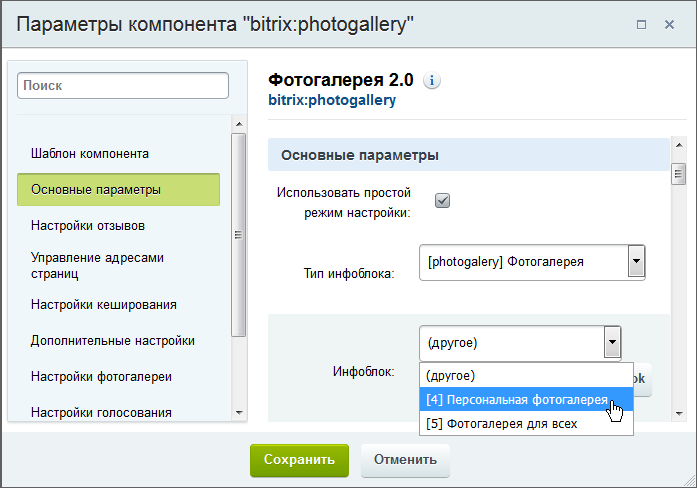

# Публикация фото галерей

**Навигация**
- [← Оглавление курса](index.md)
- [← Предыдущий: 20254 — Практические задания](lesson_20254.md)
- [Следующий: 2957 — Настройка модуля →](lesson_2957.md)

Официальная страница урока: https://dev.1c-bitrix.ru/learning/course/index.php?COURSE_ID=48&LESSON_ID=2982

Публикация фотогалерей выполняется с использованием визуальных  компонентов  модуля **Фотогалерея 2.0**, а затем компонент настраивается на нужный инфоблок.

Рассмотрим примеры публикации разных типов фотогалерей.

### Простая фотогалерея

Простая фотогалерея - это галерея, которой управляет один пользователь. Только он может загружать в неё изображения и определять права доступа к ним.

Публичный интерфейс такой фотогалереи создается с помощью комплексного компонента

			Фотогалерея 2.0

                    Комплексный компонент **Фотогалерея 2.0** позволяет получить полнофункциональную фотогалерею,
 создавая физически только одну страницу.

						[Описание компонента «Фотогалерея 2.0 (комплексный компонент)» в пользовательской документации.](http://dev.1c-bitrix.ru/user_help/detail.php?ID=91321)

		. Создайте  новую страницу  и разместите на ней этот компонент. При настройке параметров компонента укажите Тип инфоблока и Инфоблок:

### Многопользовательская фотогалерея

Такая фотогалерея отображает все фотографии и альбомы пользователей (или групп) социальной сети на одной физической странице.  Создайте страницу  и разместите на ней комплексный компонент

			Фотогалерея 2.0 (многопользовательская)

                    Комплексный компонент **Фотогалерея 2.0 (многопользовательская)** позволяет получить полнофункциональную многопользовательскую фотогалерею, создавая физически только одну страницу.

						[Описание компонента «Фотогалерея 2.0 (многопользовательская) (комплексный компонент)» в пользовательской документации.](http://dev.1c-bitrix.ru/user_help/detail.php?ID=139125)

		.

В настройках компонента укажите Тип инфоблока и Инфоблок (см. иллюстрацию выше). Например, чтобы на странице отображались галереи пользователей, выберите **Фотогалерея для всех**. В результате все персональные галереи пользователей будут отображаться в виде соответствующих ссылок с именами пользователей.

Аналогично выполняются настройки для фотогалерей групп.

### Фотогалерея Социальной сети

Страницы фотогалерей пользователей и групп выполняется аналогично размещением соответствующих комплексных компонентов:  Социальная сеть - пользователь  и  Социальная сеть - группы .

После этого в настройках компонентов укажите Тип инфоблока и Инфоблок (см. иллюстрацию выше).

В результате в публичном разделе:

- на личной странице пользователя будет доступна вкладка **Фото**, с помощью которой пользователь может хранить персональные альбомы и фотографии;
- на странице группы будет доступна закладка **Фото**, на которой организована фотогалерея группы.

Управление доступом к личным фотогалереям выполняется пользователем/модератором группы в персональных настройках.

|  | #### Документация по теме: |
| --- | --- |

- [Описание компонентов модуля](http://dev.1c-bitrix.ru/user_help/service/photogallery/components_2/index.php)
