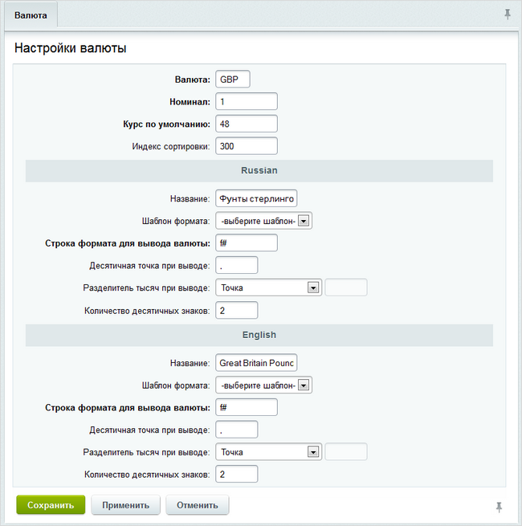
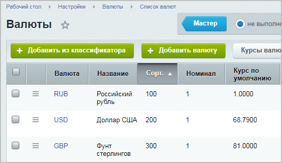
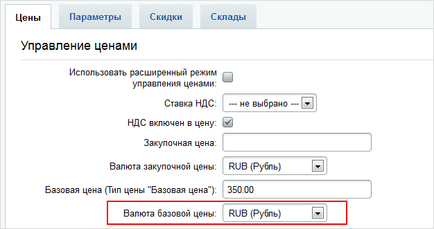
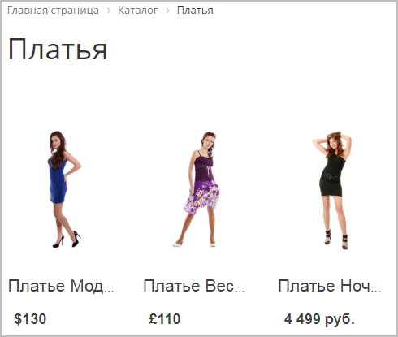
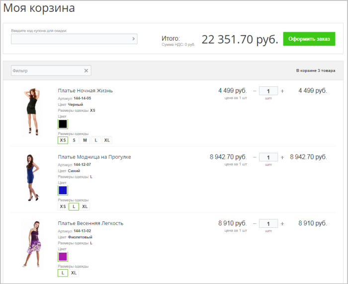
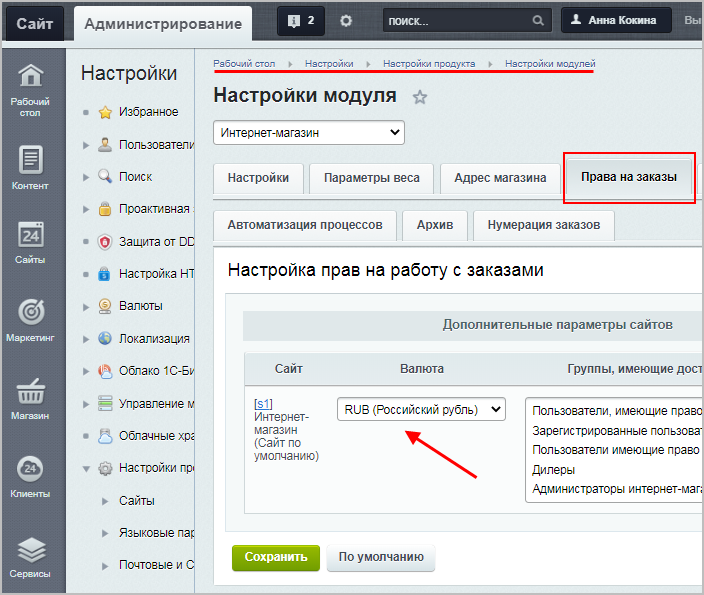

# Пример работы с валютами

**Навигация**
- [← Оглавление курса](index.md)
- [← Предыдущий: 3165 — Информер курса валют](lesson_3165.md)
- [Следующий: 11859 — Как изменить валюту в публичной части магазина →](lesson_11859.md)

Официальная страница урока: https://dev.1c-bitrix.ru/learning/course/index.php?COURSE_ID=48&LESSON_ID=3038

### Видеоурок

<!-- &lt;p&gt;&lt;iframe title="Пример работы с валютами" src="//www.youtube.com/embed/dNoEbcsxSeg?feature=oembed&rel=0" allowfullscreen="" width="853" height="480" frameborder="0"&gt;
	&lt;/iframe&gt;&lt;/p&gt; -->

### Пример работы с валютами

Пусть имеется каталог продукции с товарными позициями, у которых цены представлены не только рублями, но и долларами и фунтами стерлингов. Перед нами поставлена следующая задача:

- корректно отображать цены данных товарных позиций в списке товаров;
- для пользователей вывести информацию по курсам валют на сайте;
- а при заказе данных товарных позиций конвертировать цену в рубли по курсу ЦБ РФ.

Для начала нужно создать требуемые валюты, а также настроить шаблоны их отображения на сайте. В дистрибутиве 1С-Битрикс по умолчанию уже настроена одна валюта: рубли. Она же и является базовой валютой.

Создайте валюты

Нажмите на кнопку **Добавить валюту** на контекстной панели. Откроется форма добавления валюты.

[Подробнее](lesson_6398.md#add_valut)...

		 USD и GBP (фунты стерлингов). Для примера приведем

			образец заполнения формы

                    

		. Должен получиться такой список:

Далее нам нужно настроить курсы данных валют. Переходим в раздел **Курсы валют** (Настройки &gt; Валюты &gt; Курсы валют). И

			создаем курсы

Для создания курса валюты на текущую дату нажмите на кнопку **Создать курс валют** на контекстной панели. Откроется форма создания курса валют.

[Подробнее](lesson_3164.md#add_curs)...

		 для двух валют (USD и GBP) по отношению к базовой валюте RUB.

Теперь перейдя на карточку товара в каталоге товаров, можно указать цену в валютах которые мы создали, выбрав необходимое значение из выпадающего списка:

Создадим

Перейдите на страницу Магазин &gt; Каталог товаров &gt; Напольные покрытия &gt; Разделы &gt; Подложка (либо на страницу Контент &gt; Каталоги &gt; Напольные покрытия &gt; Подложка) и нажмите кнопку **Создать товар**.

[Подробнее](https://dev.1c-bitrix.ru/learning/course/index.php?COURSE_ID=42&LESSON_ID=6744&LESSON_PATH=3912.5201.5208.5213.6744)...

		 3 товара в каталоге товаров с ценами в разных валютах и проверим, чтобы в настройках компонента

			Каталог

                     Комплексный компонент осуществляет вывод полного каталога товаров из определенного инфоблока.

						[Описание компонента «Каталог (комплексный компонент)» в пользовательской документации.](http://dev.1c-bitrix.ru/user_help/detail.php?ID=62978)

		 была отключена опция **Показывать цены в одной валюте**. В итоге на странице каталога в публичной части, при переходе в раздел с созданными нами товарами, мы сможем наблюдать 3 товара с ценами в разных валютах:

**Дополнительно, вне темы примера**: Перед выводом товаров разместим компонент

			Таблица курсов валют

                    Компонент служит для отображения таблицы курсов валют в соответствии с их форматом. Компонент стандартный и входит в дистрибутив модуля.

						[Описание компонента «Таблица курсов валют» в пользовательской документации.](http://dev.1c-bitrix.ru/user_help/detail.php?ID=63428)

		 (**bitrix:currency.rates**), таким образом, пользователь сможет

			видеть курсы,

		 по которым будет произведена конвертация валют в рубли. В настройках компонента выберите из списка валюты, которые необходимо выводить, а также валюту по отношению к которой будет пересчитываться курс (в данном случае это RUB).

Теперь закажем эти платья и перейдём в корзину:

Цены платьев автоматически перевелись в рубли по курсу, который мы установили.

**Примечание**: при настройке скидок для каталога с несколькими валютами учтите, что

			правила корзины

Правила работы с корзиной (Маркетинг &gt; Товарный маркетинг &gt; Правила работы с корзиной) позволяют задавать различные варианты условий применения скидок (наценок) к товарам, торговым предложениям или комплектам.

[Подробнее](https://dev.1c-bitrix.ru/learning/course/index.php?bitrix_include_areas=Y&COURSE_ID=42&LESSON_ID=8425)...

		 работают только в одной валюте, устанавливаемой

			в настройках модуля Интернет-магазин.

Настройки &gt; Настройки продукта &gt; Настройки модулей &gt; Интернет-магазин:

