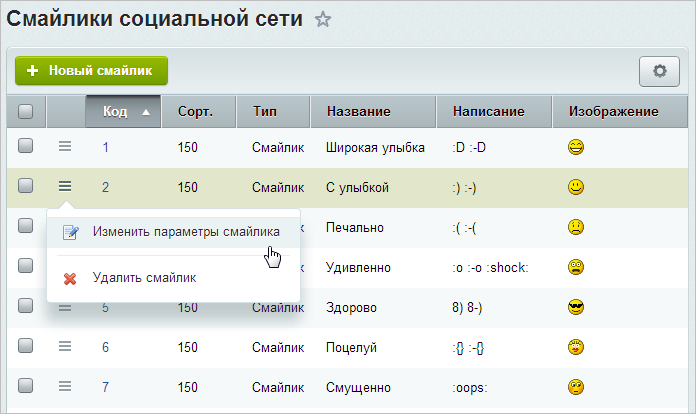

# Смайлы социальной сети

**Навигация**
- [← Оглавление курса](index.md)
- [← Предыдущий: 2782 — Страница рабочей группы](lesson_2782.md)
- [Следующий: 20364 — Проверьте себя →](lesson_20364.md)

Официальная страница урока: https://dev.1c-bitrix.ru/learning/course/index.php?COURSE_ID=48&LESSON_ID=3114

Добавление и редактирование смайлов, доступных для использования в сообщениях социальной сети, осуществляется на странице **Смайлики социальной сети** (Сервисы &gt; Социальная сеть &gt; Смайлы):

Для добавления нового смайлика служит кнопка **Новый смайлик**. Для того чтобы отредактировать уже существующий смайлик, воспользуйтесь соответствующим пунктом меню действий.

Форма создания (редактирования) смайлика имеет следующий вид:

|  | #### Документация по теме: |
| --- | --- |

- [Смайлы](https://dev.1c-bitrix.ru/user_help/service/socialnetwork/socnet_smile.php)
- [Создание и редактирование смайлика](https://dev.1c-bitrix.ru/user_help/service/socialnetwork/socnet_smile_edit.php)
