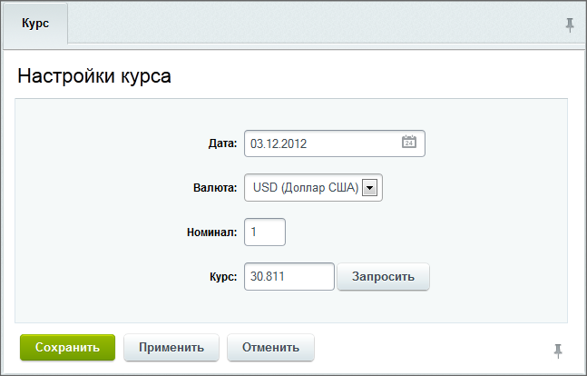
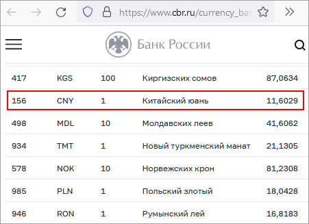
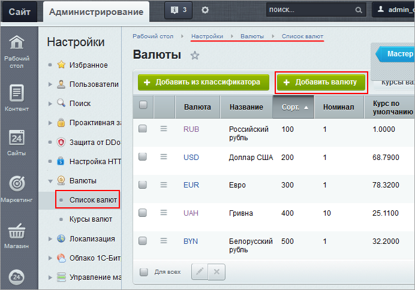
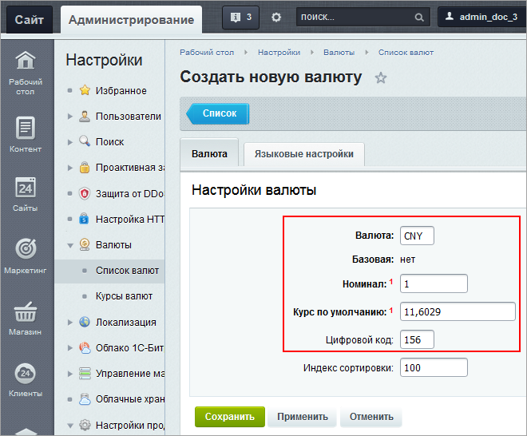
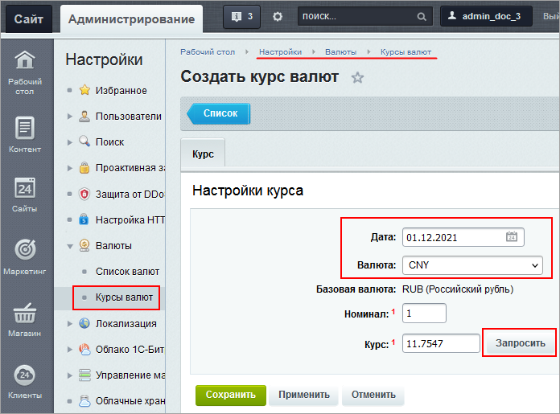

# Курсы валют: создание курса

**Навигация**
- [← Оглавление курса](index.md)
- [← Предыдущий: 8641 — Создание валют через классификатор](lesson_8641.md)
- [Следующий: 3165 — Информер курса валют →](lesson_3165.md)

Официальная страница урока: https://dev.1c-bitrix.ru/learning/course/index.php?COURSE_ID=48&LESSON_ID=3164

### Видеоурок

<!-- &lt;p&gt;&lt;iframe title="Курсы валют: создание курса" src="//www.youtube.com/embed/CS5AbIovnP4?feature=oembed&rel=0" allowfullscreen="" width="853" height="480" frameborder="0"&gt;
	&lt;/iframe&gt;&lt;/p&gt; -->

### Курсы валют

Для управления курсами валют служит страница **Курсы валют** (Настройки &gt; Валюты &gt; Курсы валют). Можно устанавливать курсы для денежных единиц, установленных в разделе **Список валют**.

При конвертации валют на текущую дату система берет самый новый из курсов. Если курс не найден, то берется курс по умолчанию (курс, заданный в настройках валюты).

Для создания курса денежной единицы на текущую дату нажмите на кнопку **Создать курс валют** на контекстной панели. Откроется форма создания курса валют:

1. В поле **Дата** выберите дату, на которую нужно сохранить курс;
2. В поле **Валюта** в выпадающем окне выберите валюту, курс которой необходимо сохранить;
3. Нажмите кнопку **Запросить**. Система запросит курс валют на выбранную дату с нужного сайта (см. примечание ниже) и выведет значения в полях **Номинал** и **Курс**;
  **Примечание**: Для получения курса валюты необходимо, чтобы алфавитный код валюты был корректным, т.е. из списка международного стандарта ISO 4217 (например, если при создании валюты вручную был ошибочно указан код **UJD** (которого нет в списке) вместо **USD**, то получить курс автоматически не получится).
  **Важно!** Запрос курса валют может быть выполнен, если в системе в качестве базовой используется одна из следующих валют:
  - российский рубль - запрос выполняется с сайта Центрального банка РФ;
  - гривна - запрос с сайта Национального банка Украины;
  - белорусский рубль - запрос с сайта Национального банка Республики Беларусь.
4. Сохраните внесенные изменения. Откроется форма отчета со списком сохраненных курсов, в которой добавится новый.

### Пример создания курса валюты

Допустим, мы стали торговать с Китаем и нам понадобился курс юаня. Давайте добавим юань в список валют и создадим его курс.

Посмотреть буквенные и цифровые коды, а также текущий курс, чтобы установить его по умолчанию, можно, например, на сайте Центробанка России. На сегодня это выглядит так:

 

Создадим новую валюту, как описано в уроке [Курсы валют](lesson_6398.md):

- В меню Настройки &gt; Валюты &gt; Список валют нажмем кнопку
  			Добавить валюту
                      
  		.
- Установим буквенный и цифровой коды, номинал, курс по умолчанию:
   
- Языковые настройки установятся по умолчанию, их можно пока не менять. Если при расчетах в этой денежной единице нам понадобится, например, изменить количество десятичных знаков при отображении цен, это можно сделать позже.

Создадим курс нашей новой валюты:

- В меню Настройки &gt; Валюты &gt; Курс валют нажмем кнопку **Создать курс валют**.
- В форме создания зададим дату, выберем валюту из списка и нажмем кнопку
  			Запросить
                      
  		.
- Номинал и курс автоматически проставятся, нам останется только сохранить.

> **Напоминаем**:
>
> - Курс валюты для расчетов и отображения цен берется из списка, самый свежий по дате.
> - Если в списке курс отсутствует, то берется тот, что установлен при создании валюты **по умолчанию**.

**Обратите внимание!** В примере описаны стандартные возможности модуля **Валюты**. Если вам понадобится дополнительные опции (например, автоматическое обновление или построение графиков курса валюты, добавление наценки к официальному курсу и т.п), вы всегда можете поискать такой функционал на [Маркетплейсе](https://marketplace.1c-bitrix.ru/search/?tags=&how=r&q=%D0%BA%D1%83%D1%80%D1%81+%D0%B2%D0%B0%D0%BB%D1%8E%D1%82).

### Документация по теме

- [Курсы валют](https://dev.1c-bitrix.ru/user_help/settings/currency/currency_rates.php)
- [Валюты: создание и управление](lesson_6398.md)
