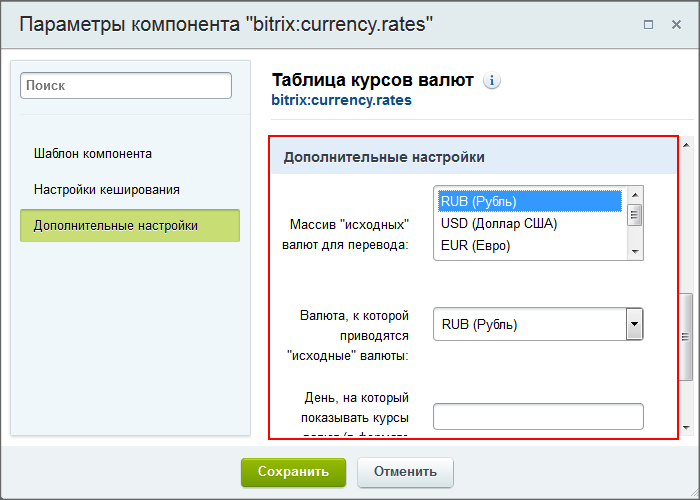
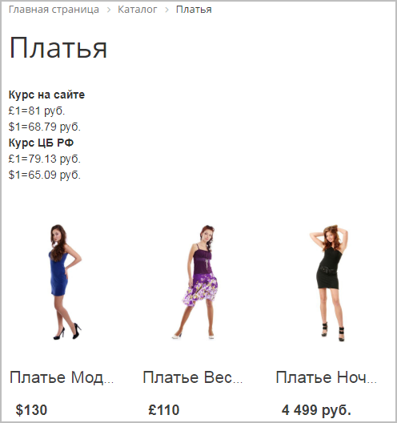

# Информер курса валют

**Навигация**
- [← Оглавление курса](index.md)
- [← Предыдущий: 3164 — Курсы валют: создание курса](lesson_3164.md)
- [Следующий: 3038 — Пример работы с валютами →](lesson_3038.md)

Официальная страница урока: https://dev.1c-bitrix.ru/learning/course/index.php?COURSE_ID=48&LESSON_ID=3165

### Информер курса валют

Работа модуля **Валюты** внешне не видна: к нему обращаются модули **Торговый каталог** и **Интернет-магазин** в своей работе. Но есть один внешне отображаемый компонент, который позволяет «увидеть» присутствие модуля на сайте. Это –

			информер

**Инфо́рмер** (англ. informer — «осведомитель, доносчик») — автоматически обновляющийся специальный блок, который устанавливается на сайте пользователя для предоставления посетителям дополнительного контента (оперативной информации из какой-то области) от поставщика этой информации.

[Подробнее](https://ru.wikipedia.org/wiki/%D0%98%D0%BD%D1%84%D0%BE%D1%80%D0%BC%D0%B5%D1%80)...

		 курса валют.

Рассмотрим размещение информера курса валют на сайте.

Откройте нужную страницу для [редактирования](lesson_4482.md) в режиме визуального редактора и поместите в рабочую область компонент

			Таблица курсов валют

                    Компонент служит для отображения таблицы курсов валют в соответствии с их форматом. Компонент стандартный и входит в дистрибутив модуля.

						[Описание компонента «Таблица курсов валют» в пользовательской документации.](http://dev.1c-bitrix.ru/user_help/detail.php?ID=63428)

		 (Контент &gt; Валюты). Вызовите окно настроек параметров компонента:

- В поле **Массив "исходных" валют для перевода** выберите денежные единицы, данные которых должны отражаться на информере;
- В поле **Валюта, к которой приводятся "исходные" валюты** укажите базовую валюту;
- В поле **День, на который показывать курсы валют** укажите дату курса, с которой будут браться параметры;
- **Показывать курс валют с ЦБ РФ** - отметьте данную опцию, если хотите указать курс ЦБ России.

Сохраните внесенные изменения и таблица отобразится на странице:

### Документация по теме

- [Описание компонента](https://dev.1c-bitrix.ru/user_help/components/content/currency/currency_rates.php)
