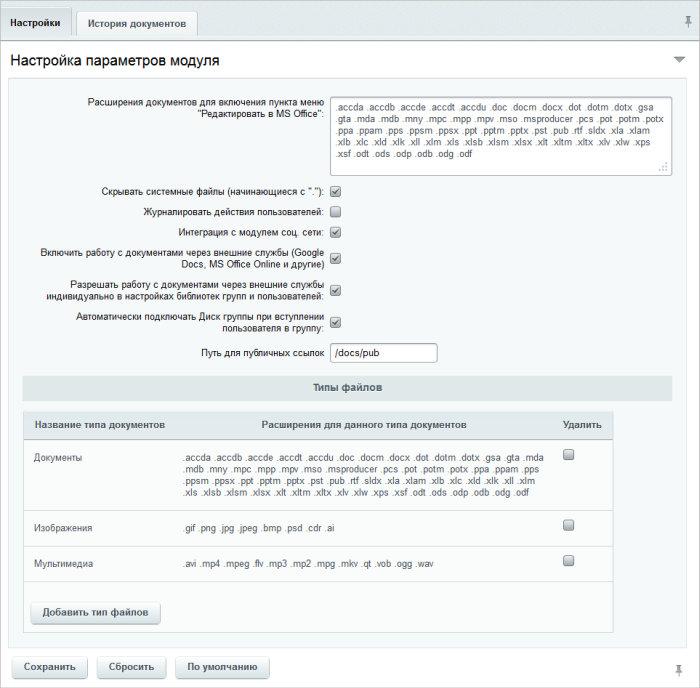
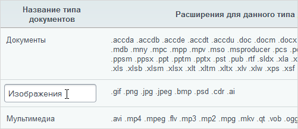
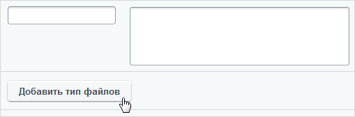
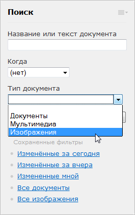

# Настройка модуля

**Навигация**
- [← Оглавление курса](index.md)
- [← Предыдущий: 20914 — Настройки модуля](lesson_20914.md)
- [Следующий: 2670 — Создание библиотек документов →](lesson_2670.md)

Официальная страница урока: https://dev.1c-bitrix.ru/learning/course/index.php?COURSE_ID=48&LESSON_ID=3180

### О Библиотеке документов

Средства системы коробочного **Битрикс24** позволяют организовать специальный раздел коллективного доступа и работы над документами. Раздел может состоять из нескольких подразделов (библиотек), права доступа к которым могут быть различными для отдельных групп пользователей, рабочих групп.

Для нормальной работы системы поиска по содержимому документов, созданных в **MS Office** версий ранее 2007 (форматы **doc**, **xls** и **ppt**), необходимо произвести соответствующие [настройки](/learning/course/index.php?COURSE_ID=48&CHAPTER_ID=888).

**Внимание!** На данный момент модуль **Библиотека документов** работает некорректно на веб-серверах под управлением IIS 7.x. Архитектура таких веб-серверов в базовом варианте не позволяет организовать работу PHP-скриптов по протоколу WebDav: сервер перехватывает все запросы и они не доходят до системы «Битрикс24 в коробке».

### Настройки модуля

Глобальные параметры библиотеки документов определяются на странице настроек модуля **Библиотека документов** (Настройки &gt; Настройки продукта &gt; Настройки модулей &gt; Библиотека документов):

Здесь можно указать следующие параметры:

- **Расширения документов для включения пункта меню "Редактировать в MS Office"** - если загруженный в библиотеку документов файл будет иметь одно из указанных здесь расширений, то можно будет редактировать его каким-либо офисным редактором, выбрав соответствующий пункт в меню действий данного файла.
- **Скрывать системные файлы (начинающиеся с ".")** - оставьте здесь галочку, если хотите чтобы не отображались системные файлы вида: **.hgrc**, **.DS_Store**.
- **Журналировать действия пользователей** - отметьте данную опцию, если хотите чтобы информация об изменении документов вносилась в системный журнал событий.
  **Примечание:**при отмеченной опции журналироваться будут только события библиотеки документов на инфоблоках. К примеру, изменения файлов библиотеки документов на диске отмечаться не будут.
- **Интеграция с модулем соц. сети** - снимите галочку, если хотите чтобы работа с библиотекой документов не отображалась в Социальной сети (к примеру, уведомления в Живой ленте о добавлении/изменении файлов в библиотеке документов).
- **Включить работу с документами через внешние службы (Google Docs, MS Office Online и другие)** - оставьте здесь галочку, если хотите чтобы [работа с документами](https://helpdesk.bitrix24.ru/open/8626407/) компании могла осуществляться через внешние сервисы.
  **Примечание:**Для правильной работы данного функционала необходимо предварительно [настроить работу с документами](https://dev.1c-bitrix.ru/learning/course/index.php?COURSE_ID=48&CHAPTER_ID=03040&LESSON_PATH=3918.4635.4772.3040) через внешние службы **Google Docs** и **MS Office Online** .
- **Разрешать работу с документами через внешние службы индивидуально в настройках библиотек групп и пользователей** - оставьте здесь галочку, если разрешаете работу с личными документами и документами рабочих групп через **Google Docs**. В этом случае сотрудник портала (владелец группы) самостоятельно включает/отключает работу с документами через **Google Docs** в настройках личной библиотеки (библиотеки рабочей группы).
- **Автоматически подключать Диск группы при вступлении пользователя в группу** - следует снять галочку, если вы не хотите, чтобы Диск группы подключался к диску сотрудника, в нее вступающего.
  **Примечание:**при снятии галочки подключенные Диски групп отключены не будут.
- **Путь для публичных ссылок** - укажите путь, по которому будет формироваться адрес [публичной ссылки](https://helpdesk.bitrix24.ru/open/5390599/) документа.

### Типы файлов

В типах файлов указываются параметры, необходимые для последующего поиска файлов по библиотеке документов на инфоблоках.

Указываются название типа документов и расширения, которые позволяют отнести файл к данному типу. Вы можете изменять названия и расширения, для этого щелкните по нужному полю левой кнопкой мыши:

Чтобы добавить какой-либо тип файлов, нажмите

			**Добавить тип файлов**

                    

		, появятся пустые поля для ввода названия типа и расширений файлов.

Чтобы удалить какой-либо тип файлов, отметьте его галочкой в поле **Удалить** и нажмите **Сохранить**.

Указываемые типы файлов нужны для параметра **Тип документа** при использовании фильтра в публичном разделе:

### Закладка "История документов"

На закладке **История документов** можно настроить параметры настройки истории документов:

- **Максимальное количество записей в истории документа** - здесь можно указать максимально хранимое количество записей в истории изменений документа, вносимых сотрудниками.
  **Примечание:**если документ участвует в документообороте, то данный параметр настраивается в опциях модуля **Документооборот**.
- **Использовать склейку истории изменений документа** - при выставленной галочке, в случае многократного изменения документа в течении периода времени, указанного в параметре **История изменений документа склеивается в течении, секунд**, сохраняться в истории документа будет первоначальная и предпоследняя версии экземпляров документа(последней версией считается сам документ).
  **Внимание!**"Склейка" не происходит и в историю добавляется новый экземпляр, если текущее время больше, чем дата последней версии документа + значение параметра.
- **История изменений документа склеивается в течении, секунд** - выставляется количество секунд, в течении которого происходит "склейка" экземпляров в истории документа.
