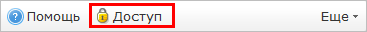
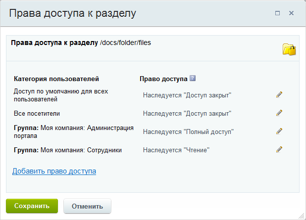
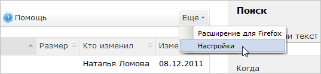
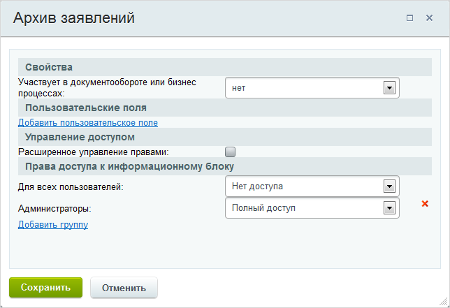
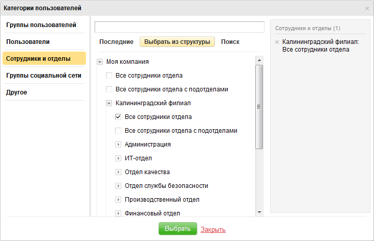
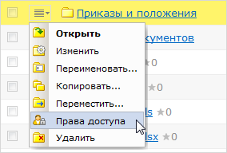

# Выставление прав доступа

**Навигация**
- [← Оглавление курса](index.md)
- [← Предыдущий: 2670 — Создание библиотек документов](lesson_2670.md)
- [Следующий: 11425 — Автоматическая настройка компьютеров в корпоративной сети для работы с webdav →](lesson_11425.md)

Официальная страница урока: https://dev.1c-bitrix.ru/learning/course/index.php?COURSE_ID=48&LESSON_ID=3212

Рассмотрим как можно настроить параметры доступа к библиотекам документов в зависимости от используемого источника данных:

### Физическая папка на диске

Для библиотек документов, использующих в качестве источника данных физическую папку на диске, права доступа к файлам можно настроить при создании библиотеки. Если при создании библиотеки права доступа заданы не были, то наследуются заданные по умолчанию: для группы **Сотрудники** - **Чтение**, для группы **Администрация портала** - **Полный доступ**, для всех остальных - **Доступ закрыт**.

Чтобы перенастроить права доступа для библиотеки документов, берущей данные с папки на диске, нажмите **Доступ**:

В открывшемся окне укажите необходимые права доступа:

- **Доступ закрыт** - запрет на любые действия.
- **Полный доступ** - разрешены все возможные действия.
- **Запись** - данное право идентично полному доступу.
- **Чтение** - разрешен только просмотр.
- **Документооборот** - в библиотеке документов на основе физической папки отсутствует документооборот/бизнес-процессы, поэтому данное право даст возможность только чтения.

Права доступа обладают свойством "наследования", т.е. если для текущего раздела/страницы явно не задан уровень прав, то устанавливается то право, которое задано для вышележащего раздела.

### Информационный блок

Настройки прав доступа непосредственно к библиотеке документов задается в настройках соответствующего информационного блока. Переход к настройкам осуществляется со страницы библиотеки по кнопке контекстной панели **Еще**, выбрав пункт **Настройки**:

Откроется форма настройки прав доступа к инфоблоку и участия его в документообороте и бизнес-процессах:

Если опция **Расширенное управление правами** не отмечена, то выполняется простая настройка прав доступа к библиотеке для групп пользователей, созданных в системе. Ссылка **Добавить группу** служит для добавления полей, с помощью которых можно выбрать группу пользователей и назначить ей некоторое право доступа.

Если опция **Расширенное управление правами** отмечена, то форма имеет несколько другой вид:

В этом случае общая настройка прав доступа ко всей библиотеке может быть выполнена для:

- групп пользователей системы;
- некоторых отдельных пользователей системы;
- некоторых сотрудников компании или сотрудников некоторого всего отдела;
- групп социальной сети или некоторых их участников.

Ссылка **Добавить** служит для перехода к

			окну выбора категорий

                    

		 пользователей, для которых необходимо настроить права доступа к библиотеке документов. Выберите тех, для кого следует настроить права, и задайте им необходимые уровни прав доступа к библиотеке (о том, как работать с данной формой, вы можете прочитать в уроке **Права доступа**).

Кроме того, расширенный режим управления правами позволяет настроить отдельные права доступа на некоторые папки и документы библиотеки.

**Внимание!** Информация ниже актуальна только для расширенного режима настройки прав инфоблоков.

По умолчанию доступ к папкам и файлам библиотеки документов определяется настройками инфоблока.  Чтобы задать отдельные права доступа к конкретной папке (файлу аналогично), в ее меню действий выберите

			**Права доступа**

                    

		. В открывшейся форме указаны текущие права доступа:

С помощью ссылки **Добавить** выберите необходимые категории пользователей и назначьте им необходимые уровни

			прав доступа

                    **Внимание!**Права доступа, которые наследуются от библиотеки изменить невозможно.

		. На папку (файл) возможно назначение следующих прав доступа:

- **Нет доступа** - доступ к папке (файлу) запрещён.
- **Добавление** - можно загружать документы, но при этом нельзя будет их просматривать.
- **Чтение** - разрешен только просмотр папки и документов.
- **Изменение** - идентично полному доступу, но нельзя управлять правами доступа.
- **Изменение с ограничениями** - можно редактировать и удалять файлы, разделы изменять запрещено.
- **Полный доступ** - полный доступ к папке (файлу).

**Важно!** Помните о том, что приоритет доступа  имеет разрешающую направленность. К примеру, если в настройках инфоблока доступ к библиотеке документов для сотрудника запрещен, а для папки в составе этого инфоблока - разрешен, то сотрудник сможет с ней работать. В обратном случае (для инфоблока - разрешен, для папки-запрещен) - сотрудник все равно будет иметь к ней доступ в соответствии с выставленным правом доступа.
