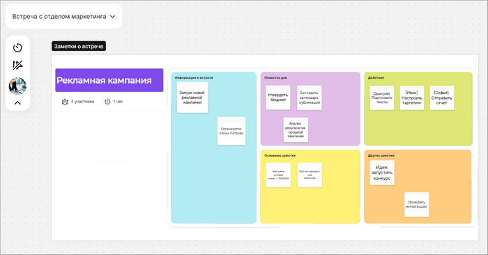
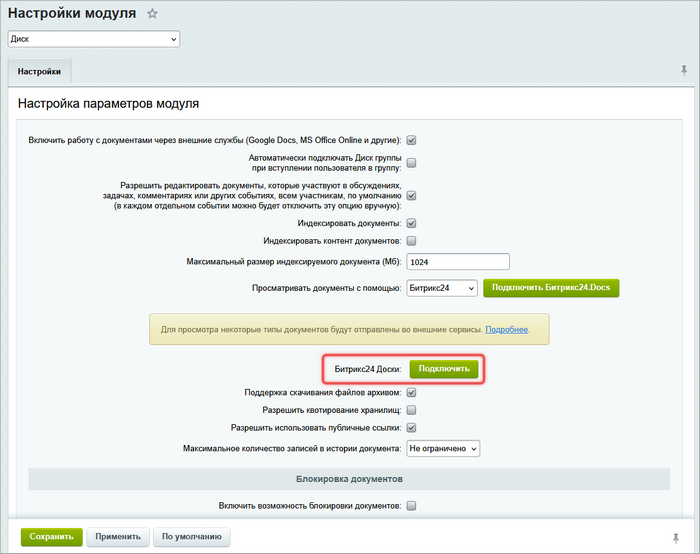
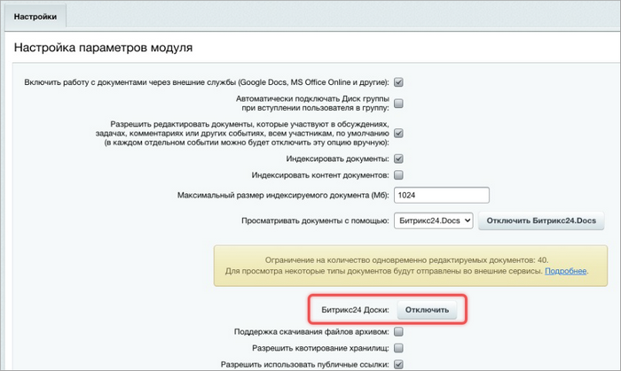

# Битрикс24 Доски

**Навигация**
- [← Оглавление курса](index.md)
- [← Предыдущий: 13066 — Настройка работы с документами](lesson_13066.md)
- [Следующий: 13758 — Задачи на портале →](lesson_13758.md)

Официальная страница урока: https://dev.1c-bitrix.ru/learning/course/index.php?COURSE_ID=48&LESSON_ID=32866

Битрикс24 Доски — инструмент для совместной работы над проектами в модуле Диск. С помощью досок можно:

- отображать идеи и стратегии,
- строить схемы и планы,
- обсуждать задачи и вносить изменения в режиме реального времени.

Сотрудники портала работают с Досками напрямую, а внешних участников приглашают по публичной ссылке.

### Проверить условия подключения

Битрикс24 Доски доступны с версии 25.600 модуля Диск.

С версии 25.700.100 система подключает Доски автоматически при активном инструменте Документы.

Чтобы подключить Доски, убедитесь, что портал:

- имеет активную лицензию Битрикс24,
- работает через публичный IP или домен,
- использует валидный SSL-сертификат.

### Подключить Доски

1. В административном разделе откройте страницу Настройки &gt; Настройки продукта &gt; Настройки модулей &gt; Диск.
2. В поле Битрикс24 Доски нажмите Подключить.
  
3. В диалоговом окне укажите сервер и нажмите Зарегистрироваться.

После успешного подключения на странице появится кнопка Отключить.

### Начать работу с Досками

После подключения раздел Доски автоматически добавляется в меню портала. Если пункт не отображается, сбросьте кеш на странице.

Подробную информацию о работе с Досками читайте в статьях:

- [Битрикс24 Доски: пространство для визуализации идей](https://helpdesk.bitrix24.ru/open/23361080/)
- [Битрикс24 Доски: интерфейс и возможности](https://helpdesk.bitrix24.ru/open/26757656/)
- [Как настроить доступ к доскам в Битрикс24](https://helpdesk.bitrix24.ru/open/25483894/)
