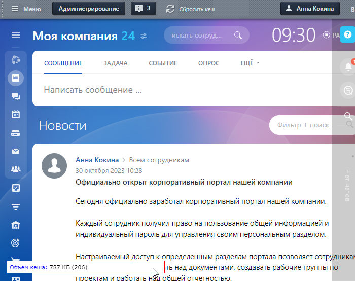
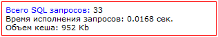
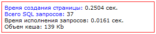
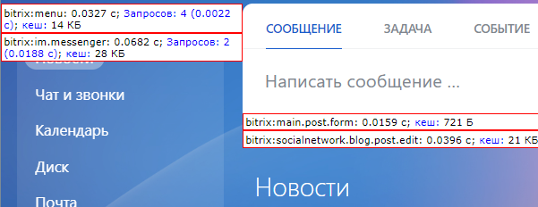
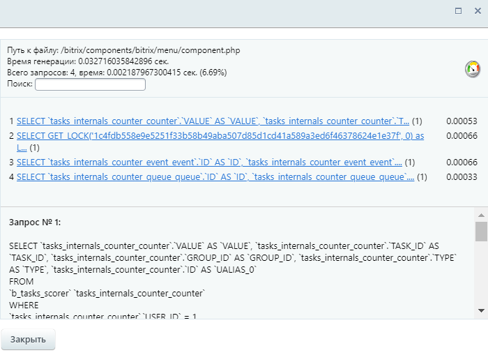

# Публичная часть модуля

**Навигация**
- [← Оглавление курса](index.md)
- [← Предыдущий: 3374 — Настройки модуля](lesson_3374.md)
- [Следующий: 5125 — Страницы и компоненты →](lesson_5125.md)

Официальная страница урока: https://dev.1c-bitrix.ru/learning/course/index.php?COURSE_ID=48&LESSON_ID=3375

### Просмотр статистики "с лица"

Для оценки производительности в публичной части сайта используется кнопка

			Отладка

                    

		, которая позволяет отображать статистику прямо на странице:

**Примечание:**

- Для административной части сайта также доступна **Статистика SQL-запросов**, **Время исполнения страницы**.
  			Отображение статистики
                      
  		 включается с помощью меню кнопки **Отладка** в публичной части сайта.
- До версии 20.0.1300 также отображалась **Статистика компрессии**. С указанной версии модуль **Компрессия** удалён из продукта.

### Что отображается в статистике

Статистика в целом по странице отображается внизу страницы:

- Информация для опций
                      
  		 **Время исполнения страницы** и **Статистика компрессии**
- Информация для опции
  			Статистика SQL-запросов
                      
  		.
  Ссылка Всего SQL запросов позволяет отобразить более подробную информацию обо всех запросах на странице в специальной форме ([см. ниже](#perfmon_sql_pub)).
- При одновременно отмеченных опциях **Время исполнения страницы** и **Статистика SQL-запросов** внизу страницы будет доступна ссылка
  			Время создания страницы
                      
  		, которая позволит отобразить статистику страницы в специальной форме:
  
  **Примечание:** При отмеченной опции **Суммарная статистика** по ссылке Время создания страницы будет доступна более
  			подробная информация
                      Ссылки в верхней части формы позволяют отобразить в нижней части формы список задействованных
   включаемых областей. Ссылки в нижней части формы позволяют отобразить [информацию о запросах](#perfmon_sql_pub).
  
  		.

### Информация о запросах

Для просмотра информации о запросах компонента выберите пункт меню **Статистика включаемых областей** и затем используйте ссылку вида Запросов: n, отображаемую в информационной области, которая расположена рядом с компонентом:

Откроется форма, в которой будет отображена

			информация о запросах

                    В нижней части формы отображается детальная информация о каждом запросе. Для отображения информации о другом запросе компонента необходимо использовать ссылку в верхней части формы.

		:

### Кеш

Данные о кеше выводятся во всплывающем окне:

