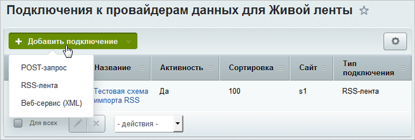
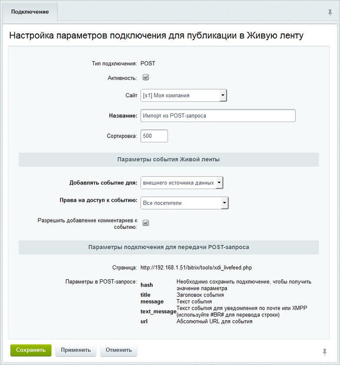
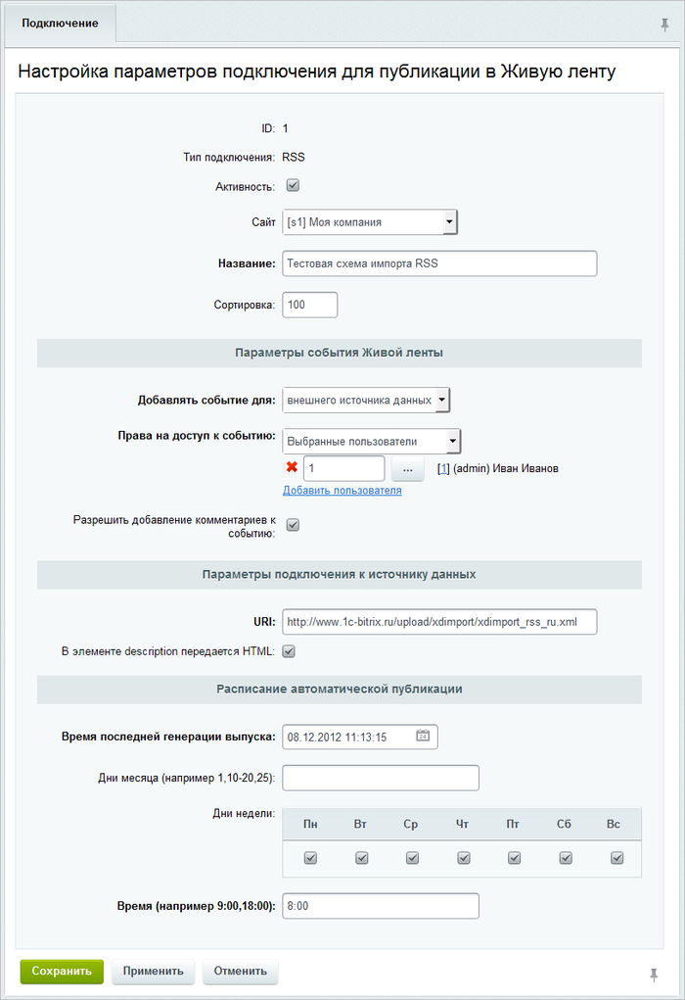
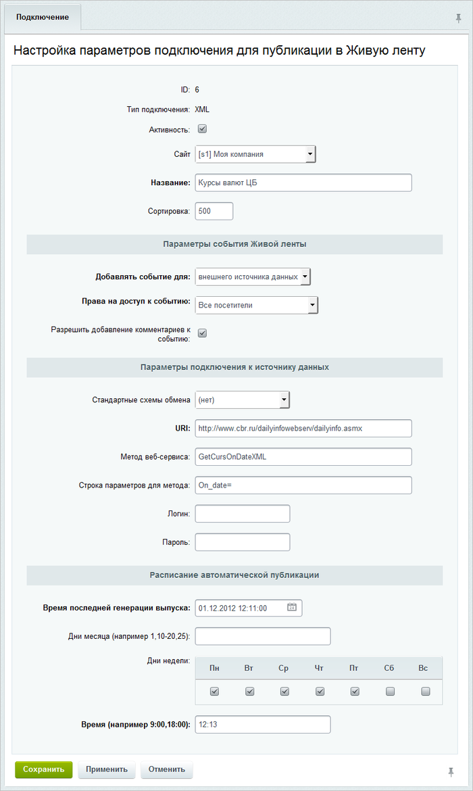
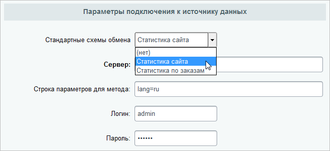

# Публикация в Живую ленту

**Навигация**
- [← Оглавление курса](index.md)
- [← Предыдущий: 20368 — Практические задания](lesson_20368.md)
- [Следующий: 3478 — Выгрузка данных из 1С:УТ →](lesson_3478.md)

Официальная страница урока: https://dev.1c-bitrix.ru/learning/course/index.php?COURSE_ID=48&LESSON_ID=3463

### Публикация в живую ленту

**Примечание**: В скриншотах на странице приведены демонстрационные данные.

Настройки модуля расположены в административной части портала в разделе **Сервисы** (Сервисы &gt; Внешние источники данных &gt; Публикация в Живую ленту). Всего с порталом может работать неограниченное количество внешних источников.

Подключаемый вебсервис должен возвращать данные в нужных полях. На текущий момент поддерживается 3 способа (протокола) импорта данных:

- **POST** - прием информации порталом по протоколу HTTP в виде запроса методом POST;
- **RSS** - импорт из внешнего RSS-источника;
- **Веб-сервис (XML)** - импорт на базе сервисно-ориентированной модели (SOA) или веб-сервисов.

### Интерфейс настройки для режима POST

Для настройки соединения необходимо заполнить данные:

- В поле **Название** указать название внешнего источника данных.
  **Обратите внимание**, это название будет непосредственно отображаться в Живой ленте, поэтому оно должно быть простым и понятным.
- В параметре **Добавлять событие для** указать тип события:
  В зависимости от выбора события необходимо выбрать сущность и само событие для POST-запроса.
  **Примечание:**Для типа **внешний источник данных** доступ можно поставить принудительно: либо **всем сотрудникам**, либо только **авторизованным**, либо **выбранным сотрудникам**. Также можно выбрать опцию **Разрешить комментарии** для возможности обсуждения.

  - **рабочей группы** - выбор рабочей группы, к которой привязывается событие;
  - **страницы пользователя** - выбрать сотрудника, на странице которого будет отображаться данные;
  - **ленты новостей** - выбрать информационный блок новостей;
  - **внешнего источника данных** - без привязки к какой-либо сущности портала;
  - **рабочие отчеты** - выбрать сотрудника, рабочий отчет которого будет выводиться;
  - **рабочее время** - выбрать сотрудника, рабочее время которого будет выводиться.
- В секции **Параметры подключения для передачи POST-запроса** указывается скрипт портала и параметры POST-запроса, который должна сформировать внешняя по отношению к порталу система:

  - **hash** - хеш авторизации, чтобы портал разрешил импорт данных;
  - **title** - заголовок события для отображения в Живой ленте;
  - **message** - текст события для отображения в Живой ленте (может включать HTML-форматирование);
  - **text-message** - текст события в виде простого текста (для уведомлений подписчиков по почте или jabber);
  - **url** - абсолютный путь события, для просмотра подробностей по этому событию, которые можно посмотреть вне портала.

### Интерфейс настройки для RSS

- Секция настроек **Параметры события Живой ленты** аналогична секции для настройки POST-запроса.
- В поле **URI** указывается путь источника RSS-ленты.
  **Примечание**: В связи с изменениями, связанными с безопасностью, убедитесь, что в настройках схем публикации в живую ленту типа "RSS-лента" установлена активной опция **В элементе description передается HTML** там, где это необходимо.
- В секции настроек **Расписание автоматической публикации** задается расписание импорта данных с внешнего источника.

### Интерфейс настройки для Веб-сервисов (XML)

В отличие от RSS, здесь указываются все необходимые параметры для обращения к веб-сервису, опубликованному на внешнем источнике данных: **URL**, **Метод**, **строку параметров запроса** и **параметры авторизации**:

Также есть два стандартных импорта - **статистики** и **заказов** с сайта под управлением «1C-Битрикс», где необходимо указать сервер и данные доступа к нему:

