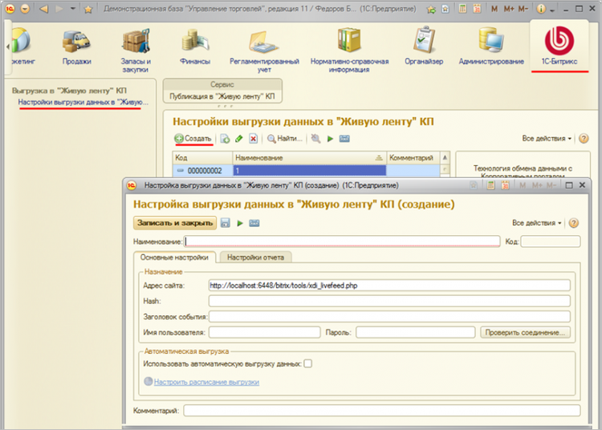
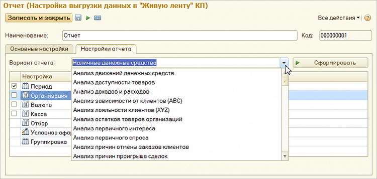
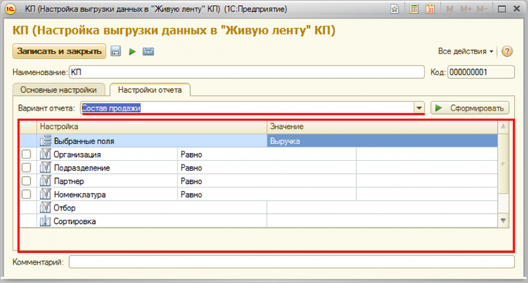
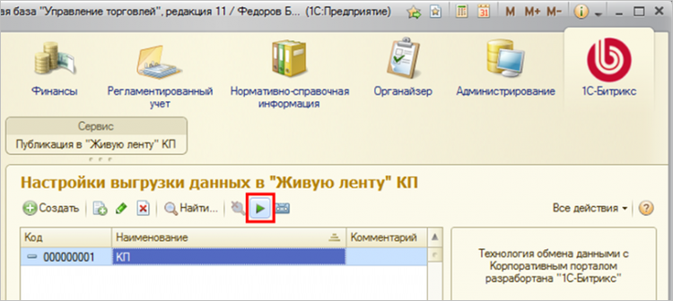
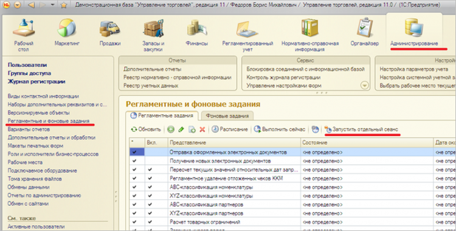
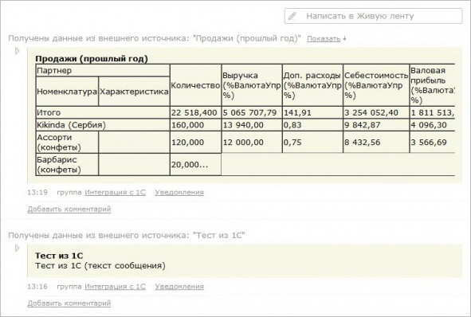
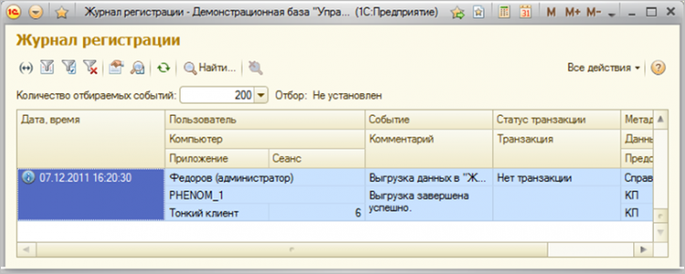

# Выгрузка данных из 1С:УТ

**Навигация**
- [← Оглавление курса](index.md)
- [← Предыдущий: 3463 — Публикация в Живую ленту](lesson_3463.md)
- [Следующий: 3479 — Импорт из RSS-ленты →](lesson_3479.md)

Официальная страница урока: https://dev.1c-bitrix.ru/learning/course/index.php?COURSE_ID=48&LESSON_ID=3478

Для **«1С:Управление торговлей»** был создан специальный модуль, который, используя режим POST-запросов, выгружает в Живую ленту различные отчеты. Модуль поставляется в виде [дополнения](http://1c.1c-bitrix.ru/bitrix/redirect.php?event1=download&event2=1c_intranet_module&event3=&goto=http%3A//www.1c-bitrix.ru/download/1c/livefeed.zip&af=a9136659bb3eae121a7adea56a432493) для **«1С:Управление торговлей»**, которое устанавливается в режиме сравнения и объединения конфигураций (инструкция по установке открывается после распаковки архива).

### Настройки выгрузки данных

После установки модуля появится интерфейс для настройки выгрузки данных на корпоративный портал, также можно создать неограниченное количество выгрузок со следующими настройками:

На вкладке **Основные настройки** необходимо определить параметры интеграции: в первую очередь указать параметры POST-запроса, которые 1С будет отправлять корпоративному порталу: **URL**, **hash** и **заголовок события**. Поля **Имя пользователя** и **Пароль** можно использовать для проверки установки соединения с порталом.

Учитывая, что в режиме POST-запросов корпоративный портал выступает пассивным потребителем информации, в 1С можно настроить автоматическую выгрузку данных в указанное время:

На вкладке **Настройки отчета** выбирается один из представленных на выбор отчетов:

После выбора отчета появится интерфейс его настройки, где можно указать, параметры выборки данных:

Нажатием кнопки **Сформировать** можно посмотреть результат произведенных настроек - то, что будет впоследствии выгружаться в Живую ленту.

Настройка окончена, теперь можно приступать к  выгрузке данных.

### Ручной запуск обмена

Для ручного запуска обмена данными по настройке (узлу обмена) нажимаем кнопку **Выгрузить данные в «Живую ленту» КП** в форме узла или форме списка узлов. Будет запущен процесс обмена, по окончании которого будет выдано соответствующее сообщение:

### Автоматический запуск обмена

Если настроена автоматическая выгрузка по расписанию, то 1С самостоятельно будет формировать данные и отправлять их Корпоративному порталу. Если на сервере «1С:Предприятия» включено выполнение регламентных заданий, обмен будет происходить автоматически по заданному расписанию. В файловом варианте работы для выполнения автоматического обмена по расписанию, должен быть запущен специальный сеанс, обрабатывающий регламентные задания:

### Результат обмена в ЖЛ

После выполнения обмена, в живой ленте корпоративного портала появляется сообщение примерно следующего вида:

Также в настройках импорта на Корпоративном портале можно управлять доступом к этой информации. Так, отчет по продажам можно вывести, например, в рабочую группу **Продажи**. В итоге отчеты в Живой ленте увидят только те, кто имеет право их просматривать.

### Журнал обмена

В 1С доступен **Журнал обмена**, в котором фиксируются результаты всех выгрузок.

Можно посмотреть историю обмена, удачные и неудачные попытки выгрузки и зафиксированные ошибки, например, отсутствие соединения с порталом. Эта информация поможет разобраться в причинах, если в нужное время отчет не появился на портале:

**Примечание:**Для быстрого просмотра протокола обмена по строке журнала достаточно навести указатель мыши на поле **Комментарий**.
