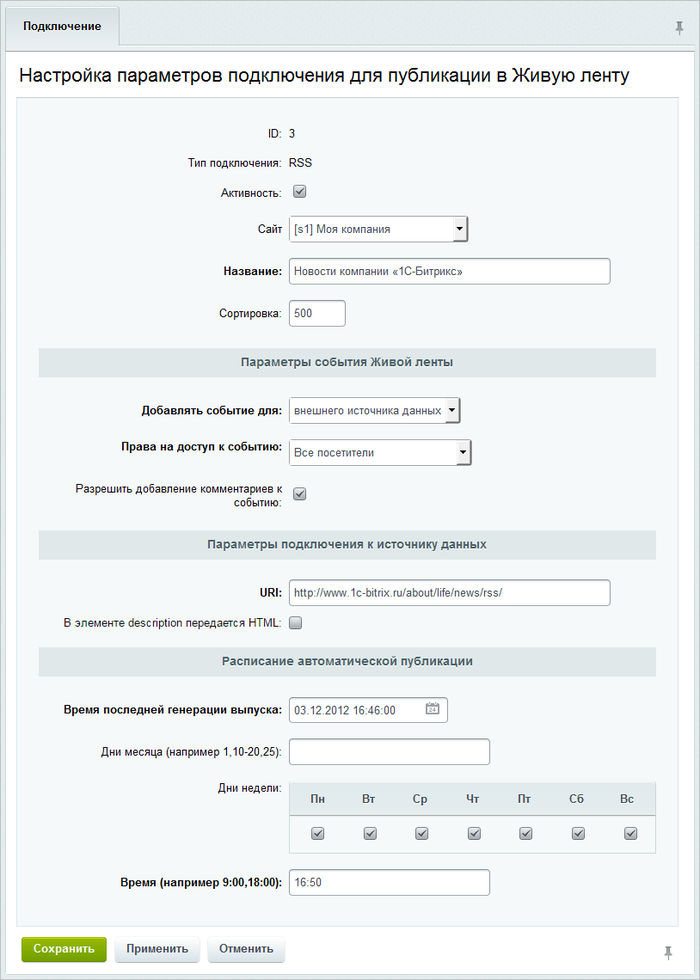

# Импорт из RSS-ленты

**Навигация**
- [← Оглавление курса](index.md)
- [← Предыдущий: 3478 — Выгрузка данных из 1С:УТ](lesson_3478.md)
- [Следующий: 3480 — Импорт из веб-сервиса →](lesson_3480.md)

Официальная страница урока: https://dev.1c-bitrix.ru/learning/course/index.php?COURSE_ID=48&LESSON_ID=3479

Для демонстрации воспользуемся [RSS-лентой](http://www.1c-bitrix.ru/about/life/news/rss/) новостей сайта «1C-Битрикс».

В данном случае необходимо указать **URL** RSS-источника и настроить **расписание** для импорта событий:

В итоге в Живой ленте мы увидим новости компании «1C-Битрикс».
