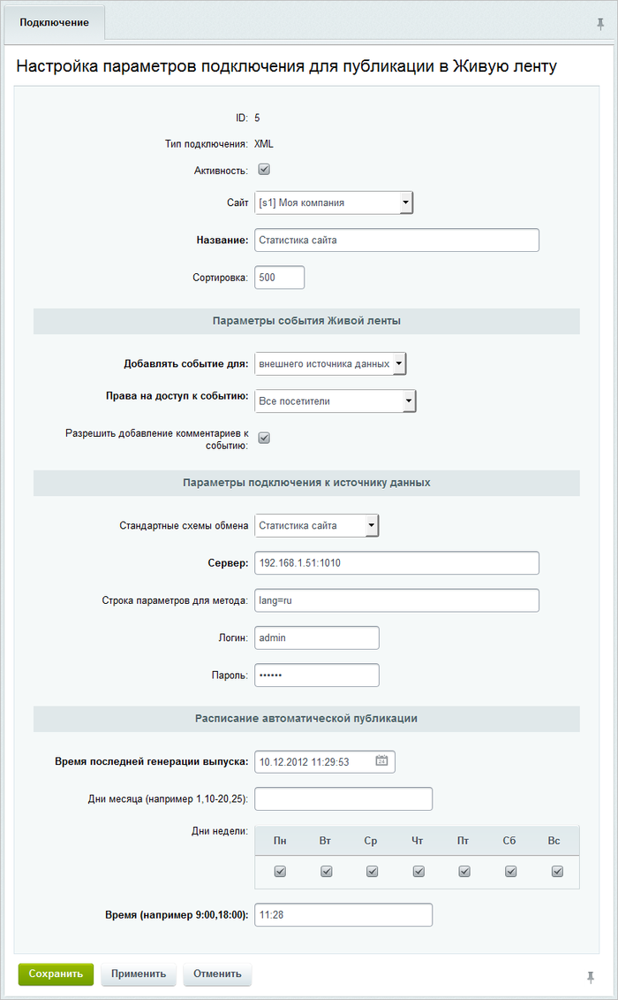
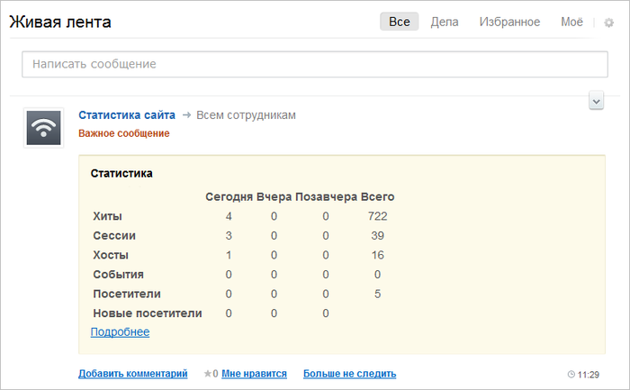

# Импорт из веб-сервиса

**Навигация**
- [← Оглавление курса](index.md)
- [← Предыдущий: 3479 — Импорт из RSS-ленты](lesson_3479.md)
- [Следующий: 12910 — Работа с Диском →](lesson_12910.md)

Официальная страница урока: https://dev.1c-bitrix.ru/learning/course/index.php?COURSE_ID=48&LESSON_ID=3480

Для демонстрации воспользуемся стандартным веб-сервисом «1C-Битрикс», который предоставляет данные статистики по сайту.

**Примечание:**На стороне сайта должен быть инсталлирован модуль **Веб-сервисы**.

В поле **Стандартные схемы обмена** необходимо выбрать из списка **Статистика сайта**, указать **URL** и **параметры авторизации**, а также выбрать **расписание** получения отчета.

В живой ленте в назначенное время будет отображаться статистика сайта:

