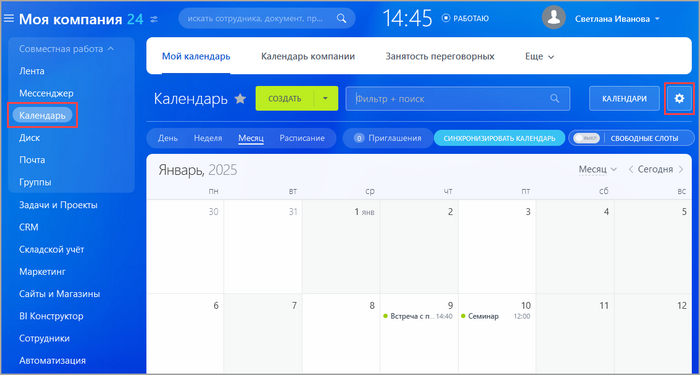
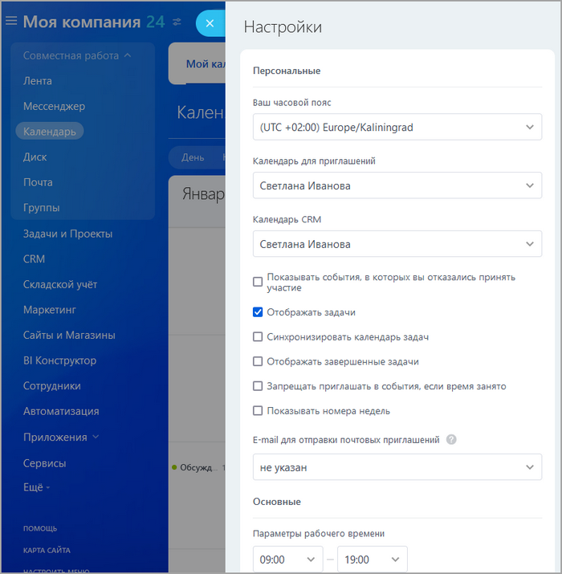
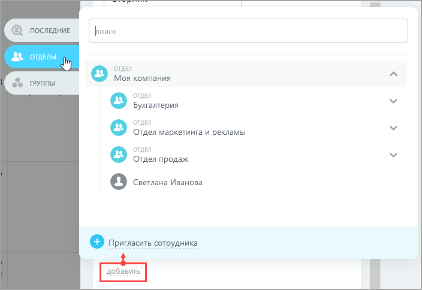
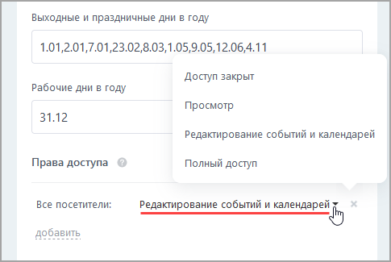

# Настройки календаря

**Навигация**
- [← Оглавление курса](index.md)
- [← Предыдущий: 12147 — Настройки модуля календарей](lesson_12147.md)
- [Следующий: 13068 — Настройка синхронизации Календарей с Google.Calendar →](lesson_13068.md)

Официальная страница урока: https://dev.1c-bitrix.ru/learning/course/index.php?COURSE_ID=48&LESSON_ID=3500

Чтобы настроить календарь, нажмите "шестеренку":





Здесь

			частично дублируются

                     

		 настройки модуля, которые мы делали в административной части. То есть можно установить выходные и праздничные дни недели и года, время начала и окончания рабочего дня. Здесь же настраивается отображение задач и событий:


В секции **Права доступа** настраиваются уровни доступа к календарю для различных категорий пользователей








<!-- &lt;p&gt;Начальник может смотреть календари подчиненных вне зависимости от выставляемых подчиненными прав доступа.
&lt;/p&gt; -->


**Примечание**: подробнее о календарях смотрите на странице [Поддержка24](https://helpdesk.bitrix24.ru/open/17018898/).


## Ошибка ErrorFolderNotFound

При синхронизации календарей пользователей с **MS Exchange** может возникать ошибка: **ErrorFolderNotFound**. Причина ошибки - в настройке прав доступа пользователей к **MS Exchange**.

Для установки нужного уровня прав в **power shell** выполните:


```
Get-MailboxDatabase -identity “[mailbox database name]” | Add-ADPermission -user [username] -AccessRights GenericAll
```


Где `mailbox database name` - результат выполнения команды:


```
Get-MailboxDatabase | ft Identity
```
