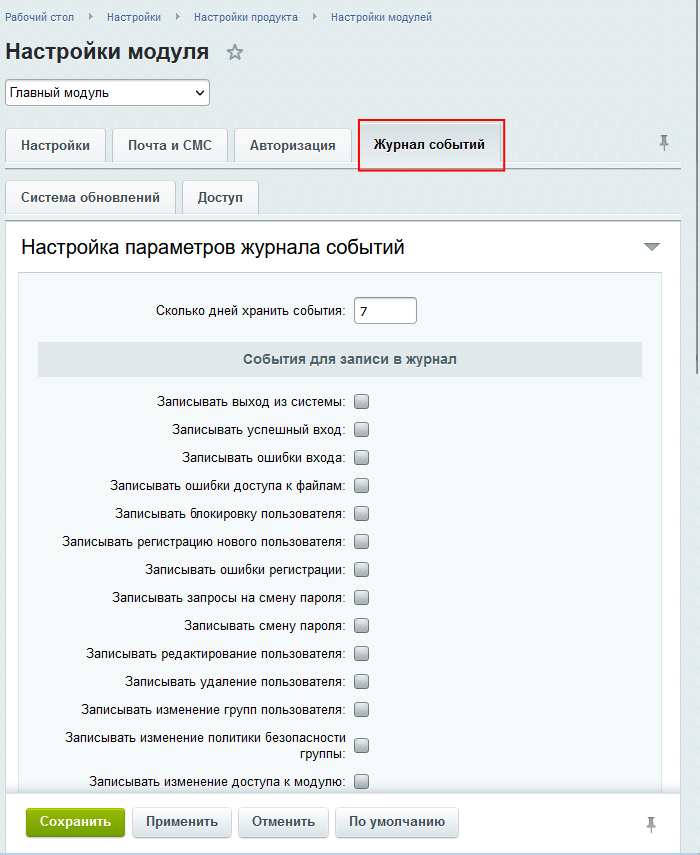

# Контроль за изменениями в системе

**Навигация**
- [← Оглавление курса](index.md)
- [← Предыдущий: 3261 — Настройка HTTPS-соединения](lesson_3261.md)
- [Следующий: 3799 — Пример настроек закладки Безопасность группы пользователей →](lesson_3799.md)

Официальная страница урока: https://dev.1c-bitrix.ru/learning/course/index.php?COURSE_ID=48&LESSON_ID=3556

|  | ### Следим за изменениями |
| --- | --- |

Одной из задач обеспечения безопасности в работе сайта является мониторинг изменений в системе. Для осуществления такого мониторинга можно использовать несколько инструментов.

|  | #### Журнал событий |
| --- | --- |

Журнал событий

			описан выше

                    На странице Журнал событий (Настройки &gt; Инструменты &gt; Журнал событий) вы можете просмотреть события сайта.

[Подробнее ...](lesson_2034.md)

		, вы с ним, вероятно, уже знакомы.  Настраивается он на

			одноименной закладке

                    

		 **Главного модуля**.

|  | #### Журнал изменений |
| --- | --- |

Специальный компонент

			Журнал изменений

                    На странице **Список событий** (*Аналитика &gt; События &gt; События*) представлена информация по каждому событию, произошедшему как на сайте, так и вне сайта.

						[Описание компонента «События» в пользовательской документации.](http://dev.1c-bitrix.ru/user_help/detail.php?ID=63379)

		 , который выводит список изменений:

- пользователи (добавление);
- страницы (изменение, добавление, удаление);
- меню (изменение, создание, удаление);
- файлы (изменение, добавление, удаление, перемещение, копирование, переименование);
- разделы (добавление, изменение, удаление, перемещение, копирование, переименование);
- инфоблоки (добавление, изменение, удаление элементов и разделов);
- форумы общие и в рамках социальных сетей (сообщение: скрытие,показ, изменение, перенос, удаление; тема: показ, скрытие, прикрепление, открепление, открытие, закрытие, удаление, изменение).

Для использования компонента создайте отдельную страницу на сайте с доступом к ней для нужной группы пользователей. Разместите на ней указанный компонент и настройте его.

Для контроля за изменениями в инфоблоках необходимо настроить

			параметры журнала событий

                    

		 для конкретного инфоблока в его настройках.

|  | #### В чём разница? |
| --- | --- |

**Журнал изменений** и **Журнал событий** в чем-то перекликаются. Отличие их в том, что Журнал изменений более подходит для мониторинга изменений контента, а Журнал событий - для мониторинга изменений настройки системы.
