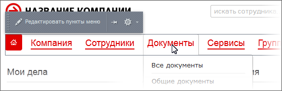
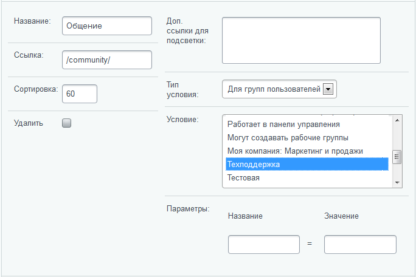

# Запретить показ пункта меню

**Навигация**
- [← Оглавление курса](index.md)
- [← Предыдущий: 4781 — Многодепартаментность](lesson_4781.md)
- [Следующий: 6306 — Реализация сценария использования абонементов на посещения →](lesson_6306.md)

Официальная страница урока: https://dev.1c-bitrix.ru/learning/course/index.php?COURSE_ID=48&LESSON_ID=3561

На примере главного меню портала в

			дизайне Lite

                    В дизайне Битрикс24 такие действия неприменимы.

		 рассмотрим, как можно запретить показ какого-либо его пункта. Например, запретим вывод пункта меню **Общение** для группы сотрудников **Техподдержка**.

В режиме правки наведите курсор на главное меню портала и кликните по всплывающей кнопке **Редактировать пункты меню**:

Откроется окно редактирования меню:

Пройдите по ссылке Редактировать меню в Панели управления, откроется форма параметров меню. Найдите в ней параметры пункта **Общение**:

В опции **Тип условия** выберите **Для групп пользователей**, после чего изменится вид опции **Условие**:

Выберите группу **Техподдержка** и отныне сотрудники, входящие в нее, не будут видеть пункт главного меню портала **Общение**.

Сохраните внесенные изменения
