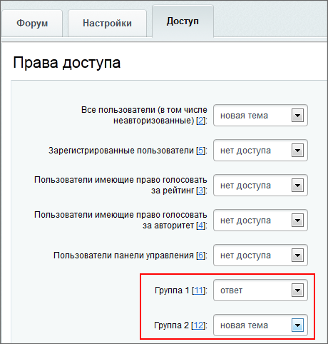

# Примеры работы

**Навигация**
- [← Оглавление курса](index.md)
- [← Предыдущий: 1987 — Расчёт и особенности рейтингов](lesson_1987.md)
- [Следующий: 3106 — Смайлы →](lesson_3106.md)

Официальная страница урока: https://dev.1c-bitrix.ru/learning/course/index.php?COURSE_ID=48&LESSON_ID=3582

**Примеры из жизни**

Пара примеров работы с рейтингами на основе модуля **Форум**

### Настройка званий на форуме

Настроим систему рейтингов так, чтоб пользователь на форуме получал звание в зависимости от количества нормированных голосов у него.

- Для начала необходимо отключить опцию **Включить бонусную систему** в настройках модуля Форум (Настройки &gt; Настройки продукта &gt; Настройки модулей &gt; Форум), это позволит использовать на форуме **Рейтинги** вместо собственной системы подсчета баллов.
  **Примечание:** Для форумов используется только **Авторитет**.
- На странице **Звания** (Сервисы &gt; Форумы &gt; Звания) необходимо
  			создать звания
                      На любом форуме есть проблема оценки сообщений пользователя и его квалификации. В "1С-Битрикс: Управление сайтом" для этого используются стандартные механизмы: баллы и звания.
  [Подробнее ...](lesson_2966.md)
  		, которые будут выдаваться пользователям, в зависимости от количества нормированных голосов у пользователя.

### Перемещение пользователя в группу в зависимости от рейтингов на примере форума

- Создадим 2 группы пользователей (Настройки &gt; Пользователи &gt; Список пользователей): **Группа 1** и **Группа 2**.
  Пользователи 1-й группы смогут лишь отвечать на сообщения в форуме, но не смогут создавать новые темы, пользователи же 2-й группы будут иметь доступ к обсуждению существующих тем, а также возможность создания новых тем.
- Настроим доступ
                      Управление форумами осуществляется, как правило, в Административном разделе. Создание новых форумов возможно только в административном разделе.
  [Подробнее ...](lesson_2964.md)
  		 к желаемому форуму для созданных ранее групп на странице **Список форумов** (Сервисы &gt; Форумы &gt; Список форумов, закладка **Доступ**)
  			следующим образом
                      
  		:

  - Группа 1: **Ответ**;
  - Группа 2: **Новая тема**.
- Создадим новые правила обработки (Сервисы &gt; Рейтинги &gt; Правила обработки):
  В качестве **Условия** выберем **Значение авторитета**. В поле **Кол-во нормированных голосов** для разных правил укажем:
  

  - Добавление в Группу 1;
  - Удаление из Группы 1;
  - Добавление в Группу 2.

  - Добавление в Группу 1 - **Больше или равно 0**. Все пользователи форума автоматически будут добавлены в эту группу для того, чтобы они смогли отвечать в чужих темах;
  - Удаление из Группы 1 - **Больше или равно 10**; Когда пользователь достигнет авторитета 10 и больше, система удалит его из Группы 1.
  - Добавление в Группу 2 - **Больше или равно 10**. Система добавить пользователей в группу, чтоб они смогли создавать собственные темы на форуме.

После произведенных настроек пользователи, в зависимости от их авторитета, будут переводиться в соответствующие группы и получать определенные права на форуме.
