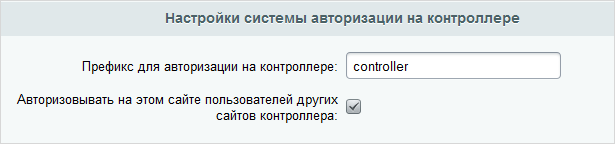

# Авторизация

**Навигация**
- [← Оглавление курса](index.md)
- [← Предыдущий: 3526 — Счётчики](lesson_3526.md)
- [Следующий: 2920 — Публикация новостей с контроллера на подключенных сайтах →](lesson_2920.md)

Официальная страница урока: https://dev.1c-bitrix.ru/learning/course/index.php?COURSE_ID=48&LESSON_ID=3587

|  | Страница **Авторизация** (Сервисы &gt; Контроллер &gt; Авторизация) позволяет настроить авторизацию пользователей на подчинённых сайтах, между подчинёнными сайтами и на контроллере. |
| --- | --- |

Для задания параметров авторизации необходимо выбрать нужный вид авторизации, установить флажок, разрешающий авторизацию и задать соответствие групп между сайтами с помощью **Символьных идентификаторов**. Символьный идентификатор группы задаётся в настройках группы, в одноимённом поле.

**Примечание**: даже если Символьные идентификаторы не заданы, то группу **Администраторы** и **Все пользователи (в том числе не авторизованные)** всегда можно задать, используя коды `administrators` и `everyone` соответственно.

Кроме того, необходимо выполнить настройки

			Главного модуля

Главный модуль задаёт параметры работы системы в целом. Форма настройки находится на странице Настройки &gt; Настройки продукта &gt; Настройки модулей &gt; Главный модуль.

[Подробнее](https://dev.1c-bitrix.ru/user_help/settings/settings/settings.php)...

		 на подчиненных сайтах. На закладке **Журнал событий** доступны следующие параметры:

- **Префикс для авторизации на контроллере** – указывается префикс, который будет использоваться для авторизации пользователей контроллера;
- **Авторизовывать на этом сайте пользователей других сайтов контроллера** – при отмеченной опции пользователи других сайтов контроллера смогут авторизовываться на этом сайте, причем обязательно должна быть разрешена авторизация между подчиненными сайтами на контроллере и настроено соответствие групп (см. выше).

Если разрешена авторизация пользователей контроллера на подчиненных сайтах, задано соответствие групп пользователей и указан префикс для авторизации на контроллере, например **controller**, то при заходе на подчиненный сайт пользователь должен указать в качестве логина `controller\логин_на_контроллере` и в качестве пароля `пароль_на_контроллере`. Пользователь авторизуется, причем на подчиненном сайте будет создан локальный пользователь с соответствующими именем и правами.

Если разрешена авторизация пользователей подчиненных сайтов на контроллере и задано соответствие групп пользователей, то при заходе на контроллер пользователь должен указать в качестве логина `доменное_имя_подчиненного_сайта\логин_на_сайте` и в качестве пароля `пароль_на_сайте`. На контроллере будет создан локальный пользователь с соответствующими именем и правами.

|  | ### Пример |
| --- | --- |

Пользователь принадлежит группе **Сотрудники техподдержки** на контроллере. На странице **Авторизация** контроллера на закладке **На подчинённых сайтах** задано, что группа **Сотрудники ТП** соответствует группе **Администраторы магазина** на подчинённом сайте.

В результате пользователь, авторизуясь на подчинённом сайте под логином контроллера (даже если он и не имеет аккаунта на этом сайте), приобретает права группы **Администраторы магазина**, даже если он и не входит в эту группу.

**Примечание**: Администраторы контроллера всегда могут авторизовываться на подчиненных сайтах с наивысшими правами. При подключении сайта к контроллеру на подключенном сайте создается локальный пользователь-администратор, пароль от которого в зашифрованном виде хранится на контроллере.

<!-- &lt;p&gt;При входе на подчинённый в адресе страницы будет прописываться логин через обратный слэш. Например: &lt;span class="link"&gt;www.site.com\login&lt;/span&gt;.&lt;/p&gt; -->

|  | #### Документация по теме: |
| --- | --- |

- [Авторизация](https://dev.1c-bitrix.ru/user_help/service/controller/controller_auth.php)
