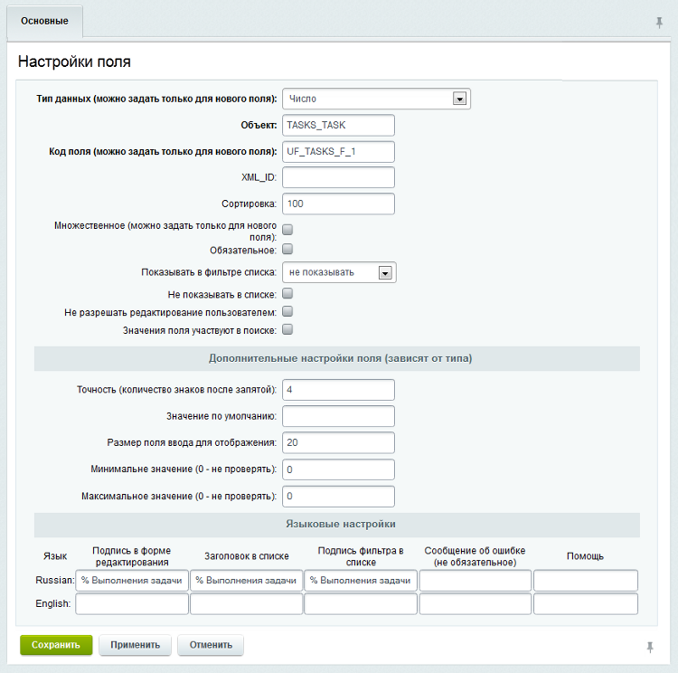
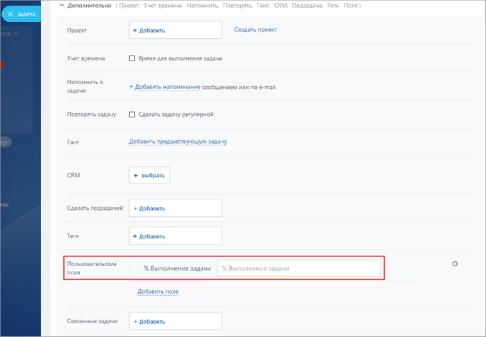
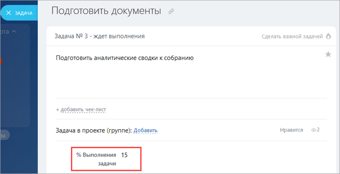

# Добавление пользовательских полей для задач

**Навигация**
- [← Оглавление курса](index.md)
- [← Предыдущий: 13758 — Задачи на портале](lesson_13758.md)
- [Следующий: 12890 — «1С-Битрикс24»: два в одном →](lesson_12890.md)

Официальная страница урока: https://dev.1c-bitrix.ru/learning/course/index.php?COURSE_ID=48&LESSON_ID=3764

Система позволяет добавить собственные поля для задач.

### Создание поля

Рассмотрим пример создания поля, в котором сотрудник сможет самостоятельно указывать процент выполнения задачи.

Создадим новое пользовательское поле на странице **Пользовательские поля** (Настройки &gt; Настройки продукта &gt; Пользовательские поля):

- в поле **Тип данных** выберем **число**;
- в поле **Объект** укажем `TASKS_TASK`;
- зададим уникальный **Код поля**, который будет начинаться с `UF_`, например `UF_TASKS_F_1`;
- укажем подписи для поля в блоке **Языковые настройки**.

### Поле в публичной части

Теперь при создании и просмотре задачи пользователю будет доступно соответствующее поле:

