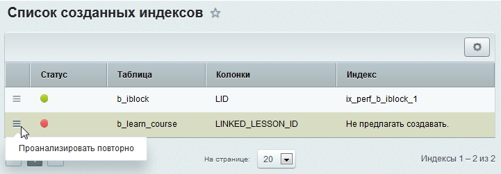

# Индексы

**Навигация**
- [← Оглавление курса](index.md)
- [← Предыдущий: 5129 — Таблицы в базе данных](lesson_5129.md)
- [Следующий: 5130 — Настройки и ошибки PHP →](lesson_5130.md)

Официальная страница урока: https://dev.1c-bitrix.ru/learning/course/index.php?COURSE_ID=48&LESSON_ID=3798

**Индексы**

	 Заочно нельзя сказать какие

			индексы

                    **Поиско́вый и́ндекс** - структура данных, которая содержит информацию о документах и используется при поиске на сайте.

		 необходимо создавать, надо всегда рассматривать конкретную ситуацию. Они нужны для конкретных выборок на конкретных проектах. В зависимости от архитектуры и логики проекта медленные запросы получаются у каждого свои, и для них нужны свои индексы, часто составные.

Страницы **Анализ индексов** и **Список индексов** - инструмент анализа и рекомендаций по созданию индексов.

### Создание индекса (видеоурок)

### Анализ индексов

Анализ индексов лучше производить после получения списка медленных запросов. Для этого в настройках модуля включите

			соответствующую опцию

                    

		 и установите время, после которого запрос будет считаться медленным. Рекомендуемое время работы монитора -

			сутки

Данное время работы можно установить, если отмечена опция **Записывать только медленные SQL запросы**. В противном случае время работы монитора составляет до 1 часа.

		, но, опять же, надо учитывать реалии конкретного проекта.

После получения списка медленных запросов на странице **Анализ индексов** (Настройки &gt; Производительность &gt; Индексы &gt; Анализ индексов) необходимо воспользоваться кнопкой **Выполнить анализ собранных SQL запросов** и отобразится список всех запросов, которые были совершены за это время, отсортированных по имени таблицы:

В общем списке в первую очередь нужно обращать внимание на запросы с большей продолжительностью и на большое их количество. Но и в случае больших величин у этих параметров не на каждый запрос стоит создавать индекс (возможно нужно просто исправить код компонента). Косвенным критерием успешности создания индекса служит время выполнения запроса до и после создания индекса.

При необходимости можно посмотреть план выполнения любого запроса. Команда **Детальный анализ** позволяет перейти к анализу конкретного запроса и созданию его индекса.

На этой странице жирным шрифтом выделяются таблица и колонки, к которым обращается запрос.

Структура таблицы

                    

		 - информационная закладка. Главное в ней - размер таблицы. И если размер большой (к примеру, больше 100 мегабайт), то построение и удаление индексов лучше проводить в часы наименьшей нагрузки на сайт.

Анализ запросов

                    

		 - закладка с собственно анализом запроса. При принятии решения о создании индекса учитывайте, селективен ли этот запрос и процент

			селективности

                    **Селективность индекса** – это отношение количества различных проиндексированных значений к общему количеству строк в таблице. Индекс с высокой селективностью хорош тем, что позволяет Базе данных при поиске соответствий отфильтровывать больше строк. [Подробнее](https://backendinterview.ru/db/relational/mysql/indexes.html)...

		. Информация об этом выводится в таблице.

**Создание индекса** - закладка, на которой непосредственно принимается решение о создании (или нет) индекса. Те запросы, по которым не нужно создавать индекс, можно внести в список **Не предлагать создавать**.

Запросы, по которым принято решение, пропадают из списка запросов и появляются на странице **Список индексов**.

### Список индексов

Страница **Список индексов** (Настройки &gt; Производительность &gt; Индексы &gt; Список индексов) отображает результаты ваших решений по анализу тех или иных запросов. "Зелёный" статус - индекс создан, "красный" статус - индекс не будет создаваться.

