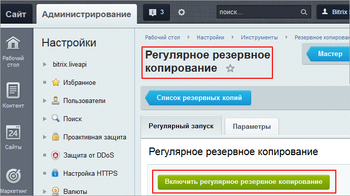
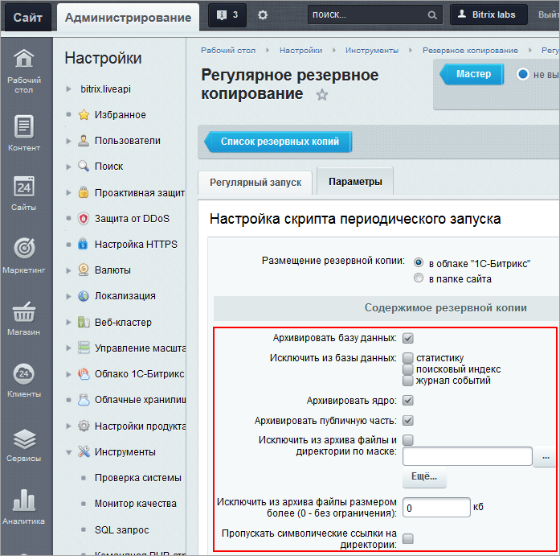
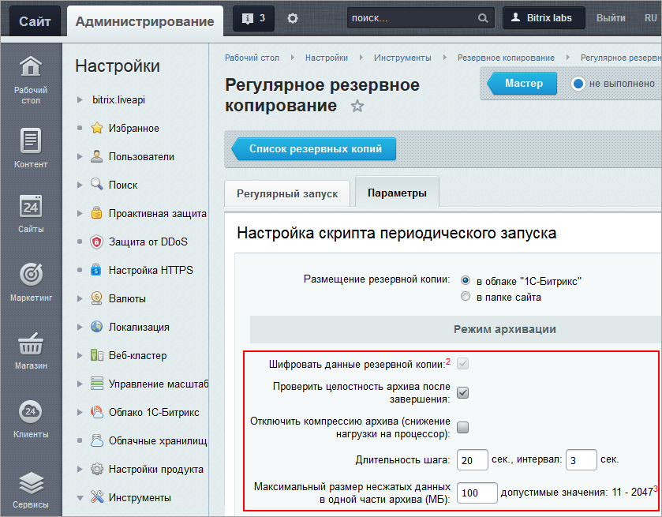
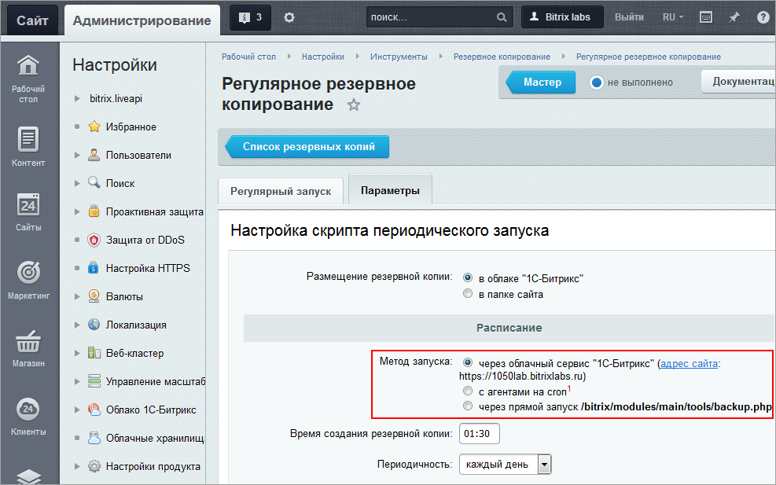

# Регулярное резервное копирование

**Навигация**
- [← Оглавление курса](index.md)
- [← Предыдущий: 7080 — Хранение и шифрование резервных копий](lesson_7080.md)
- [Следующий: 2563 — Резервное копирование из командной строки →](lesson_2563.md)

Официальная страница урока: https://dev.1c-bitrix.ru/learning/course/index.php?COURSE_ID=48&LESSON_ID=4464

### Видеоурок

Во многих случаях потеря или повреждение информации могут стоить очень дорого. Чтобы дополнительно обезопасить себя от возможных проблем с восстановлением данных, настройте регулярное резервное копирование. Так вы сможете быть уверены, что не забудете сделать бэкап, и что информация в резервной копии будет актуальной.

### Регулярное резервное копирование

С версии 12.0 в *Bitrix Framework* возможно создание резервных копий в автоматическом режиме. Параметры автоматического резервного копирования задаются на странице **Регулярное резервное копирование** (Настройки &gt; Инструменты &gt; Резервное копирование &gt; Регулярное резервное копирование).

**Примечание**: Детальное описание полей формы смотрите в [документации](http://dev.1c-bitrix.ru/user_help/settings/utilities/dump/dump_auto.php).

### Настройки автоматического бэкапа

На странице **Регулярное резервное копирование** можно:

1. Включить или выключить
                      
  		 регулярное копирование
2. Указать,
  			где размещать резервную копию
                      
  		 - локально на сайте, либо [в облаках](lesson_7080.md#backup_cloud): *1С-Битрикс* или в стороннем облаке.
3. Задать
  			расписание копирования
                      
  **Примечание**: минимальная частота создания резервной копии - 1 день.
4. Настроить порядок
  			сохранения или удаления локальных копий
                      
5. Указать, какие
  			части сайта исключать или включать
                      
  		 в резервную копию (аналогично настройкам при ручном архивировании)
6. Настроить
  			режим архивации
                      
  **Примечание**: при автоматическом создании резервной копии, в отличие от ручного создания, приходится хранить пароль пользователя в базе данных в зашифрованном виде. Для шифрования используется лицензионный ключ. То есть несанкционированный доступ к файлу архива возможен, если только злоумышленник получит полный доступ к вашему сайту. Даже если такое произойдёт, то удалить архив сайта с облака *"1С-Битрикс"* ему не удастся.
7. Выбрать метод запуска резервного копирования. Доступен запуск:
  

  - через облачный сервис *1С-Битрикс*
  - с агентами на *cron*. Нужно настроить выполнение агентов на *cron*, запуская каждую минуту `/bitrix/modules/main/tools/cron_events.php`. При этом автоматическое резервирование будет выключено
  - через прямой запуск `/bitrix/modules/main/tools/backup.php`. Если по каким-то причинам на проекте не используются
    			агенты
                        **Агенты** - технология, позволяющая запускать произвольные PHP функции (агенты) с заданной периодичностью. Технически агент - это запись в специальной таблице.
    [Читать подробнее...](https://dev.1c-bitrix.ru/learning/course/index.php?COURSE_ID=43&CHAPTER_ID=03436)
    		, то необходимо настроить на определенное время запуск php скрипта `/bitrix/modules/main/tools/backup.php` через панель хостинга

### Запуск через облачный сервис

#### Настройка расписания

Для настройки регулярного резервного копирования через облачный сервис достаточно задать расписание. Администратору не нужно делать дополнительных настроек на сервере, поэтому такой вариант рекомендуется для небольших проектов.

#### Процесс копирования

После запуска процесса система передает облачному сервису уникальный идентификатор расписания. Когда наступает время создания резервной копии, сервис открывает специальную страницу на вашем сайте и передает ей параметры для создания копии. Доступ к административной части сервису не нужен, поэтому она может быть закрыта по IP.

Этапы создания резервной копии

1. Создание локальной копии на сервере.
2. Проверка целостности копии с помощью второй копии.
3. Отправка копии в облачное хранилище.
4. Удаление локальной копии после успешной загрузки в облако.

#### Отображение резервных копий

После завершения процесса в списках резервных копий появится новая запись на страницах:

- *Настройки &gt; Облако 1С-Битрикс &gt; Резервные копии* — список облачных резервных копий
- *Настройки &gt; Инструменты &gt; Резервное копирование &gt; Список резервных копий* — список всех резервных копий, доступных для восстановления

#### Особенности времени выполнения

Время завершения резервной копии отличается от времени, указанного в настройках регулярного копирования. В списке отображается время завершения по часовому поясу сервера, и оно может варьироваться.

**Пример.** Система выполняет ежедневное резервное копирование в 04:00. В списке две копии: время завершения первой — 06:35, второй — 06:54.

Точное выполнение резервного копирования в заданное время не всегда возможно. Процесс зависит от наличия свободных ресурсов для выполнения задачи.

Гарантировать точное время могут другие методы запуска регулярного резервного копирования: агенты на cron или прямой запуск скрипта `/bitrix/modules/main/tools/backup.php`.

### Запуск на cron

Скрипт `/bitrix/modules/main/tools/cron_events.php` выполняется на *cron*'е каждую минуту. Сначала он проверяет отправку почты и выполняет системные агенты. Затем, если наступило установленное в настройках время, создаётся резервная копия. Создание копии задано не через агент сознательно: чтобы отправка почты и выполнение агентов могли выполняться независимо от создания резервной копии.

Если произошла какая-то ошибка при автоматическом резервном копировании, то повторный запуск скрипта будет возможен только через сутки. А в течение этих суток создать бэкап можно только вручную. Это сделано для того, чтобы на хостинге не возникало неприятных ситуаций из-за ошибок и зацикливания резервного копирования.

В случае ошибки в [системный журнал](lesson_2034.md) заносится соответствующее уведомление. На странице Настройки &gt; Инструменты &gt; Резервное копирование &gt; Журнал резервного копирования расположен фильтр системного журнала, настроенный на вывод только записей по резервным копиям:

### Дополнительно

- [Настройка резервного копирования сайта](https://dev.1c-bitrix.ru/learning/course/index.php?COURSE_ID=37&LESSON_ID=8857) в *BitrixVM/BitrixEnv* (курс Виртуальная машина BitrixVM);
- [Автоматическое резервное копирование в облако битрикс](http://dev.1c-bitrix.ru/community/blogs/product_features/automatic-backup-to-the-bitrixcloud.php) (блог).
