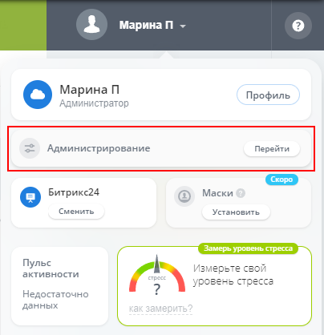
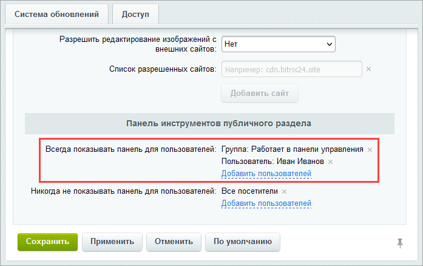
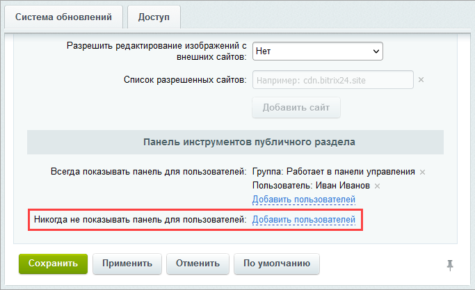

# Административный раздел

**Навигация**
- [← Оглавление курса](index.md)
- [← Предыдущий: 21860 — Настройка DNS для домена портала](lesson_21860.md)
- [Следующий: 1839 — Логика интерфейса административного раздела →](lesson_1839.md)

Официальная страница урока: https://dev.1c-bitrix.ru/learning/course/index.php?COURSE_ID=48&LESSON_ID=4508

|  | ### Где настройки сайта |
| --- | --- |

> **Административный раздел** - часть коробочных продуктов 1С-Битрикс (*1С-Битрикс: Управление сайтом* и *коробочная версия Битрикс24*), где производится управление модулями системы, структурой сайта, его содержанием, посетителями и другими составляющими сайта. Недоступен для просмотра обычным посетителям сайта. Список возможностей Контент-менеджера в этом разделе зависит от того, какие права дал ему Администратор.

Изучите основные элементы интерфейса

			Административного раздела

                    **Административный раздел** - раздел системы, недоступный для просмотра обычным посетителям сайта. В нём производятся настройки сайта и системы для работы.

[Подробнее...](https://dev.1c-bitrix.ru/learning/course/index.php?COURSE_ID=34&CHAPTER_ID=04459&LESSON_PATH=3905.4455.4459)

		 системы, с помощью которых выполняется полное управление содержанием и настройками сайта.

			Публичная часть

                    **Публичный раздел** - это часть сайта, которая доступна всем пользователям ресурса. Иначе говоря, это сам сайт в том виде, в котором его видят посетители сайта. [Подробнее...](https://dev.1c-bitrix.ru/learning/course/index.php?COURSE_ID=34&CHAPTER_ID=04458&LESSON_PATH=3905.4455.4458)

		 у каждого сайта - своя. А вот Административный раздел в коробочных продуктах 1С-Битрикс везде одинаковый. Изучив его один раз, Контент-менеджер сможет работать с любым сайтом.

#### Как попасть в Административный раздел?

Для перехода в Административный раздел служит вкладка **Администрирование**, расположенная на

			Панели управления

                    На Панели управления собраны все команды, которые доступны контент-менеджеру при работе с сайтом. [Подробнее](/learning/course/index.php?COURSE_ID=34&LESSON_ID=1831)...

		 в Публичном разделе сайта. Это основной способ для *1С-Битрикс: Управление сайтом*.

Есть и другой способ перехода. Можно сразу авторизоваться в административной части системы, если к адресу сайта дописать

			/bitrix/

                    То есть в адресной строке браузера должно быть набрано: https://&lt;домен сайта&gt;/bitrix/

		 и открыть сайт по такой ссылке.

Приведем пример: пусть ваш сайт называется myshop.ru. Тогда ссылка для перехода в админку сайта будет выглядеть так: https://myshop.ru/bitrix/.

В *коробочной версии Битрикс24* такая панель управления по умолчанию

			скрыта

                    Изменить эти настройки так, чтобы панель отображалась, может администратор в настройках **Главного модуля** (вкладка Настройки, секция Панель инструментов публичного раздела).

Описание параметров в [пользовательской документации](https://dev.1c-bitrix.ru/user_help/settings/settings/settings.php).

		 для всех пользователей. Поэтому переход в административный раздел выполняется через дописывание `/bitrix/` в адресе портала или через кнопку **Администрирование** в

			виджете пользователя

                    

Подробнее о виджете на [helpdesk.bitrix24.ru](https://helpdesk.bitrix24.ru/open/15000834/).

		 (кнопка доступна если пользователь состоит в группе пользователей **Администраторы**).

**Обратите внимание:** информация актуальна только для *коробочной версии Битрикс24*. В *облачной версии Битрикс24* нет административного раздела.

## Как включить показ административной панели?

Выполните следующие действия:

1. Авторизуйтесь под администратором и перейдите в административный раздел по ссылке http://адрес_вашего_портала/bitrix/.
2. Перейдите на страницу с настройками главного модуля (Настройки &gt; Настройки продукта &gt; Настройки модулей &gt; Главный модуль).
3. В параметре **Всегда показывать панель для пользователей** выберите пользователей или целые группы пользователей, для которых административная панель должна быть показана:
  
  По умолчанию в системе имеется специальная группа **Работает в панели управления**. Добавьте пользователя в эту группу, и ему будет отображаться панель.
  **Примечание.** Чтобы присвоить пользователю права **Работает в панели управления** просто
  			поставьте галочку нужной группы
                      
  		 во вкладке **Группы** в профиле пользователя (Настройки &gt; Пользователи &gt; Список пользователей).
4. В параметре **Никогда не показывать панель для пользователей** обязательно уберите группу пользователей **Все посетители**:
  
5. Сохраните настройки.

Теперь панель администрирования будет отображаться в публичной части портала *«Битрикс24»* у нужного пользователя.

#### Заключение

Административный раздел одинаков для всех коробочных продуктов 1С-Битрикс. Есть несколько способов попасть в Административный раздел. Основной способ - кнопка **Администрирование** на панели управления сайтом.
