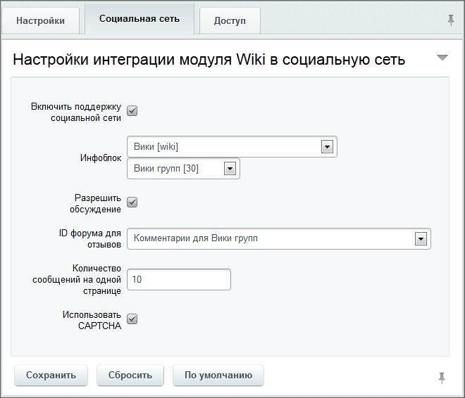

# Wiki

**Навигация**
- [← Оглавление курса](index.md)
- [← Предыдущий: 20250 — Практические задания](lesson_20250.md)
- [Следующий: 7156 — Возможности веб-форм →](lesson_7156.md)

Официальная страница урока: https://dev.1c-bitrix.ru/learning/course/index.php?COURSE_ID=48&LESSON_ID=4562

### Настройка модуля


> **База знаний (Wiki)** - чаще всего информационный раздел сайта, структуру и содержимое которого пользователи могут сообща изменять с помощью инструментов, предоставляемых самим сайтом.
>
> 	 Детальное описание способов работы и примеры работы есть в курсе [Контент-менеджер](https://dev.1c-bitrix.ru/learning/course/index.php?COURSE_ID=34&CHAPTER_ID=04491).


**Внимание!** Если в силу каких-то причин (например, использование версии до 9.5 и последующее обновление) в **Битрикс24** модуль **Wiki** не был установлен, то можно установить его самостоятельно. О его установке можно прочитать в [документации](https://dev.1c-bitrix.ru/user_help/content/wiki/install_wiki.php).


Для настройки модуля **Wiki** перейдите на страницу Настройки &gt; Настройка Продукта &gt; Настройки модулей &gt; Wiki:


На закладке **Настройки** можно запретить использование визуального редактора при создании или редактировании статей, а также указать максимальные ширину и высоту изображений, которые получатся при

			ресайзе

                    Resize - изменение размера.

		 загружаемых картинок.


На закладке **Социальная сеть**, если планируется использование Wiki в рамках Социальной сети,

			нужно указать

                    

		 инфоблок для Wiki групп, а так же ID форума, который будет использоваться для комментариев статей Wiki в группах.


На закладке **Доступ** настраиваются права работы групп пользователей со страницами Wiki.


**Внимание!** При самостоятельной [установке модуля](https://dev.1c-bitrix.ru/user_help/content/wiki/install_wiki.php) Wiki опционально можно создавать/не создавать инфоблок для него. Отказываться от создания инфоблока не рекомендуется, так как компонент Wiki не будет работать корректно с созданным вне модуля инфоблоком. Работа с инфоблоком для wiki должна производиться только через компонент или [API модуля](http://dev.1c-bitrix.ru/api_help/wiki/index.php).


### Пользовательские списки статей/категорий


Кроме штатных

			категорий,


**Категории** - один из механизмов классификации создаваемых страниц. Они помогают в поиске страниц связанных каким-то общим смыслом. Категории могут иметь подкатегории. Вложенность подкатегорий не ограничена.

[Подробнее](https://dev.1c-bitrix.ru/learning/course/index.php?COURSE_ID=34&LESSON_ID=2054)...

		 администратор может создавать произвольные выборки страниц, пополняемые автоматически. Это не совсем категории, так как они подразумевают динамическое добавление и удаление страниц по ряду параметров.


Эти списки создаются с помощью кода, размещённого в файле

			init.php


**init.php** - необязательный файл в рамках структуры файлов Bitrix Framework. Он автоматически подключается в прологе.

[Подробнее](https://dev.1c-bitrix.ru/learning/course/index.php?COURSE_ID=43&LESSON_ID=2916)...

		:


```
//Можно код разместить, например в файле /bitrix/php_interface/init.php

/*
* Функция, которая будет вызываться по событию при генерации списка категорий
* @param &obj $categories - объект, списка категорий
* @param str $sPathTemplate - путь для создания ссылки на категорию
* @return bool true.
*/
function _testOnCategoryListCreateEvent(&$categories, $sPathTemplate)
{
    $catParams = new CWikiCategoryParams; // создаем объект - набор параметров категории

    $catParams->sName = "Страницы созданные пользователем test"; // название категории
    $catParams->sTitle = "Тайтл категории cтраницы созданные пользователем тест"; // всплывающая подскака

    /*здесь вычисляем количество страниц попадающих в нашу категорию*/

    $catParams->iItemsCount = 333; // к примеру их оказалось 333
    $catParams->bIsRed = 'N'; // помечать ли категорию красным цветом, если не создана для нее страница
    $catParams->createLinkFromTemplate($sPathTemplate); // создаем ссылку на категорию
    $categories->addItem($catParams); // добавляем категорию в список категорий

    return true;
}

//обрабатываем событие создания списка категорий
AddEventHandler("wiki", "OnCategoryListCreate", "_testOnCategoryListCreateEvent");

/*
* Функция, которая будет вызываться по событию при генерации списка страниц категории
* @param &obj $categoryName - Наименование категории
* @param str $iBlockId - id iblock-а, в котором хранятся страницы вики
* @return dbResult
*/
function _testOnCategoryPagesListCreateEvent($categoryName, $iBlockId)
{
    // проверяем, наша ли категория создает список страниц
    if($categoryName != "Category:Страницы измененные сегодня")
        return false;

    //Подготавливаем данные для выборки нужных нам страниц вики

    $arPagesFilter = array(
            'IBLOCK_ID' => $iBlockId,
            'CHECK_PERMISSIONS' => 'N',
            'ACTIVE' => 'Y',
            'CREATED_USER_ID' => 478 // Показываем страницы созданные пользователем с id 478
            );

    $arSort = array('XML_ID' => 'ASC');    // Указываем сортировку

    $arPagesFilter['INCLUDE_SUBSECTIONS'] = 'Y'; // Включаем подкатегории

    // Учитываем, что вики может быть просто вики, а может быть для групп
    if (CWikiSocnet::IsSocNet())
        $arPagesFilter['SECTION_ID'] = CWikiSocnet::$iCatId;
    else
        $arPagesFilter['SECTION_ID'] = 0;

    return CIBlockElement::GetList($arSort, $arPagesFilter, false, false, Array());
}

//обрабатываем событие создания списка страниц в категории
AddEventHandler("wiki", "OnCategoryPagesListCreate", "_testOnCategoryPagesListCreateEvent");
```


### Документация по теме


- [Компоненты модуля "Wiki" (документация)](https://dev.1c-bitrix.ru/user_help/components/content/wiki/index.php)
- [Способы работы и примеры](https://dev.1c-bitrix.ru/learning/course/index.php?COURSE_ID=34&CHAPTER_ID=04491)
