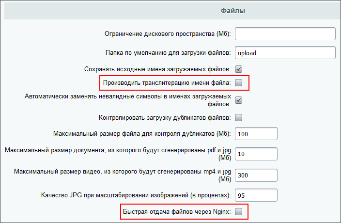

# Проверка работы

**Навигация**
- [← Оглавление курса](index.md)
- [← Предыдущий: 21882 — Сервер конвертации для нескольких сайтов](lesson_21882.md)
- [Следующий: 11141 — Настройка SMS-рассылки →](lesson_11141.md)

Официальная страница урока: https://dev.1c-bitrix.ru/learning/course/index.php?COURSE_ID=48&LESSON_ID=4619

|  | ### Если документ не виден |
| --- | --- |


Бывают случаи когда документы не открываются на просмотр. В этом случае необходимо проверить следующие моменты:


- Есть ли доступ к порталу из интернета.
- Активен ли лицензионный ключ;
- Есть ли доступ к файлам `/bitrix/tools/transformer_result.php` и папке `/upload/` из интернета под неавторизованным пользователем;
- Указание правильного домена в настройках модуля
  			Конвертер файлов
                      Форма настроек модуля Конвертер файлов (*Настройки &gt; Настройки продукта &gt; Настройки модулей &gt; Конвертер файлов*) предназначена для задания параметров подключения серверной части модуля.
  						[Описание компонента «Настройки модуля» в пользовательской документации.](http://dev.1c-bitrix.ru/user_help/detail.php?ID=13574006)
  		. Если домен содержит кириллицу, то установите домен в формате
  			Punycode
                      Punycode - стандартизированный метод преобразования последовательностей Unicode-символов в так называемые ACE-последовательности, которые состоят только из алфавитно-цифровых символов, как это разрешено в доменных именах.
- настроена работа портала по защищенному HTTPS протоколу;
- Корректноcть установки SSL-сертификата<!-- через &lt;a href="https://www.ssllabs.com/ssltest/analyze.html" title="" target="_blank"&gt;онлайн-сервис&lt;/a&gt; -->
  . В данном случае критично, чтобы была полная цепочка сертификатов. Браузер умеет сам её достраивать, а PHP - нет.
- Есть ли доступ для подключения к порталу с сервера конвертации transformer-ru-boxes.bitrix24.tech.
- Прописан ли параметр
  ```
  \Bitrix\Main\Config\Option::set('transformer', 'transformer_controller_url', 'https://transformer-ru-boxes.bitrix24.tech/bitrix/tools/transformercontroller/add_queue.php');
  ```
  Если его нет, то в *Настройки &gt; Настройки продукта &gt; Настройки модулей &gt; Конвертер файлов* в поле **Путь для добавления команд на конвертацию файлов** добавить значение: https://transformer-ru-boxes.bitrix24.tech/bitrix/tools/transformercontroller/add_queue.php.


Кроме этого можно:


- В настройках
  			**Главного модуля**
                      
  		 включить параметры
  			Производить транслитерацию имени файла
                      Чтобы кириллические символы в названии файла не мешали при скачивании такого файла.
  		 и параметр
  			Быстрая отдача файлов через Nginx
                      Чтобы не влияли настройки Nginx или облачного хранилища при скачивании файла на виртуальной машине.
  		,
- И на последок проверьте в таблице `b_transformer_command` значения STATUS и ERROR. При ошибке STATUS будет равняться 1000, а в поле ERROR может быть текст ошибки, указывающий на причину.


> **Учтите**, что после внесения изменений проверять, открываются ли документы на просмотр, нужно на новых файлах. То есть тех, которые ранее не пытались конвертироваться. Текущие файлы будут корректно открываться через сутки после внесения изменений.


<!-- убрано, тк. иностр сервер
&lt;p&gt;Для коробок, которые работают в зонах, отличных от RU, используется сервер конвертации &lt;span class="link"&gt;transformer-ru-boxes.bitrix24.tech&lt;/span&gt;. Для сохранения обратной совместимости на нем доступны два пути: новый — &lt;span class="link"&gt;/bitrix/tools/transformercontroller/add_queue.php&lt;/span&gt; и старый — &lt;span class="link"&gt;/json/add_queue.php&lt;/span&gt;.&lt;/p&gt; -->


#### Дополнительно


- [Документы](https://helpdesk.bitrix24.ru/open/17614878/) в CRM Битрикс24.
