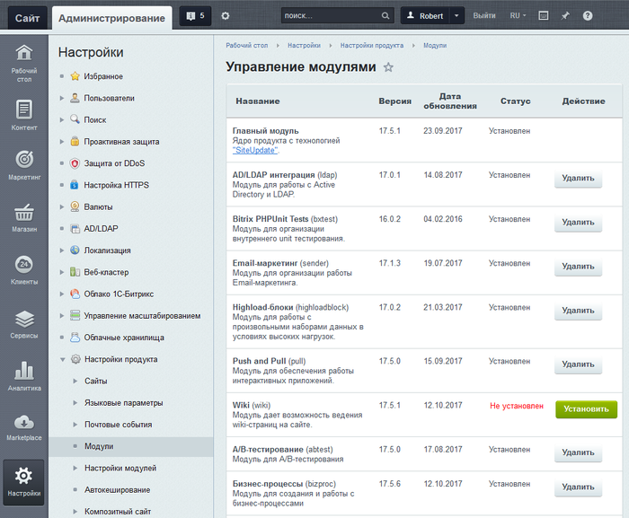

# Модульная структура

**Навигация**
- [← Оглавление курса](index.md)
- [← Предыдущий: 25356 — Как узнать редакцию продукта](lesson_25356.md)
- [Следующий: 2352 — Схема работы продукта →](lesson_2352.md)

Официальная страница урока: https://dev.1c-bitrix.ru/learning/course/index.php?COURSE_ID=48&LESSON_ID=4631

### Видеоурок

Продукты *"1С-Битрикс: Управление сайтом"* и *"Битрикс24"* имеют модульную структуру.

### Что такое модуль?

> **Модуль** - объёмная часть программного кода, отвечающая за определённый функционал на сайте. Каждый модуль отвечает за управление определенными элементами и параметрами портала: информационным наполнением и структурой, форумами, рекламой, рассылкой, распределением прав между группами пользователей, сбором статистики посещений, оценкой эффективности рекламных кампаний и так далее.
>
>
>
> Возможности редакции (лицензии) продукта, что она может, а что - нет, определяется набором модулей. Проверить состав вашей редакции можно на странице [Лицензии](https://www.1c-bitrix.ru/products/cms/license.php#tab-table-link).

Модули системы, главным образом, работают независимо друг от друга. Но есть и зависимости, функционал одних модулей основан на возможностях других. Например:

- Модуль **Торговый каталог** расширяет возможности модуля **Информационные блоки** и позволяет выполнять настройку цен товара в зависимости от различных условий, применять к товарам наценку и скидки и т.п.
- Модуль **Документооборот** позволяет организовать последовательную коллективную работу с содержимым модулей **Информационные блоки** и **Управление структурой**.

### Список модулей

Список используемых модулей выводится на странице **Управление модулями** (Настройки &gt; Настройки продукта &gt; Модули) в административном разделе системы:

)

Таблица содержит название и описание модулей, информацию о версии и дате последнего обновления, а также текущий статус в системе:

- **Установлен** – модуль и его элементы
  			доступны для использования
                      Если какой-то модуль не используется, то его можно удалить для экономии дискового пространства. Дистрибутив модуля остаётся в системе, и он в любое время может быть снова установлен.
   При деинсталляции некоторых модулей система предлагает сохранить накопленные модулем данные (таблицы модуля). Если вы в дальнейшем планируете использовать эти данные, то при удалении модуля необходимо отметить соответствующую опцию.
  		.
- **Не установлен** – модуль не доступен для использования в системе.

### Функционал модулей

Функционал установленных модулей виден в соответствующей секции

			административного меню

                    Интерфейс административного раздела системы Bitrix Framework логически разграничен на области, обеспечивающие доступ к функциональным возможностям системы.

[Подробнее ...](lesson_1839.md)

		 системы.

Для некоторых из них данные в меню загружаются динамически. Например:

- в **Информационных блоках** выполняется динамическая загрузка списка типов инфоблоков;
- в **Веб-формах** выполняется динамическая загрузка списка веб-форм;
- в **Управлении структуры** выполняется динамическая загрузка файловой структуры.

В зависимости от прав на доступ к модулям системы не всем доступен тот или иной функционал модуля.

			Управление уровнем прав

                    Настройка прав доступа к модулям системы позволяет определить диапазон допустимых действий пользователя
 над модулем и его контентом.

[Подробнее ...](lesson_2016.md)

		 пользователей на доступ к модулям системы осуществляется отдельно для каждого из них на странице его настроек.

### Настройка модулей

Страница настроек модуля имеет различное число вкладок и полей, в зависимости от его функционала. Перейти к этой странице можно следующими способами:

- с помощью административного меню: Настройки &gt; Настройки продукта &gt; Настройки модулей &gt; имя_модуля;
- с помощью кнопки **Настройки** , расположенной на административной панели. По этой кнопке вы перейдете к настройкам модуля, страницы (формы) которого открыты в текущий момент в основной рабочей области.

|  | ### Документация по теме |
| --- | --- |

- [Пользовательская документация по продукту](http://dev.1c-bitrix.ru/user_help/index.php)
