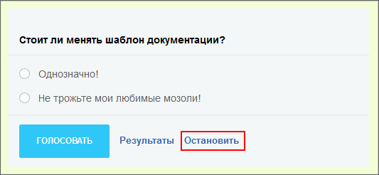

# Опросы, голосования

**Навигация**
- [← Оглавление курса](index.md)
- [← Предыдущий: 20356 — Проверьте себя](lesson_20356.md)
- [Следующий: 11967 — Отчеты 1С →](lesson_11967.md)

Официальная страница урока: https://dev.1c-bitrix.ru/learning/course/index.php?COURSE_ID=48&LESSON_ID=4685

Модуль **Опросы, голосования** предназначен для организации на портале различных опросов и голосований. Использование инструментов модуля позволяет создавать группы опросов, ограничивать доступ сотрудников к голосованиям (например, запрещать одному и тому же сотруднику голосовать дважды в рамках одного опроса), управлять показом результатов голосований и т.п.

Использование механизма разграничения прав доступа дает возможность управлять доступом сотрудников к участию в тех или иных опросах и голосованиях, а также к просмотру данных о ходе голосований и их результатов.

Управление параметрами опросов и голосований позволяет:

- ограничивать период проведения опросов;
- предлагать посетителям на выбор несколько вариантов ответов на вопрос;
- предоставлять сотрудникам возможность вводить собственные ответы на вопросы;
- управлять видом результирующих графиков и диаграмм;
- и т.д.

Для создания опросов достаточно прав группы **Администрация портала**. Для публикации опроса в публичном разделе нужно быть администратором системы.

В рамках *Битрикс24* опрос существует как сам по себе, в виде модуля **Опросы** и как часть возможностей чего-либо, например, Живой ленты. (В рамках облачных редакций Опрос - это только часть функционала другой сущности.)

Различие этих двух видов опросов:

- Как самостоятельный функционал Опрос доступен только в коробочной версии *Битрикс24*. И действует он в рамках срока активности, заданного при создании опроса.
- Как часть функционала Живой ленты опрос доступен в обоих версиях (коробочной и облачной), и его можно остановить из самой Живой ленты:
  

Как использовать модуль, подробно рассказано в курсе Контент-менеджер в главе

			Опросы.

**Опрос** — очень удобный метод сбора мнений от посетителей сайта по разным вопросам. Опросы дают возможность быстро и с минимальными затратами собрать большой объем данных и принять правильное бизнес-решение по результатам исследования.

[Подробнее](https://dev.1c-bitrix.ru/learning/course/index.php?COURSE_ID=34&CHAPTER_ID=011389&LESSON_PATH=3905.4753.11389)...

О настройках модуля можно почитать в уроке [Опросы, голосования](https://dev.1c-bitrix.ru/learning/course/index.php?bitrix_include_areas=Y&COURSE_ID=41&LESSON_ID=2859) и в [Пользовательской документации](https://dev.1c-bitrix.ru/user_help/service/vote/settings.php).
