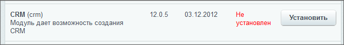
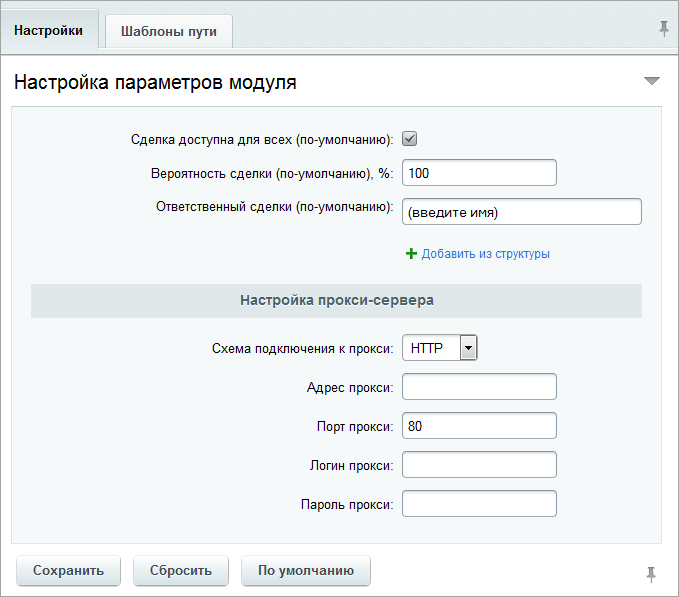

# CRM

**Навигация**
- [← Оглавление курса](index.md)
- [← Предыдущий: 2884 — BI-коннектор](lesson_2884.md)
- [Следующий: 5797 — Highload-блоки →](lesson_5797.md)

Официальная страница урока: https://dev.1c-bitrix.ru/learning/course/index.php?COURSE_ID=48&LESSON_ID=4743

### Установка и удаление

#### Установка модуля CRM

Если модуль CRM по каким-либо причинам отсутствует на вашем портале, то установите его на странице административного раздела Настройки &gt; Настройки продукта &gt; Модули.

На главной области страницы откроется таблица с перечисленными модулями корпоративного портала, нажмите **Установить** напротив модуля **CRM**:

Откроется страница с настройками установки модуля. При отмеченной опции **Скопировать публичные файлы и шаблон для сайта** система при установке модуля будет копировать необходимые файлы модуля **CRM** заново, если при этом какие-либо файлы уже имеются, то они не будут перезаписываться, а останутся неизменными.

Если вы хотите чтобы при копировании имеющиеся файлы заменялись новыми, то поставьте галочку в опции **Переписывать существующие файлы**.

**Примечание**: отмеченная опция **Переписывать существующие файлы** удалит при переустановке модуля CRM все ранее имеющиеся страницы, но оставит неизменными внесенные данные (контакты, компании, лиды, сделки).

После того, как все параметры настроены, нажмите кнопку **Установить модуль**.

Если установка прошла успешно, то на появившейся странице вы будете оповещены об этом соответствующим сообщением.

Нажмите кнопку **Вернуться в список** чтобы перейти на страницу административного раздела со списком модулей.

#### Удаление модуля CRM

Перейдите на страницу административного раздела со списком модулей. Найдите в таблице строку модуля **CRM** и нажмите кнопку **Удалить**. Появится запрос подтверждения на удаление с настройками процесса удаления. Снимите галочку у опции **Сохранить таблицы** если не хотите сохранять имеющиеся в системе CRM данные, такие как списки контактов, компаний, лидов и сделок.

Для удаления модуля нажмите кнопку **Удалить модуль**.

Если удаление прошло успешно, то на появившейся странице вы будете оповещены об этом соответствующим сообщением.

Нажмите кнопку **Вернуться в список** чтобы перейти на страницу административного раздела со списком модулей.

### Настройка модуля

В административном разделе можно настроить [параметры сделок](https://helpdesk.bitrix24.ru/open/5493461/) по-умолчанию, прокси-сервера и изменить адреса страниц в структуре портала для компонентов CRM (Настройки &gt; Настройки продукта &gt; Настройки модулей &gt; CRM):

**Примечание:** сотрудник, заданный как ответственный для сделок по-умолчанию, будет таковым для сделок, импортированных из интернет-магазинов, в [настройках интеграции](/learning/course/index.php?COURSE_ID=42&LESSON_ID=3645) которых не задан ответственный для сделок.

Администратор системы может менять настройки CRM и управлять правами доступа, давая их отдельным сотрудникам, либо группам сотрудников. Подробнее об этом читайте на [helpdesk.bitrix24.ru](https://helpdesk.bitrix24.ru/open/6268091/).

#### Дополнительная информация

- [CRM (документация)](http://dev.1c-bitrix.ru/user_help/service/crm/index.php)
