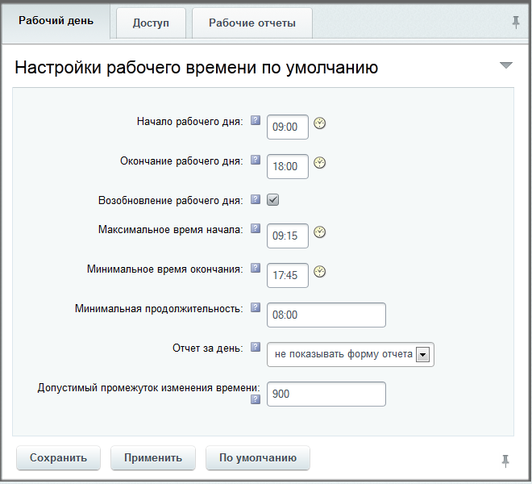
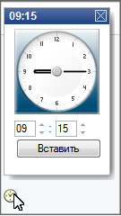
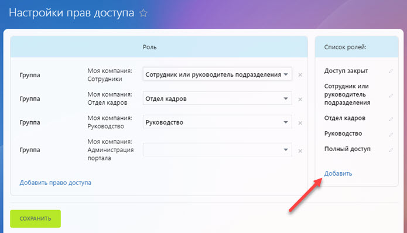

# Учет рабочего времени

**Навигация**
- [← Оглавление курса](index.md)
- [← Предыдущий: 20272 — Проверьте себя](lesson_20272.md)
- [Следующий: 4781 — Многодепартаментность →](lesson_4781.md)

Официальная страница урока: https://dev.1c-bitrix.ru/learning/course/index.php?COURSE_ID=48&LESSON_ID=4760

### Описание модуля

Модуль **Учет рабочего времени** предназначен для организации контроля за количеством рабочего времени, затраченным сотрудником, и задачами, решёнными им за этот период.

Настройка параметров модуля производится на странице Настройки &gt; Настройки продукта &gt; Настройки модулей &gt; Учет рабочего времени, на вкладке **Рабочий день**:

Разъяснения значений всех полей даётся в подсказке рядом с полем: . Для задания параметров времени можно использовать инструмент **Указать время**:

### Настройки

#### Настройка рабочего дня

Настройка параметров рабочего дня производится во вкладке **Рабочий день**. Установленные параметры будут являться параметрами по умолчанию для всей компании, однако могут быть [переопределены](https://helpdesk.bitrix24.ru/open/9631501/) в настройках подразделения или сотрудника. Такие настройки доступны пользователям, входящим в группу **Отдел кадров**.

#### Настройки доступа

Во вкладке **Доступ** в группе полей **Субординация** настраиваются права доступа к управлению записями о рабочих днях и к чтению отчетов.

**Сотрудники могут редактировать текущий рабочий день** – отмеченная опция дает право сотрудникам вносить изменения в уже отмеченное время начала и конца рабочего дня.

**Примечание**: В записи о рабочем дне отображается факт внесения сотрудником изменений.

**Управление рабочим днем и чтение отчетов** – укажите доступ всех сотрудников и руководителей подразделений к чтению отчетов и управлению рабочим днем.

**Изменение и подтверждение записей** – укажите права доступа руководителей подразделений на изменение и подтверждение записей о рабочих днях своих подчиненных.

**Примечание**: О том, как назначить права доступа к рабочим графикам и времени, читайте на на [helpdesk.bitrix24.ru](https://helpdesk.bitrix24.ru/open/17874288/). Необходимые уровни доступа вы можете создать как в

			публичном интерфейсе

		 *Битрикс24*, так и в административном разделе на странице [Уровни доступа](lesson_2015.md).

#### Настройка отчётов

На закладке **Рабочие отчеты** можно настроить форум, в котором будут храниться комментарии к отчетам. Если в этом нет особой необходимости не рекомендуется менять форум, установленный по умолчанию.

Если используется штатный дизайн, то нет необходимости и изменять пути для страниц отчётов.

#### Дополнительная информация

- [Учёт рабочего времени (документация)](http://dev.1c-bitrix.ru/user_help/service/timeman/index.php)
