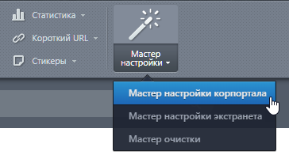
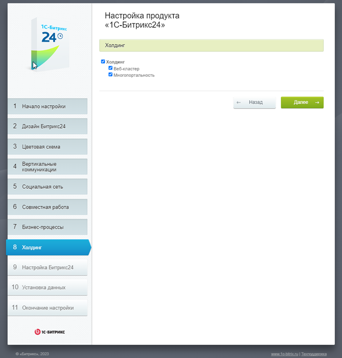
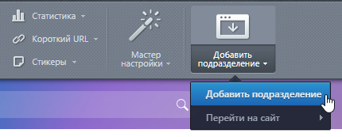
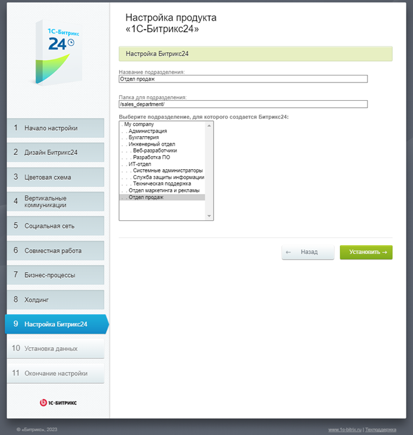
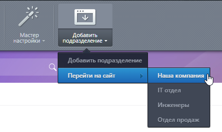
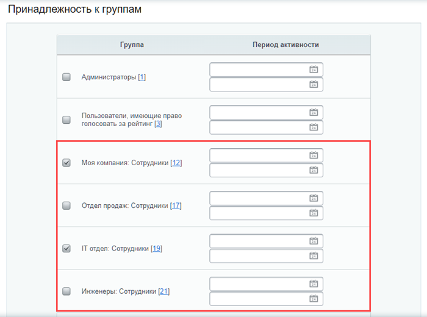
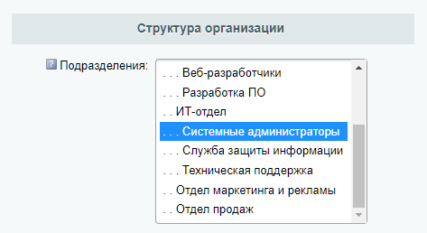

# Многодепартаментность

**Навигация**
- [← Оглавление курса](index.md)
- [← Предыдущий: 4760 — Учет рабочего времени](lesson_4760.md)
- [Следующий: 3561 — Запретить показ пункта меню →](lesson_3561.md)

Официальная страница урока: https://dev.1c-bitrix.ru/learning/course/index.php?COURSE_ID=48&LESSON_ID=4781

### Многодепартаментность

Многодепартаментность — это возможность создать отдельный портал для [подразделения компании или отдела](lesson_2777.md). Функция подходит компаниям с филиалами или несколькими офисами. Каждое подразделение получает свой портал, при этом сохраняется общий портал для всей компании.

Функционал доступен только в редакции Энтерпрайз. Мобильное приложение не поддерживает работу с департаментами.

#### Как работает

Многодепартаментность использует [многосайтовость на одном домене](https://dev.1c-bitrix.ru/learning/course/index.php?COURSE_ID=103&LESSON_ID=286). Каждый портал подразделения — это отдельный сайт в подкаталоге. Часть данных будет общей с главным порталом, но большая часть — индивидуальна для филиала. Количество порталов для подразделений организации не ограничено.

#### Как функционал разделен между порталами

Общее для всех порталов:

- персональный календарь
- задачи,
- файлы,
- фотогалерея,
- сообщения пользователя;
- раздел Сотрудники.

**Особенность ссылок в задачах.** Если открыть карточку задачи через режим [Список](https://helpdesk.bitrix24.ru/open/17987682/), ссылка на задачу будет вести на основной портал. Чтобы ссылки на задачи учитывали путь к порталу подразделения, используйте другие режимы работы с задачами: [Сроки](https://helpdesk.bitrix24.ru/open/17707160/), [Мой план](https://helpdesk.bitrix24.ru/open/17729742/) и так далее.

Индивидуально для каждого портала:

- группы, блог, форум и лента новостей пользователя,
- раздел Компания,
- раздел Документы,
- раздел Cервисы,
- раздел Группы.

**Внимание.** Функционал модуля CRM работает только на основном портале.

### Как включить

Для включения многодепартаментности запустите мастер настройки портала в панели управления:

Включение поддержки многодепортаментности осуществляется на 8-м шаге мастера:

После прохождения всех шагов мастера, в панели появится кнопка Добавить подразделение.

### Как создать подразделение

Для создания портала подразделения компании нажмите кнопку Добавить подразделение.

Кнопка запустит тот же самый [мастер настройки портала](https://dev.1c-bitrix.ru/learning/course/index.php?COURSE_ID=135&CHAPTER_ID=04721), но теперь на 9 шаге мастера необходимо указать подразделение, для которого создается портал.

После прохождения всех шагов мастера автоматически откроется портал подразделения. Переход между порталами осуществляется одним из способов:

- через панель управления по команде Перейти на сайт кнопки Добавить подразделение:
  
- через пункты левого меню, где каждый портал отображается отдельным пунктом:
  
  На скриншоте в меню с портала «Инженеры» доступны переходы по трем порталам: «Наша компания», «IT отдел» и «Отдел продаж».

Новый портал подразделения создается с демо-данными. Удалить их можно с помощью [мастера удаления демо-данных](lesson_2354.md).

### Как добавить сотрудников на портал подразделения

После создания портала подразделения компании для него автоматически будут созданы отдельные группы пользователей. Названия групп будут содержать название портала.

Кроме того, мастер автоматически добавит всех сотрудников выбранного подразделения к соответствующей группе сотрудников.

В случае добавления новых пользователей на уже созданный портал подразделения компании, необходимо добавить их:

- В нужные группы на вкладке Группы формы редактирования пользователя. Причем для того, чтобы сотрудник имел доступ к главному порталу и порталу подразделения, он должен состоять в обеих группах Сотрудники (основного портала и портала подразделения). Например, в группах «Моя компания: Сотрудники» и «IT отдел: Сотрудники»:
  
- В подразделение на вкладке Пользователь формы:
  

**Примечание:** Подробнее про управление пользователями рассказывается в главе [Управление пользователями](https://dev.1c-bitrix.ru/learning/course/index.php?COURSE_ID=48&CHAPTER_ID=04503).
