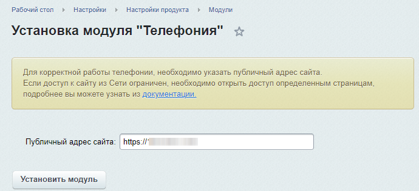
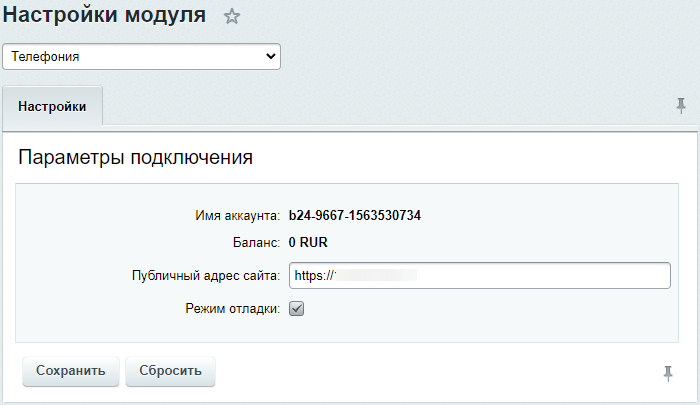

# Телефония (voximplant)

**Навигация**
- [← Оглавление курса](index.md)
- [← Предыдущий: 5044 — Возможности телефонии](lesson_5044.md)
- [Следующий: 5017 — Настройки локальной сети →](lesson_5017.md)

Официальная страница урока: https://dev.1c-bitrix.ru/learning/course/index.php?COURSE_ID=48&LESSON_ID=4869

Модуль для работы с облачной телефонией **Телефония** (voximplant) - базовый при любом варианте использования телефонии. Он необходим как при использовании телефонии от VoxImplant, так и при использовании АТС, так как производит конвертацию телефонного сигнала в формат WebRTC, понятный для браузеров. В работе модуля используются сервисы VoxImplant.


### Установка


Установка модуля выполняется обычным для коробочной версии **Битрикс24** способом, на странице Настройки&gt; Настройки продукта &gt; Модули. При установке проверяются версии модулей Главный (**main**), Интранет (**intranet**), Push & Pull (**pull**) с активным сервером очередей и Веб-мессенджер (**im**).


**Примечание**: для работы модуля необходима активная лицензия на коробочную версию Битрикс24. При обращении в ТП сервиса Битрикс24 по поводу проблем с телефонией нужно сообщать имя аккаунта.


При установке необходимо ввести адрес портала:





**Примечание**: Для корректной работы модуля требуется, что бы обработчики событий запускались [через cron](https://dev.1c-bitrix.ru/learning/course/index.php?COURSE_ID=43&LESSON_ID=2943).


**Внимание!** Если на портале стоит редирект на https версию портала, то в настройках модуля телефонии сервер обязательно должен быть прописан через https.


### Настройка модуля


В Административной части, в [форме настроек](http://dev.1c-bitrix.ru/user_help/settings/voximplant/index.php) модуля можно включить режим отладки:





После включения этого режима в файле `/modules/voximplant.log` будет вестись лог всех событий, связанных с работой модуля. Для настроек критична ошибка вида:


```
2014.09.14 10:31:48
PORTAL GET INCOMING CONFIG
Array
(
[ERROR] => Config is`t found for number: 9003
)
```


Ошибка связана с расхождением номера, на который идёт запрос на портал и номером, на который отвечает модуль **SIP коннектор**. В приведённом выше примере это номер 9003.  В этом случае рекомендуется в блоке **Исходящие настройки** настроек [SIP АТС](https://helpdesk.bitrix24.ru/open/6803851/)  в поле **Номер телефона** указать номер, выводимый в этой ошибке.


Затем нужно выбрать [способ подключения телефонии](https://helpdesk.bitrix24.ru/open/6450911/).
