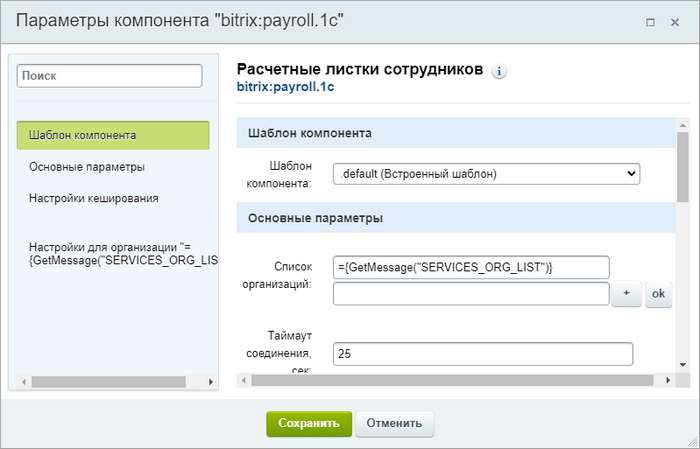
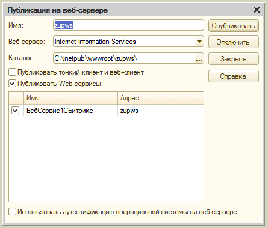
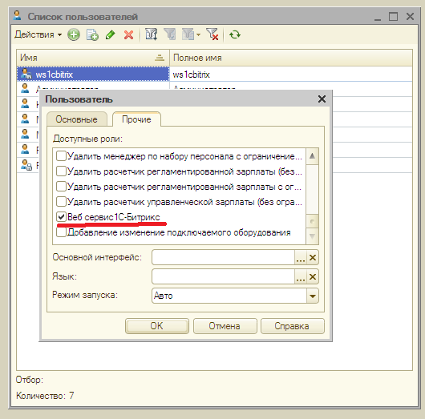
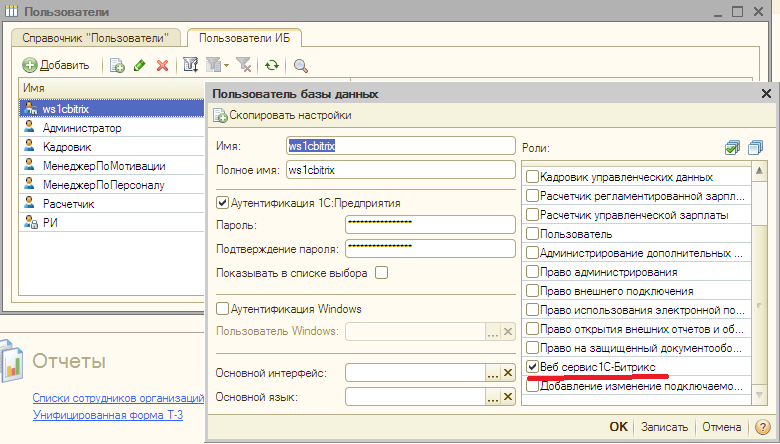

# Зарплата и отпуск

**Навигация**
- [← Оглавление курса](index.md)
- [← Предыдущий: 20316 — Практические задания](lesson_20316.md)
- [Следующий: 2777 — Структура компании →](lesson_2777.md)

Официальная страница урока: https://dev.1c-bitrix.ru/learning/course/index.php?COURSE_ID=48&LESSON_ID=4873

Сервис **Зарплата и отпуск** работает только с "1С: ЗУП". Для настройки сервиса необходимо произвести настройки на стороне "1С" и на стороне «Битрикс24 в коробке».

### Настройки на стороне «Битрикс24 в коробке»

Для настройки сервиса **Зарплата и отпуск** необходимо настроить компонент **Расчетные листки сотрудников** (**bitrix:payroll.1c**), размещенный на странице Сервисы &gt; Зарплата и отпуск.

Детальное описание полей дано в пользовательской документации по «Битрикс24 в коробке». Минимально достаточная настройка заключается в следующем:

- В поле **Список организации** создайте новую организацию, если их несколько. Если организация одна, то можно просто переименовать имеющуюся по умолчанию. Обязательно нажмите на кнопку **ОК**. Форма перезагрузится.
- В группе полей **Настройки для организации ***** заполните поля:

  - **URL веб-сервиса** - адрес сервиса, полученный от администратора программы "1С: ЗУП";
  - **Порт** - порт сервиса, полученный от администратора программы "1С: ЗУП";
  - **Логин** и **Пароль** пользователя 1С, от имени которого будет производиться доступ к программе "1С: ЗУП".
- Сохраните внесенные изменения.

### Настройки на стороне "1С:ЗУП", ред. 2.5 и ред. 3.0

#### Настройки на стороне "1С:ЗУП", ред. 3.0

**Примечание:** подробное описание настроек со стороны **1С:ЗУП**, ред. **3.0** представлено в соответствующей [главе курса](/learning/course/index.php?COURSE_ID=48&CHAPTER_ID=06705).

#### Настройки на стороне "1С:ЗУП", ред. 2.5

УРЛ веб-сервиса указывается при публикации из "1С". Подробно публикация вэб-сервисов описана в документации к 1С. Кратко о необходимых действиях (нужен доступ в **Конфигуратор** и административные права):

- Откройте пункт меню Администрирование &gt; Публикация на веб-сервере:
  
  После этого получится УРЛ такого вида: http://test_server/zupws/ws/zupws
- Доступ к вэб-сервису осуществляется от любого пользователя, у которого включена роль **Веб-сервис 1С Битрикс**. То есть в "1С" для работы необходимо создать такого пользователя, задать ему пароль и включить эту роль.
  В **Конфигураторе**:
  
  В режиме Предприятия:
  
