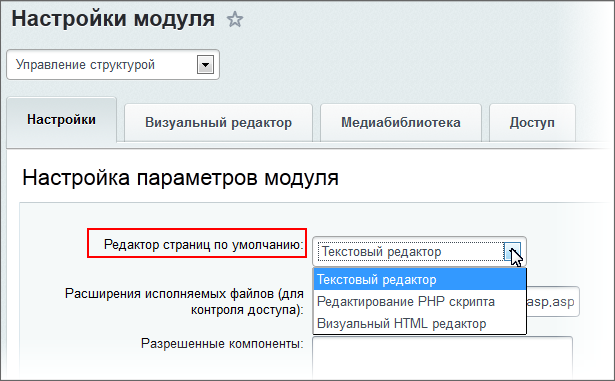

# Подключение редактора

**Навигация**
- [← Оглавление курса](index.md)
- [← Предыдущий: 13104 — Оповещения журнала событий](lesson_13104.md)
- [Следующий: 2026 — Настройка визуального редактора →](lesson_2026.md)

Официальная страница урока: https://dev.1c-bitrix.ru/learning/course/index.php?COURSE_ID=48&LESSON_ID=4941

### Видеоурок

Посмотрите короткий видеоролик о подключении редактора и его основных настройках (настройки подробнее будут рассматриваться в следующих уроках [Настройка визуального редактора](lesson_2026.md) и [Настройки отображения компонентов](lesson_1902.md)).

### Подключение редактора

	Чтобы редактором страниц по умолчанию был визуальный HTML-редактор, необходимо его выбрать в настройках модуля **Управление структурой**.

**Внимание!**  Все пользователи, которым необходимо вносить хоть какие-нибудь изменения в

			Публичной части сайта

Панель управления - наш основной инструмент по работе с содержимым сайта. Находясь на вкладке **Сайт**, контент-менеджер может вносить изменения в публичную часть сайта и сразу видеть результат. Это значительно облегчает повседневную работу.

[Подробнее](https://dev.1c-bitrix.ru/learning/course/index.php?COURSE_ID=34&CHAPTER_ID=04458&LESSON_PATH=3905.4455.4458)...

		, должны иметь доступ на чтение к папке `/bitrix/admin`. Это папка, в которой расположен визуальный HTML-редактор. Без этого редактирование будет возможно только в текстовом режиме.

### Визуальный редактор в модулях системы

	Подключение визуального редактора в модуле **Управление структурой** дает общее разрешение на его использование. Но для разных модулей использование визуального редактора можно настроить по отдельности в

			настройках модулей

                     Подключение визуального редактора на примере настроек модуля **Информационные блоки**:

		. Это можно сделать у большинства модулей, например:

- Информационные блоки;
- Веб-формы;
- Обучение;
- Опросы, голосования;
- Подписка, рассылки
- и другие.
