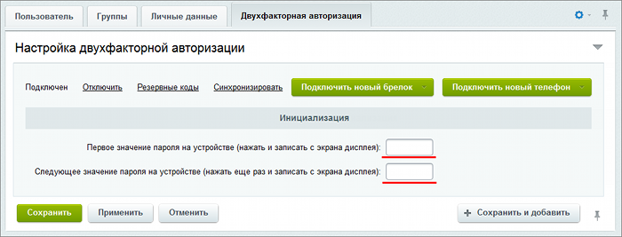

# Синхронизация

**Навигация**
- [← Оглавление курса](index.md)
- [← Предыдущий: 5007 — Резервные коды](lesson_5007.md)
- [Следующий: 5034 — Компоненты →](lesson_5034.md)

Официальная страница урока: https://dev.1c-bitrix.ru/learning/course/index.php?COURSE_ID=48&LESSON_ID=5008

|  | ### Синхронизация |
| --- | --- |

Синхронизация необходима для случаев, когда на устройстве генерации одноразовых паролей **по счетчику** была произведена генерация паролей несколько раз (например, случайно нажата кнопка на аппаратном устройстве), но не было выполнено ни одной удачной аутентификации. Тогда, в случае превышения числа нажатий значения, заданного в

			параметре

На закладке **Параметры** (Настройки &gt; Проактивная защита &gt; Двухэтапная авторизация) можно настроить параметры механизма двухэтапной авторизации.

[Подробнее](lesson_5002.md#otp_settings)...

		 **Размер окна проверки паролей**, произойдет нарушение синхронизации счетчика генерации, и пользователь не сможет выполнить вход на сайт.

В этом случае необходимо выполнить повторную синхронизацию пользователя с устройством – привести значение на сервере в соответствие значению, хранящемуся в устройстве. Для этого администратор системы или сам пользователь (при наличии соответствующих разрешений) должен сгенерировать два последовательных значения одноразовых паролей и ввести их в форму редактирования параметров пользователя.

**Примечание:** Чтобы избежать нарушений синхронизации, можно увеличить значение параметра **Размер окна проверки паролей**.

Количество действующих кодов авторизации **по счетчику** после предыдущей успешной авторизации ограничивается

			параметром

На закладке **Параметры** (Настройки &gt; Проактивная защита &gt; Двухэтапная авторизация) можно настроить параметры механизма двухэтапной авторизации.

[Подробнее](lesson_5002.md#otp_settings)...

		  **Размер окна проверки паролей**.

Количество действующих кодов авторизации **по времени** ограничивается временным интервалом **1 минута** в обе стороны (по 2 кода, которые действительны 30 секунд).
