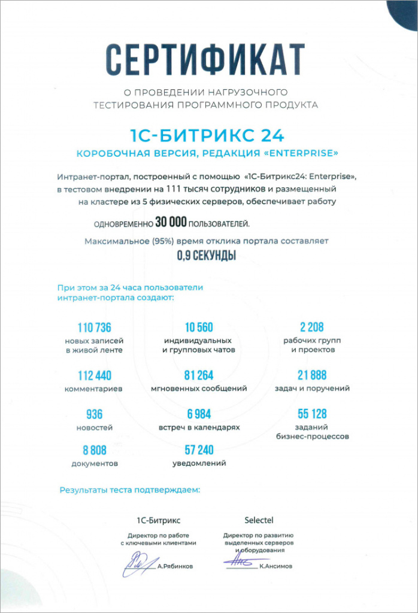

# Нагрузочное тестирование 2021

**Навигация**
- [← Оглавление курса](index.md)
- [← Предыдущий: 15304 — Нагрузочное тестирование 2015](lesson_15304.md)
- [Следующий: 15302 — Нагрузочное тестирование CRM 2022 года →](lesson_15302.md)

Официальная страница урока: https://dev.1c-bitrix.ru/learning/course/index.php?COURSE_ID=48&LESSON_ID=5023

В январе 2021 года компании «1С-Битрикс» и [Selectel](https://selectel.ru) провели нагрузочное тестирование продукта [«1С-Битрикс24: Enterprise»](https://enterprise.1c-bitrix.ru/products/b24/), для оценки производительности построенного на его основе интранет-портала большой корпорации.

### Описание

В ходе нагрузочного тестирования на интранет-портал, развернутый в кластерном решении и наполненный большим количеством тестовых данных, подавалась нагрузка, имитирующая поведение реальных пользователей.

Виртуальные пользователи выполняли наборы операций, свойственные типовым сценариям работы: авторизовывались на портале, читали новости, группы и ленту Новостей, создавали индивидуальные и групповые чаты, обменивались мгновенным сообщениями, ставили задачи, загружали документы, выполняли бизнес-процессы. Каждый пользователь выполнял один из типовых сценариев и завершал работу с порталом.

#### Ключевые задачи теста:

- смоделировать работу интранет-портала большой корпорации (100 тысяч сотрудников, большое количество демонстрационных данных);
- обеспечить методику тестирования, максимально близкую к поведению пользователей в реальной жизни;
- продемонстрировать стабильную работу портала без наличия ошибок, в случае одновременной работы с порталом трети от всех сотрудников корпорации (не менее 30 тыс.) на доступном оборудовании;
- подтвердить эффективность технологии **Веб-кластер** в продукте «1С-Битрикс24: Enterprise»;
- обеспечить время отклика портала не более 1 секунды (для 95% запросов).

### Условия

#### Оборудование:

Аппаратное обеспечение и его бесперебойная работа в ходе тестирования были обеспечены компанией Selectel, одним из лидеров российского рынка хостинга.

Выделенное оборудование включало в себя физические серверы двух конфигураций:

- Сервер баз данных: Intel Xeon W-2255 3.7 ГГц (10 ядер), 128 ГБ DDR4, 2 х 960 ГБ NVMe + 2 x 8000 ГБ HDD.
- Сервер приложений: Intel Xeon E-2236 3.4 ГГц (6 ядер), 32 ГБ DDR4, 2 x 480 ГБ SSD.

Был развернут кластер, включающий 2 сервера баз данных и 3 сервера приложений (веб-сервера). Данная конфигурация была выбрана для обеспечения высокой производительности кластера с одновременным обеспечением высокой отказоустойчивости.

Программное обеспечение серверов было сконфигурировано с помощью продукта [1С-Битрикс: Виртуальная машина](https://dev.1c-bitrix.ru/learning/course/index.php?COURSE_ID=37). Кластерное решение реализовано на основе технологии [Веб-кластер](https://dev.1c-bitrix.ru/learning/course/index.php?COURSE_ID=48&CHAPTER_ID=04750), входящей в редакцию «1С-Битрикс24: Enterprise».

#### Параметры тестового интранет-портала

- Типовое коробочное решение «1С-Битрикс24: Enterprise», версия 20.x.x с последними обновлениями, задействован модуль **Веб-кластер** для построения кластерного решения.
- Демонстрационный контент на момент старта финального теста: 590 тыс. сообщений в ленте Новостей, 540 тыс. комментариев, 40 тыс. новостей, 180 тыс. задач, 415 тыс. мгновенных сообщений.
- Количество сотрудников в базе данных портала на момент старта финального теста: 111 304 (распределены по 67 структурным подразделениям).

#### Методика генерации нагрузки

Нагрузка создавалась инструментом [JMeter](https://jmeter.apache.org/), версии 5.3.3. Данные теста записывались в InfluxDB – высокопроизводительную БД, предназначенную для обработки высокой нагрузки записи и запросов. Для визуализации аналитики использовали приложение Grafana. Мониторинг серверов осуществлялся при помощи системы мониторинга Zabbix.

Для тестирования было выбрано 29 сценариев из 13 блоков, свойственных для типового интранет-портала: авторизация, лента Новостей, поиск, чат (групповой и один на один), задачи, календарь, мой диск, новости, фотогалерея, сотрудники, профиль, бизнес-процессы, рабочие группы. Для каждого теста были подобраны веса, учитывающие работу различных пользователей на портале и долю каждого из блоков в общей нагрузке.

В отличие от предыдущего нагрузочного теста (2015 год) была применена новая методика генерации нагрузки от пользователей. Вместо одного виртуального пользователя, перебирающего в случайном порядке типовые цепочки действий, нагрузка генерировалась большим количеством разных пользователей со своей учетной записью на портале. Генератор нагрузки авторизовывал каждого такого пользователя в системе, а затем выполнял под этим пользователем разнообразный набор сценариев. При этом между выполнением каждого нового сценария выполнялось ожидание (от 20 сек до 10 минут). Таким образом, эмулировалось максимально реальное поведение сотрудников предприятия, которые зашли в интранет-портал и работают с ним в течение дня.

### Результаты

Интранет-портал на базе «1С-Битрикс24: Enterprise» в тестовом внедрении на 111 тысяч сотрудников и размещенный на кластере из 5 физических серверов, обеспечивал одновременную работу 30 тысяч сотрудников. При этом время ответа портала не превысило 0.9 сек для 95% обращений к системе.

Указанное количество пользователей за 1 час генерируют на тестовом портале:

- 39 новостей
- 4 614 сообщений в ленте Новостей
- 4 685 комментариев
- 440 чатов
- 3 386 мгновенных сообщений
- 2 297 заданий бизнес-процессов
- 912 задач
- 367 документов
- 92 рабочих групп и проектов
- 291 встреч в календарях
- 2 385 уведомления

За сутки (24 часа) будет сгенерировано при этом:

- 110 736 новых записей в ленте Новостей
- 10 560 индивидуальных и групповых чатов
- 2 208 рабочих групп и проектов
- 112 440 комментариев
- 936 новостей
- 6 984 встреч в календарях
- 21 888 задач и поручений
- 8 808 документов
- 81 264 мгновенных сообщений
- 57 240 уведомлений
- 55 128 заданий бизнес-процессов

### Выводы

Результаты проведенного тестирования **1С-Битрикс24: Enterprise** подтвердили высокую производительность платформы и стабильность при работе с большими нагрузками. Демонстрационный портал, развернутый в кластерном решении из 5 серверов, обеспечил одновременную работу 30 тысяч пользователей, а это соответствует примерному профилю нагрузки для крупной корпорации, в которой работает 100-200 тысяч сотрудников.

При этом система обеспечила быстрый (даже по меркам интернет-проектов) отклик, для подавляющего большинства запросов не превышающий 1 сек, что, безусловно, делает работу с порталом комфортной для современного пользователя. Технология **Веб-кластера** вновь подтвердила свою производительность и надежность.

Методика тестирования, сценарии и профили нагрузки, использование физических пользовательских профилей максимально приблизили условия теста к реальным. Это дает возможность использования результатов данного тестирования как эталонных, на которые можно опираться при проектировании новых проектов.

Важно отметить, что нами не преследовалась цель максимизация показателей по сгенерированному контенту на портале за время теста (новостям, задачам, документам, сообщениям и другим). Важнее было обеспечить их соответствие реальной жизни. И тем не менее, скорость добавления информации на портал оказалась также очень высокой, что покрывает потребности многих заказчиков с большим запасом!

Методику тестирования, конфигурацию портала и тестового стенда мы готовы предоставлять по запросу нашим корпоративным заказчикам и интеграторам как основу для проведения полномасштабного тестирования собственных разработанных порталов или их прототипов, проверки гипотез, расчета запаса прочности решения при пиковых нагрузках. Разворачиваемые стенды могут дополняться индивидуальными условиями, в частности интеграциями с корпоративными системами предприятия, которые планируются в проекте. Это позволит получить более точные результаты.

### Сертификат

