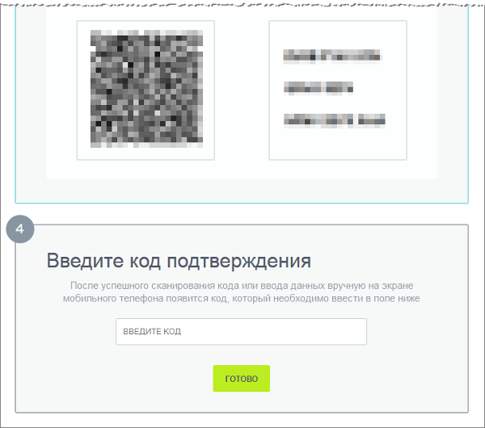
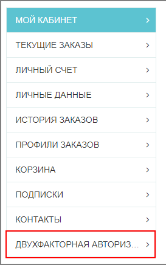

# Компоненты

**Навигация**
- [← Оглавление курса](index.md)
- [← Предыдущий: 5008 — Синхронизация](lesson_5008.md)
- [Следующий: 26614 — Поиск троянов →](lesson_26614.md)

Официальная страница урока: https://dev.1c-bitrix.ru/learning/course/index.php?COURSE_ID=48&LESSON_ID=5034

|  | ### Компоненты |
| --- | --- |

В редакциях **Стандарт** и **Малый бизнес** есть модуль **Проактивная защита**, но нет модуля **Социальная сеть**, который выводит форму подключения пользователями двухэтапной авторизации. Администратор должен создать публичные страницы для размещения компонентов подключения и

			резервных кодов.

Функционал резервных кодов используется для доступа на сайт в тех случаях, когда нет возможности использовать устройство двухэтапной авторизации. Например, при утере брелка или телефона с приложением.

[Подробнее](lesson_5007.md)...

**Примечание:** Доступ к информации, выводимой компонентами в публичной части сайта, имеют только авторизованные пользователи.

#### Вывод страницы подключения двухфакторной авторизации с помощью компонента

Для вывода

			формы

                    

		 подключения нового устройства двухэтапной авторизации в публичной части используется компонент

			Подключение устройства OTP

						[Описание компонента «Подключение устройства OTP» в пользовательской документации.](http://dev.1c-bitrix.ru/user_help/detail.php?ID=1171760)

		. Использование этого компонента удобно если пользователь захочет подключить свое устройство, но у него нет доступа в административный раздел.

Для вывода формы необходимо:

- Создать страницу, на которой разместится инструкция по подключению;
- С помощью
  			визуального редактора
                      В любой работе важен хороший инструмент. 1С-Битрикс обладает мощным встроенным WYSIWYG редактором для работы со страницами сайта. С его помощью мы способны редактировать любую информацию на сайте. [Подробнее](https://dev.1c-bitrix.ru/learning/course/index.php?COURSE_ID=34&CHAPTER_ID=06299&LESSON_PATH=3905.6299)...
  		 добавить компонент **Подключение устройства OTP**;
- Сделать удобную для пользователей ссылку на эту страницу;
- Теперь на этой странице пользователи смогут подключить двухфакторную авторизацию, следуя инструкции.

## Пример создания такой страницы

Рассмотрим пример добавления страницы подключения двухфакторной авторизации в Интернет магазине в личном кабинете пользователя:

- Создадим новую страницу с названием **Двухфакторная авторизация**;
- В визуальном редакторе добавим компонент **Подключение устройства OTP**:
  
- Добавим в меню личного кабинета пользователя
  			пункт Двухфакторная авторизация
                      
  		 со ссылкой на созданную страницу;
- Теперь пользователь сможет подключить себе двухфакторную авторизацию.
  <!-- &lt;p&gt;&lt;a href="javascript:ShowImg('/images/admin_expert/security/otp/open_page_OTP.png',728,393,'Подключение устройства OTP')"&gt;&lt;img style="cursor: pointer;" alt="Нажмите на рисунок, чтобы увеличить" src="/images/admin_expert/security/otp/open_page_OTP_sm.png"&gt;&lt;/a&gt;&lt;/p&gt; -->

Для вывода

			формы управления резервными кодами

                    

		 в публичной части используется компонент

			Резервные коды OTP.

						[Описание компонента «Резервные коды OTP» в пользовательской документации.](http://dev.1c-bitrix.ru/user_help/detail.php?ID=1171758)

|  | #### Дополнительно |
| --- | --- |

- [Подключение пользователем двухэтапной авторизации](https://dev.1c-bitrix.ru/learning/course/index.php?COURSE_ID=34&LESSON_ID=6921&LESSON_PATH=3905.2339.6818.6921)
- [компонент Социальная сеть](https://dev.1c-bitrix.ru/user_help/components/obschenie/social_network/socnet.php) - пользовательская документация
- [компонент Подключение устройства OTP](https://dev.1c-bitrix.ru/user_help/components/sluzhebnie/security/bitrix_security_user_otp_init.php) - пользовательская документация
- [компонент Резервные коды OTP](https://dev.1c-bitrix.ru/user_help/components/sluzhebnie/security/bitrix_security_user_recovery_codes.php) - пользовательская документация
