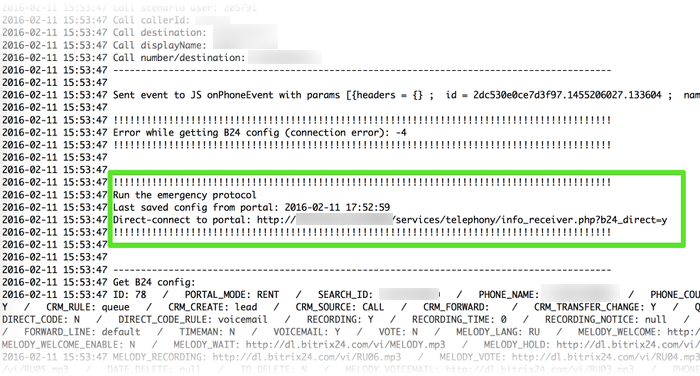
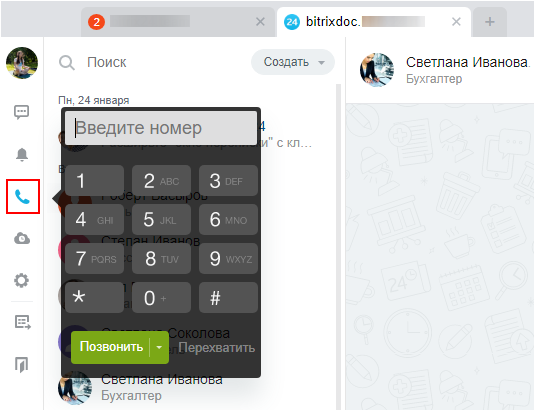
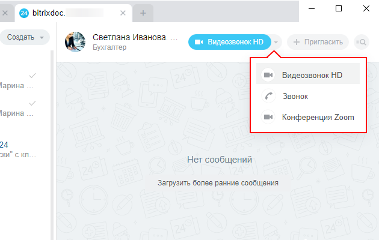

# Возможности телефонии

**Навигация**
- [← Оглавление курса](index.md)
- [← Предыдущий: 20010 — Проверьте себя](lesson_20010.md)
- [Следующий: 4869 — Телефония (voximplant) →](lesson_4869.md)

Официальная страница урока: https://dev.1c-bitrix.ru/learning/course/index.php?COURSE_ID=48&LESSON_ID=5044

В этом уроке кратно рассмотрим возможности Телефонии в Битрикс24. Основная информация по настройкам и работе с телефонией представлена в статьях раздела [Телефония](https://helpdesk.bitrix24.ru/open/6450911/) системы помощи [Поддержка24](https://helpdesk.bitrix24.ru). В рамках этого курса рассмотрим только возможности телефонии и административные настройки для коробочной версии Битрикс24.

### Возможности

**Внимание!** Телефония работает только на

			**активной**

                    Если по окончании действия лицензии Вы приняли решение не продлевать лицензию, то работа продукта перейдет в ограниченный режим, т.е. часть функций станут недоступны.

Подробнее в курсе [Установка и настройка](https://dev.1c-bitrix.ru/learning/course/index.php?COURSE_ID=135&LESSON_ID=12856).

		 лицензии. Кроме этого, на номер лицензии завязываются лицензии SIP-коннектора и оплата телефонии. При смене лицензии телефонией по старым подключениям пользоваться невозможно.

Перед сменой лицензии необходимо отключить арендованные и привязанные номера, АТС.

Сервис Битрикс24 даёт возможность использовать телефонию для решения производственных задач. Телефония в Битрикс24 реализована с помощью технологии [WebRTC](https://ru.wikipedia.org/wiki/WebRTC) позволяющей совершать/принимать звонки прямо из браузера. Эта технология поддерживается браузерами в версиях не ниже: Google Chrome v29, Mozilla Firefox v27, Opera v18, Яндекс.Браузер v13. (К сожалению Internet Explorer не поддерживает WebRTC.)

В силу разных, зависимых от разработчиков браузеров, причин IP-телефония гарантированно корректно функционирует только в Google Chrome и Mozilla Firefox. В Opera и Яндекс.Браузер работа нестабильная от версии к версии браузеров.

## Ограничение на использование звонков на сайтах без SSL-сертификата для Битрикс24 в коробке

Google Chrome с версии 47 отключает WebRTC на всех сайтах, кто не использует протокол HTTPS. Это означает что для всех коробочных версий *Битрикс24*, у кого не стоит HTTPS сертификат, перестанет работать телефония и внутренние звонки. Для пользователей это будет выглядеть, как *"Невозможно получить доступ к веб-камере или микрофону"*.

Для решения проблемы, необходимо будет приобрести и настроить HTTPS сертификат для сайта. Либо использовать другие браузеры.

Для клиентов *Битрикс24* облачной версии - это предупреждение не актуально.

## Как работает телефония в Битрикс24

Для понимания работы Телефонии схематично поясним её алгоритм.

Основой работы всей телефонии является **Контроллер**, расположенный на сервере "1С-Битрикс". Именно он производит управление всеми звонками, контроль за лицензиями.

При начале звонка с портала (телефонного аппарата), клиент сначала подключается к голосовым серверам **Voixplant**. Затем голосовые сервера подключаются к Контроллеру что бы проверить лицензию. После проверки Контроллер передаёт настройки подключения обратно в звонок.

Коротко это можно описать так: Voixplant -&gt; Контроллер -&gt; Voixplant. Эта цепочка занимает не много времени.

В случае если контроллер в данный момент не доступен, то реализуется возможность работы телефонии без контроллера. Раз в сутки в аккаунт телефонии (на голосовых серверах Voixplant) Контроллер сохраняет секретный ключ и адрес портала. Если с Контроллером телефонии все в порядке то работа осуществляется по обычной схеме. (Надо проверять лицензию и сохранять статистику для аналитики.) Но если до Контроллера не получилось достучаться по каким-то причинам, то происходит переход на режим прямого доступа через упомянутые ключи. Для клиента же обычный звонок и звонок в режиме прямого доступа - ничем не отличается, он даже не будет знать что что-то было не так.

В логе звонка, при работе без контроллера, будет вот такая запись:

**Технические особенности телефонии в коробочной версии**:

1. Для корректной работы телефонии необходимо чтобы агенты были [настроены на cron](https://dev.1c-bitrix.ru/learning/course/index.php?COURSE_ID=43&LESSON_ID=2943), а не на хитах.
  Особенность запуска агентов на cron для телефонии: частота запуска не менее 1 раза в 2 минуты, рекомендуется запускать каждую минуту.
2. Телефония завязана на ключ. Поэтому если есть рабочий корпоративный портал и установка для разработки с установленным модулем Телефония, то во время звонков могут возникать
  			ошибки
  - Ошибка проверки лицензии при исходящем звонке,
  - Звонок может уходить на установку для разработки,
  - При звонке на рабочий корпоративный портал звонок будет отбиваться с ошибкой в логе "Config is`t found for number: reg12345",
  - И некоторые другие.
  		. На установке для разработки рекомендуется удалять модуль Телефония.

### IP телефония

IP телефония позволяет звонить на любые стационарные и мобильные телефоны. В отличие от [голосовых звонков](lesson_5044.md#ip_phone), IP-телефония - платная услуга, реализуемая с помощью оператора связи [Voximplant](https://voximplant.ru/).

Без аренды отдельного телефонного номера возможны только исходящие звонки. Если нужно осуществлять и входящие, то необходимо арендовать телефонный номер. Есть возможность скрывать арендованный номер и заменять его для ваших клиентов на любой существующий офисный номер. (Либо таким образом можно скрыть номер базовой станции.) Арендовав номер для приема входящих звонков и привязав его в качестве обратного получается полноценное телефонное решение.

Используя эту телефонию вы имеете возможность создать удобные правила обработки звонков: маршрутизацию и сохранение записи разговоров. Настройка маршрутизации позволяет:

- Перенаправить входящий звонок на конкретного сотрудника.
- Перенаправить звонок менеджеру, закреплённому за этим номером.
- Задать очередь сотрудников и число гудков, которые должны пройти до переадресации к следующему в очереди сотруднику.
- Указать сервису что делать, если никто из очереди сотрудников не ответил на входящий звонок.

[Тарифы](http://www.bitrix24.ru/prices/tariffs.php) установлены отдельно для России, СНГ, Европы и США. Оплата за трафик производится оператору VoxImplant через Битрикс24.

Битрикс24 позволяет вам вести детализацию звонков с просмотром даты, времени, стоимости звонка, а так же с файлом записи. Возможность записи звонков управляется администратором портала. Большой архив записей может существенно уменьшить свободное место на диске.

Пользователи Экстранета не могут звонить через ваш портал.

### IP телефония офисных АТС

Есть возможность подключить к вашему порталу офисные или облачные АТС. В этом случае используются уже имеющиеся у вас офисные номера, которые отображаются для ваших клиентов так же как раньше. Пользователи портала после такой интеграции перестают применять IP-телефоны и используют вместо них микрофоны на компьютерах.

Этот вид телефонии так же позволяет осуществлять бесплатные входящие звонки. Платная ежемесячная лицензия требуется только на исходящие звонки, оплата за трафик осуществляется по расценкам ваших операторов связи через системы оплаты самих операторов связи.

IP телефония с помощью офисных АТС позволяет:

- Все входящие звонки перенаправлять в портал Битрикс24. Звонки идентифицируются, обрабатываются по вашим правилам, фиксируются в CRM, записываются. К ним всегда можно вернуться при необходимости.
- Совершать исходящие звонки из Битрикс24 через каналы присоединенные к вашей IP-АТС с фиксацией и обработкой, как и в случае со входящими.

Минусы такой интеграции:

- Полностью выводится из эксплуатации внутренняя часть имеющейся IP-АТС. (Она рассматривается только с точки зрения некоего блока ответственного за внешние линии.)
- Необходимость дополнительных платежей.

**Примечание**: Настройка SIP подключения различна для [облачных](https://helpdesk.bitrix24.ru/open/6534609/) и [офисных](https://helpdesk.bitrix24.ru/open/6803851/) АТС. Для тестирования функционала вам доступны бесплатные минуты для исходящих звонков..

### Звонки внутри компании

Самый простой и доступный способ общения. Не требует никаких настроек со стороны пользователя или администратора портала. Всё работает "из коробки" и бесплатно. Для осуществления голосового и видеозвонка необходим микрофон и видеокамера.

К недостаткам способа можно отнести ограниченность числа возможных абонентов: пользователи вашего портала (в том числе и пользователи экстранета) и контакты из сети Битрикс24Network. Для звонков по этому способу нет возможности вести запись разговора штатными методами Битрикс24.

Подробнее описано в статье Поддержки24: [Аудио- и видеозвонки сотрудникам](https://helpdesk.bitrix24.ru/open/5562133/).
