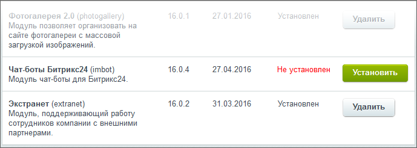
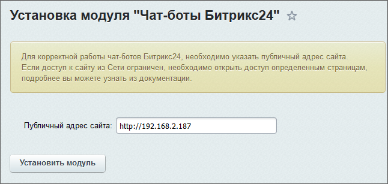

# Установка модуля

**Навигация**
- [← Оглавление курса](index.md)
- [← Предыдущий: 13450 — Практические задания](lesson_13450.md)
- [Следующий: 8399 — Настройки →](lesson_8399.md)

Официальная страница урока: https://dev.1c-bitrix.ru/learning/course/index.php?COURSE_ID=48&LESSON_ID=5048

|  | ### Установка модуля |
| --- | --- |

Модуль **Чат-боты Битрикс24** включён во все редакции коробочной версии *Битрикс24*. После его установки и настройки пользователям становится доступным функционал штатных Чат-ботов.

Модуль не устанавливается автоматически при установке дистрибутива портала или при обновлении *Битрикс24*. Устанавливать его нужно вручную на странице Настройки &gt; Настройки продукта &gt; Модули. Кроме этого, необходимо произвести настройки локальной сети для его работы.

Модуль не установится, если:

- Не установлен или не настроен модуль [Push&Pull](lesson_2033.md) с сервером очередей.
- Не установлен модуль [Веб-мессенджер (im)](lesson_4996.md) в версии не ниже 16.1.0.
- Лицензия портала не активна.

Во время установки нужно будет

			указать публичный адрес

                    

		 для доступа из Интернета к порталу.
