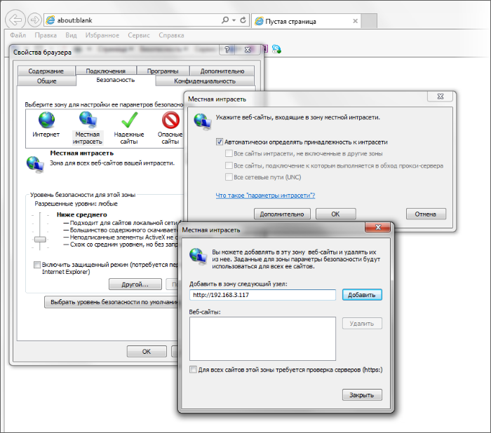
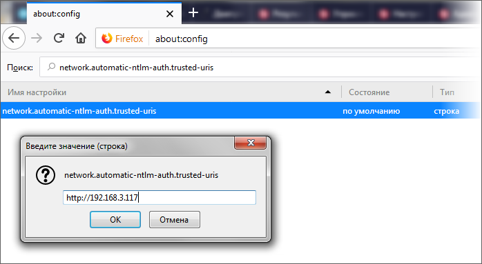

# Настройка браузеров сотрудников

**Навигация**
- [← Оглавление курса](index.md)
- [← Предыдущий: 23106 — NTLM-авторизация в стороннем окружении](lesson_23106.md)
- [Следующий: 2614 — Проблемы и решения →](lesson_2614.md)

Официальная страница урока: https://dev.1c-bitrix.ru/learning/course/index.php?COURSE_ID=48&LESSON_ID=5077

### Internet Explorer

Для успешной NTLM авторизации нужно, чтобы веб-сервер находился в зоне Local Intranet.

### Mozilla Firefox

Добавить веб-сервер к списку доверенных URI для автоматической NTLM-авторизации (через параметр `network.automatic-ntlm-auth.trusted-uris` на странице **about:config**)

