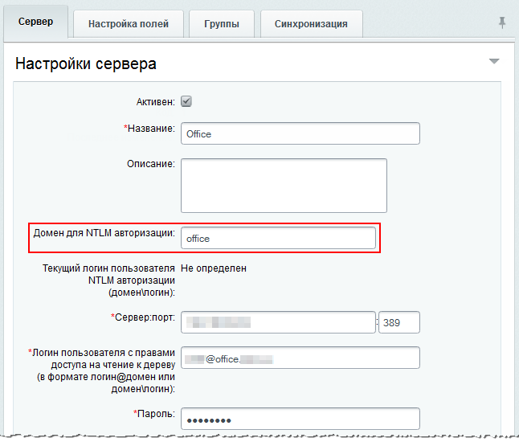

# Настройка NTLM авторизации со стороны продукта

**Навигация**
- [← Оглавление курса](index.md)
- [← Предыдущий: 2547 — Регистрация сервера](lesson_2547.md)
- [Следующий: 2548 — Настройка NTLM-авторизации для Apache →](lesson_2548.md)

Официальная страница урока: https://dev.1c-bitrix.ru/learning/course/index.php?COURSE_ID=48&LESSON_ID=5078

|  | ### Пошаговая настройка |
| --- | --- |

1. Зарегистрируйте в системе
  			AD/LDAP-сервер
                      Создание записи об AD/LDAP сервере выполняется в административном разделе Bitrix Framework, в которой указываются все необходимые сведения о сервере и соответствия групп пользователей.
  [Подробнее ...](lesson_2547.md)
  		.
2. При регистрации сервера обязательно укажите значение в поле
  			Домен для NTLM авторизации
                      Это поле очень полезно, даже когда у вас нет домена, но есть несколько LDAP-серверов. Поскольку на разных LDAP-серверах могут быть пользователи с одинаковым именем, то не понятно, на каком из серверов пользователь будет авторизован. А если указать, например, `office\ivan` то все вопросы сразу отпадают.
  		. Он должен полностью (включая регистр) совпадать с названием домена.
  
3. В настройках модуля отметьте опцию
  			Использовать NTLM авторизацию
                      
  		. Если в силу каких-то причин для хранения логина пользователя вы используете другую, не **REMOTE_USER**, переменную массива `$_SERVER`, то в поле **Имя переменной PHP, в которой хранится логин пользователя NTLM** измените имя переменной на нужное. Помните при этом, что большинство модулей продукта используют именно переменную
  			REMOTE_USER
                      В поле **REMOTE_USER** содержится значение логин или домен\логин. Вся аутентификация происходит на уровне веб-сервера, без каких либо паролей, хешей и т.д.
  		.
  Если в локальной сети несколько LDAP-серверов, то в поле **Сервер домена по умолчанию** выберите тот, который используется для NTLM-авторизации. Даже если LDAP-сервер один, то все равно желательно указать значение этого поля, чтобы сотрудникам не требовалось вводить домен при первом входе в Bitrix Framework.
4. Настройте на NTLM авторизацию на сервере
  			Apache
                      Поддержка NTLM-авторизации по умолчанию включена в дистрибутив продукта. Если вы не используете рекомендуемый компанией "1С-Битрикс" пакет, то вам необходимо сделать следующее...
  [Подробнее ...](lesson_2548.md)
  		.
