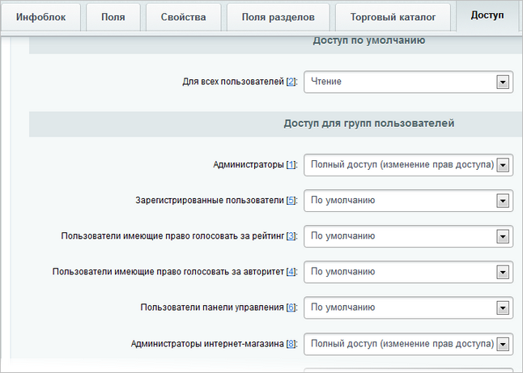

# Права на каталог товаров и услуг

**Навигация**
- [← Оглавление курса](index.md)
- [← Предыдущий: 7169 — Постановка задачи](lesson_7169.md)
- [Следующий: 8657 — Права на наполнение новостной ленты →](lesson_8657.md)

Официальная страница урока: https://dev.1c-bitrix.ru/learning/course/index.php?COURSE_ID=48&LESSON_ID=5127

|  | ### Наполнение каталога товаров и услуг |
| --- | --- |

Информация о продукции хранится в инфоблоке, из параметров компонента нам нужно узнать, в каком именно. Для этого, находясь на странице с перечнем наименований товаров,

			откройте на редактирование

                    

		 параметры компонента **Каталог**.

В параметрах компонента, поле **Инфоблок**,  посмотрите, из какого инфоблока берутся данные о продукции:

Теперь перейдите в административную часть сайта, на страницу настройки параметров инфоблока Контент &gt; Информ. блоки &gt; Типы информ. блоков &gt; Товары и услуги &gt; [s1]Продукция, закладка **Доступ** и выставьте права доступа указанным на скриншоте образом:

Выполните аналогичные действия для инфоблока услуг компании.
