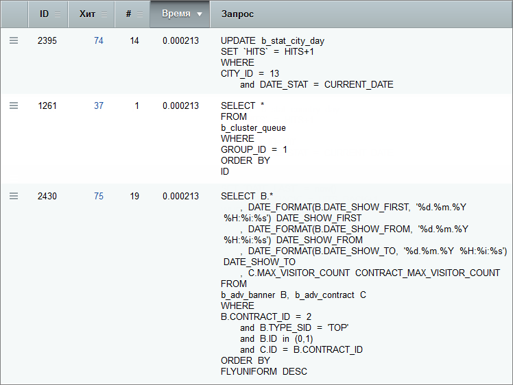

# SQL запросы

**Навигация**
- [← Оглавление курса](index.md)
- [← Предыдущий: 5126 — Хиты](lesson_5126.md)
- [Следующий: 3838 — Кеширование →](lesson_3838.md)

Официальная страница урока: https://dev.1c-bitrix.ru/learning/course/index.php?COURSE_ID=48&LESSON_ID=5128

|  | ### Отчёт по SQL запросам |
| --- | --- |

На странице **Монитор производительности: запросы** (Настройки &gt; Производительность &gt; SQL запросы) отображается отчет, если в настройках модуля включены опции

			Вести журнал запросов и Сохранять стек вызова для SQL запросов.

                    

		:

Двойной клик по строке таблицы с запросом или пункт меню действий **План исполнения** позволит просмотреть план исполнения запроса

			в новом окне

                    

		.

После проведения теста в панели производительности наведение указателя мыши на текст запроса вызовет его стек. В первой строке отображается исходная функция, вызвавшая его:

