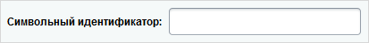
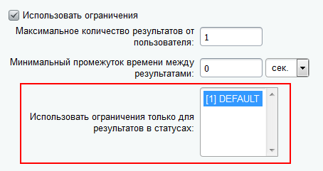
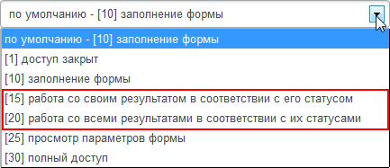
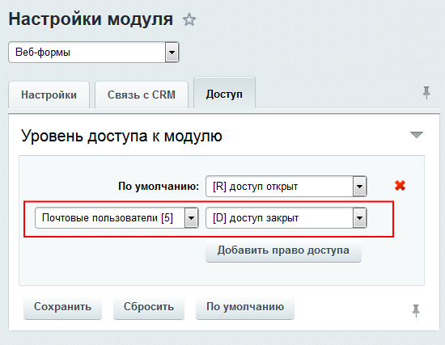
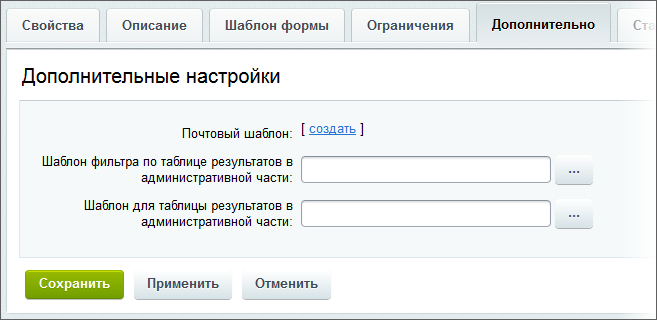

# Создание и редактирование веб-формы

**Навигация**
- [← Оглавление курса](index.md)
- [← Предыдущий: 5219 — Особенности режима](lesson_5219.md)
- [Следующий: 5155 — Создание вопросов веб-формы →](lesson_5155.md)

Официальная страница урока: https://dev.1c-bitrix.ru/learning/course/index.php?COURSE_ID=48&LESSON_ID=5153

### Видеоурок

### Создаём форму в расширенном режиме

Создание веб-формы в расширенном режиме идентично работе в

			упрощенном

                    Упрощенный режим предназначен для создания простых веб-форм.

[Читать подробнее...](lesson_2926.md)

		 режиме, но есть дополнительные параметры. Появляются:

- поле для создания
  			символьного идентификатора
                      Символьный идентификатор - последовательность латинских букв и цифр для распознавания формы системой. Он  предназначен для работы с веб-формой в коде программных компонентов, используемых при её показе в публичной части сайта.
  
  		 формы на закладке **Свойства**.
- поле, указывающее для каких
  			статусов действуют ограничения
                      
  		 на закладке **Ограничения**.
- дополнительные
  			уровни доступа
                      
  		 сотрудников к веб-форме и результатам ее заполнения.
  **Примечание**: помните, что настройки доступа к модулю **Веб-формы** по приоритету перекрывают таковые для каждой отдельной формы. То есть, если какой-то группе посетителей
  			закрыт доступ к модулю
                      
  		 совсем, то они не будут видеть веб-форму, даже если в самой форме будут установлены максимальные поля доступа.
- Появляется вкладка **Дополнительно**, на которой могут быть выбраны или созданы шаблоны для фильтра по таблице результатов в административной части, а также для самой таблицы результатов:
  
  **Примечание**: ссылка **Создать** отображается только в режиме **редактирования** веб-формы. Поэтому для генерации почтового шаблона нужно сохранить создаваемую форму с помощью кнопки **Применить**. Для каждой веб-формы может быть создано неограниченное число почтовых шаблонов.

### Документация по теме

- [Создание и редактирование веб-формы](https://dev.1c-bitrix.ru/user_help/service/form/form_edit.php)
