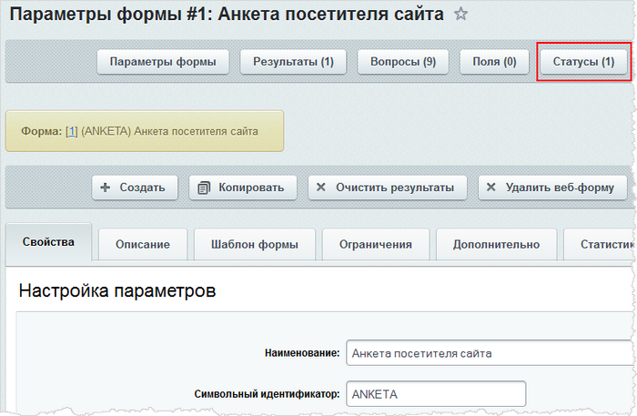
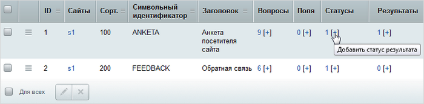
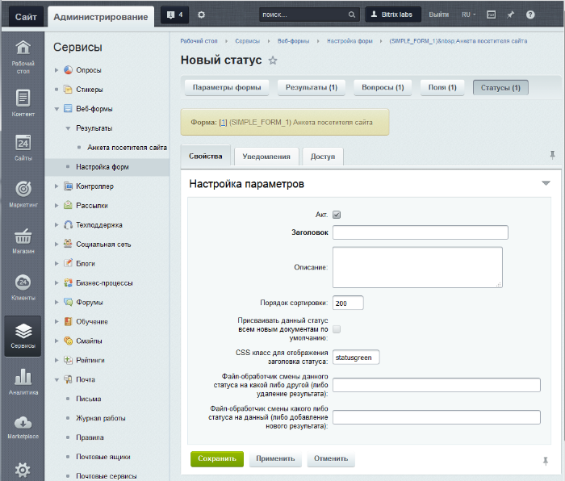
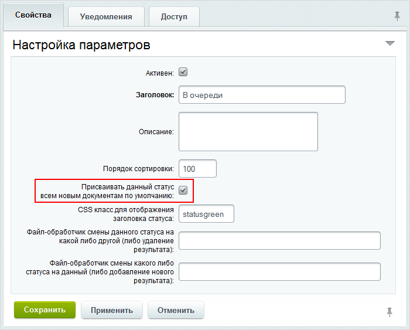
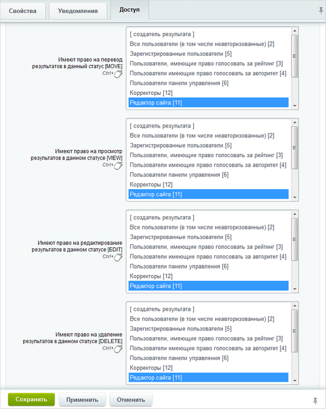

# Настройка статусов веб-формы

**Навигация**
- [← Оглавление курса](index.md)
- [← Предыдущий: 5155 — Создание вопросов веб-формы](lesson_5155.md)
- [Следующий: 5156 — Создание полей веб-формы →](lesson_5156.md)

Официальная страница урока: https://dev.1c-bitrix.ru/learning/course/index.php?COURSE_ID=48&LESSON_ID=5154

### Статусы

**Статусы** - для каждой формы создаются собственные статусы, например: Принято к рассмотрению, Опубликовано, Отклонено и так далее. Их количество не ограничено. В настройках статуса можно указать различные права доступа к результату для различных групп пользователей, а также отдельно для создателя результата.

Статусы нужны для того, чтобы реализовать сложные схемы работы с веб-формами, когда нужно не просто получить ответы на вопросы от посетителей сайта, но и обработать их: занести в CRM, составить списки по выборочным данным и так далее.

### Создание статусов

Для создания статусов веб-формы кликните либо на

			Статусы

                    

		 на специальной панели в режиме редактирования нужной веб-формы, либо перейдите по ссылке

			[+]

                    

		, расположенной в столбце **Статусы** на странице со списком форм. Откроется окно создания статуса:

На закладке **Свойства** три последние поля формы - для "тонкой" настройки, которой занимаются разработчики при кастомизации работы веб-форм. Вам нужно их заполнить, если только вы точно понимаете, что делаете. Есть особенность поля **Присваивать данный статус всем новым документам по умолчанию** на этой же закладке. Оно может быть установлено только у одного статуса для данной веб-формы.

Настройка закладки **Уведомления** описана в уроке [Настройка уведомлений](lesson_10279.md).

Обязательно нужно задать права доступа на статус. Смотрите небольшой пример ниже.

### Пример создания статусов

Создадим для результатов нашей формы два статуса:

- **В очереди**, присваиваемый автоматически
  			всем результатам
                      
  		 после заполнения анкеты. Посетителю, создавшему анкету, дана
  			возможность отредактировать
                       
  		 анкету, пока она находится в этом статусе.
- **Принято**,
  			устанавливается вручную
                      
  		 контент-менеджером после того, как анкета была рассмотрена и добавлена в банк данных. В данном статусе анкета уже не может быть отредактирована пользователем, отправившим её. Право переводить анкету в статус **Принято** будет предоставлено пользователям группы
  			Редакторы сайта
                      
  		.

<!-- &lt;/li&gt;
&lt;/ul&gt; -->

### Документация по теме

- [Список статусов](https://dev.1c-bitrix.ru/user_help/service/form/form_status_list.php)
- [Создание и редактирование статуса](https://dev.1c-bitrix.ru/user_help/service/form/form_status_edit.php)
