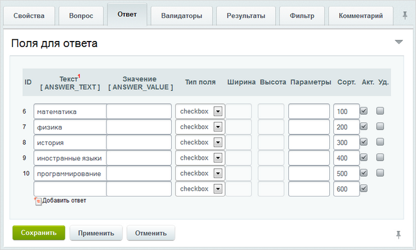

# Создание вопросов веб-формы

**Навигация**
- [← Оглавление курса](index.md)
- [← Предыдущий: 5153 — Создание и редактирование веб-формы](lesson_5153.md)
- [Следующий: 5154 — Настройка статусов веб-формы →](lesson_5154.md)

Официальная страница урока: https://dev.1c-bitrix.ru/learning/course/index.php?COURSE_ID=48&LESSON_ID=5155

### Создаём вопросы для веб-формы

Самый простой способ создать вопрос - открыть форму создания с помощью ссылки

			[+]

                    

		, расположенной в столбце **Вопросы**, откроется форма создания вопроса:

Форма создания вопроса в расширенном режиме отличается от формы в

			упрощенном

                    Упрощенный режим предназначен для создания простых веб-форм.

[Читать подробнее...](lesson_2926.md)

		. Увеличилось число вкладок, поменялись расположения полей. Опишем только существенные отличия от упрощённой формы, подробное описание полей формы есть в [документации](http://dev.1c-bitrix.ru/user_help/service/form/form_question_edit.php#f_answer).

Текст вопроса переехал на закладку

			Вопрос

                    

		. При создании вопроса можно использовать визуальный HTML-редактор, а также загрузить изображение.

На закладке **Ответ** выберите **Тип поля** для ответа на данный вопрос и зависимости от выбранного

			типа поля

                    К сожалению, в форме создания вопроса применяются технические описания типов. Расшифруем их:

**text** - строка;

**textarea** - окно для текста;

**radio** - кнопки для одиночного выбора;

**checkbox** - кнопки для множественного выбора;

**dropdown** -  выпадающий список значений;

**multiselect** - список значений;

**date** - дата;

**image** - загрузка изображения;

**file** - загрузка файла;

**e-mail** - поле для ввода электронного адреса;

**url** - поле для ввода адреса сайта;

**password** - поле для ввода пароля;

**hidden** - невидимое поле для нужд кастомизации формы разработчиками.

Четыре последних типа выглядят как обычная строка, но строку применять для этих значений
не рекомендуется, так как этот тип не имеет защиты.

		 укажите необходимые параметры в поле **Текст**:

**Примечание**: если в поле **Текст** не нужно вводить данные (для некоторых типов полей, например - файл, текст, это не нужно), то поставьте пробел, иначе система не даст сохранить вопрос и отобразит ошибку.

На закладке **Результаты** настраиваются параметры показа результатов ответа на вопрос, а на закладке **Фильтр** - типы полей фильтра для различных параметров.

Для сохранения вопроса нажмите кнопку **Сохранить**.

### Документация по теме

- [Создание и редактирование вопроса](https://dev.1c-bitrix.ru/user_help/service/form/form_question_edit.php)
