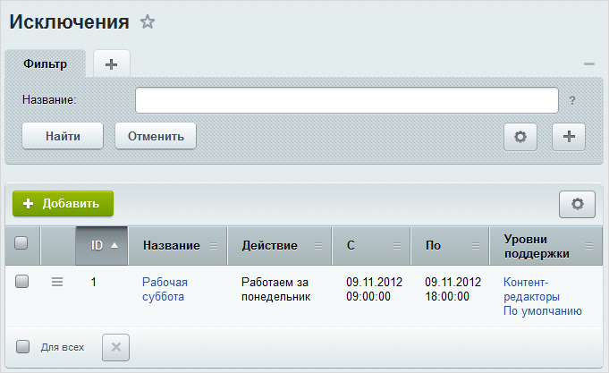

# Расписания и исключения

**Навигация**
- [← Оглавление курса](index.md)
- [← Предыдущий: 2565 — Графики](lesson_2565.md)
- [Следующий: 2628 — Группы →](lesson_2628.md)

Официальная страница урока: https://dev.1c-bitrix.ru/learning/course/index.php?COURSE_ID=48&LESSON_ID=5175

Настройка расписаний, в соответствии с которыми будет оказываться техническая поддержка, выполняется на странице **Расписания** (Сервисы &gt; Техподдержка &gt; Расписания &gt; Расписания):

В форме

			создания/редактирования

		 расписания указывается название расписания, например, **5-дневная рабочая неделя**:

На закладке

			Часы

		 выполняется детальная настройка режима работы:

Расписание работы задается для каждого дня недели.Возможны следующие режимы работы техподдержки:

- **24 часа** - круглосуточный режим работы;
- **не работает**;
- **часы работы (HH24:MI)** - позволяет задать интервалы времени работы техподдержки (используется 24-х часовой формат). Ведется проверка корректности указанных дат.
  Кнопка **Копировать** служит для копирования текущего значения времени работы в нижнее поле.

Созданные в системе расписания используются при настройке

			уровней техподдержки (SLA).

Настройка уровней сервиса выполняется на странице **Уровни техподдержки (SLA)** (Сервисы &gt; Техподдержка &gt; Уровни поддержки).

SLA определяет:

**-** время реакции на обращение пользователя (т.е. время, в течение которого сотрудник службы поддержки должен отреагировать на обращение пользователя);

**-** группы, пользователи которых имеют право на создание обращений с данным уровнем поддержки;

**-** доступные категории и уровни критичности обращений, а также оценки ответов на обращение.

[Подробнее](lesson_2620.md)...

Для уровней техподдержки можно настроить некоторые исключения в оказании технической поддержки (например, техподдержка по некоторому уровню оказывается с понедельника по пятницу, но в связи с переносом праздничного дня необходимо сделать субботу рабочим днем).  Настройка исключений осуществляется на странице **Исключения** (Сервисы &gt; Техподдержка &gt; Расписания &gt; Исключения):

В форме создания/редактирования исключения указывается название, действие исключения (отдых или работа), период действия исключения и выбираются уровни поддержки, для которых будет использоваться это исключение:

|  | #### Документация по теме: |
| --- | --- |

- [Расписания](https://dev.1c-bitrix.ru/user_help/service/support/ticket_timetable/ticket_timetable_list.php)
- [Создание и редактирование расписания](https://dev.1c-bitrix.ru/user_help/service/support/ticket_timetable/ticket_timetable_edit.php)
- [Исключения](https://dev.1c-bitrix.ru/user_help/service/support/ticket_timetable/ticket_holidays_list.php)
- [Создание и редактирование исключения](https://dev.1c-bitrix.ru/user_help/service/support/ticket_timetable/ticket_holidays_edit.php)
