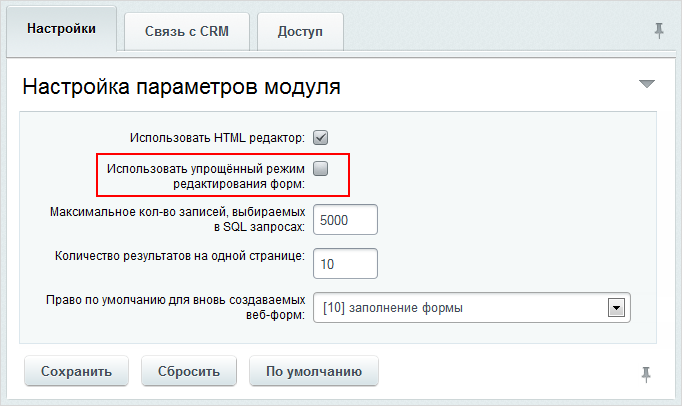

# Особенности режима

**Навигация**
- [← Оглавление курса](index.md)
- [← Предыдущий: 2926 — Упрощенный режим](lesson_2926.md)
- [Следующий: 5153 — Создание и редактирование веб-формы →](lesson_5153.md)

Официальная страница урока: https://dev.1c-bitrix.ru/learning/course/index.php?COURSE_ID=48&LESSON_ID=5219

|  | ### Используем все возможности |
| --- | --- |

Для работы в расширенном режиме в

			настройках модуля

                    Настройка модуля **Веб-формы** осуществляется на странице Настройки &gt; Настройки продукта &gt; Настройки модулей &gt; Веб-формы.

[Читать подробнее..](lesson_2858.md)

		 **Веб-формы** необходимо снять флаг с поля

			Использовать упрощённый режим редактирования форм

                    

		. Если вы работали в упрощённом режиме, а потом переключились в расширенный режим, то нежелательно возвращаться обратно в упрощенный режим. Данные, сохраненные в расширенном режиме, при переключении могут поменять структуру и сделать работу веб-формы неверной.

|  | #### Что такое Поля и Статусы |
| --- | --- |

**Поля формы** выводят промежуточные либо окончательные результаты вычислений, получаемых на основе того, что вводилось посетителем в поля для ответов. Значения полей веб-формы вычисляются программным скриптом, заданным в коде визуального компонента. Пример использования приведен в [документации](/api_help/form/events/onafterresultadd.php).

Дополнительная обработка данных программным скриптом в полях требуется редко. Если не уверены, что справитесь сами, обратитесь к администратору сайта.

**Статусы** - для каждой формы создаются несколько статусов, например: Принято к рассмотрению, Опубликовано, Отклонено и так далее. В настройках статуса можно указать различные права доступа к результату для различных групп пользователей, а также отдельно для создателя результата.

**Примечание:** при работе с веб-формами в расширенном режиме для каждой веб-формы обязательно должен быть создан и настроен хотя бы один статус.
