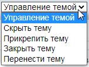
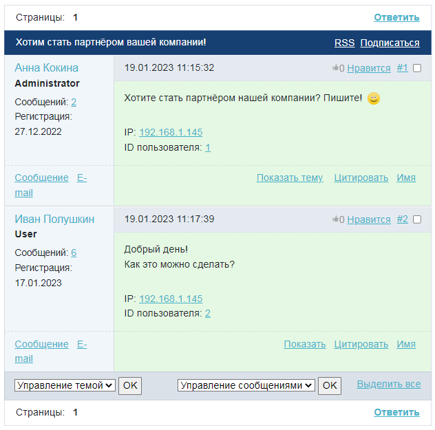
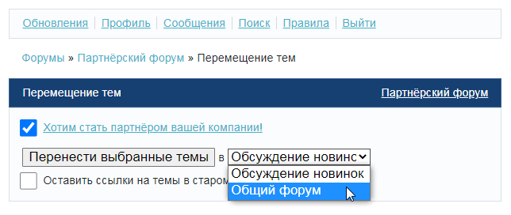
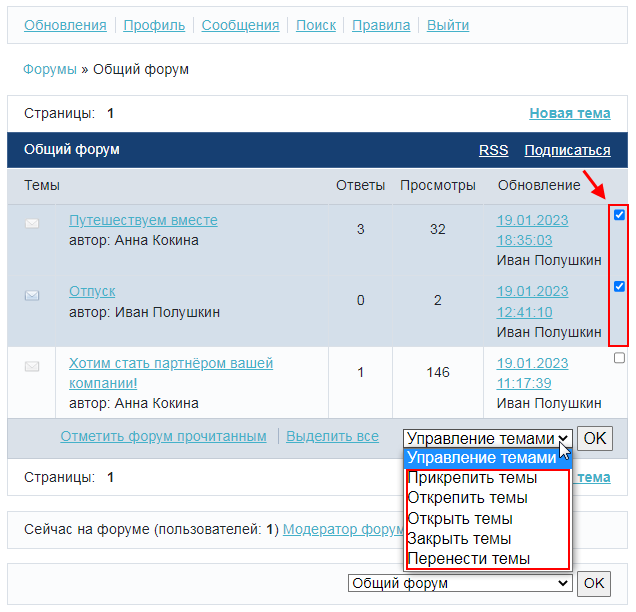
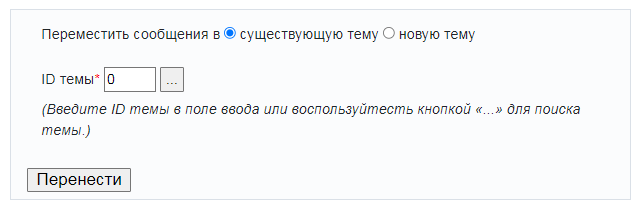
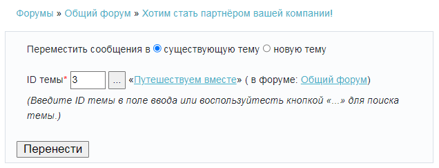
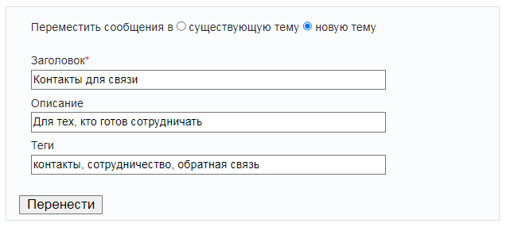

# Модератор форума

**Навигация**
- [← Оглавление курса](index.md)
- [← Предыдущий: 5515 — Сценарий для работы службы техподдержки](lesson_5515.md)
- [Следующий: 8637 — Что такое Пользовательские поля →](lesson_8637.md)

Официальная страница урока: https://dev.1c-bitrix.ru/learning/course/index.php?COURSE_ID=48&LESSON_ID=5277

Модерирование форума – одна из задач, которую могут поручить контент-менеджеру. Он должен следить за текстами пользователей: чтобы не было оскорблений, нецензурой лексики и так далее. Для этого ему даются [права](lesson_7360.md) уровня **модерирование**. Пользователь с правами модератора форума может скрывать\показывать сообщения и темы, переносить их в другие форумы, закрывать\прикреплять темы.

### Видеоурок

### Как работает модератор

У контент-менеджера есть два инструмента модерации: **Управление темами** и **Управление сообщениями**:

### Управление темой

Меню **Управление темой** представлено

			следующими пунктами

                    

		:

- **Скрыть тему** – делает тему недоступной для просмотра всем, кроме модераторов и администраторов. Для них она будет
  			выделена другим цветом
                      
  		. Для возврата выберите в меню управления темой пункт **Показать тему**.
- **Прикрепить тему** – прикрепленная тема всегда будет располагаться в верхней части списка тем и не будет смещаться вниз обновленными и новыми темами. В таких темах, как правило, размещают какую-то управляющую информацию, к примеру, правила форума.  Для открепления темы выберите в меню управления пункт **Открепить тему**.
- **Закрыть тему** – в закрытую тему нельзя добавлять сообщения, но можно прочитать. Для открытия темы выберите в меню управления пункт **Открыть тему**.
- **Перенести тему** – выберите данный пункт, если хотите переместить тему в другой форум. После того, как вы нажмете **OK**, появится форма переноса:
  
  Выберите нужный форум, в который следует поместить
  			тему
                      Если хотите, чтобы в прежнем форуме осталась ссылка на тему (хотя сама тема будет в другом форуме), оставьте галочку в опции **Оставить ссылки на темы в старом форуме?**
  		, и нажмите **Перенести выбранные темы**.

**Примечание:** темами можно управлять не только внутри них самих, но и на странице форума. Этот способ удобен для групповой работы с темами: выделяются галочками нужные темы и выбирается

			нужный пункт меню

                    

		.

### Управление сообщениями

Для управления сообщениями отметьте нужные из них галочками и выберите подходящую

			команду из меню

                    

		:

- **Скрыть сообщения** – сообщения станут недоступными для просмотра всем, кроме тех, кто имеет право на модерирование форума. Для модераторов скрытые сообщения будут видны и выделены другим цветом. Скрытые сообщения можно опять показать в теме при необходимости с помощью команды **Показать сообщения**.
- **Перенести сообщения** – перемещает выбранные сообщения в другую тему с помощью формы:
  
  Чтобы перенести сообщения в существующую тему, нужно указать её
  			ID
                      Для поиска и выбора нужной темы нажмите на кнопку 
  рядом с полем для ввода ID, появится окно:
  
  Укажите данные для поиска и нажмите **Найти**. После того, как нужная тема появится
  в списке найденных, кликните по её названию, и форма переноса сообщений
  заполнится нужной информацией:
  
  		.  После этого нажмите **Перенести**, и сообщения будут перенесены в выбранную тему.
  Чтобы перенести сообщения в новую, ещё не созданную тему, отметьте **новую тему**, введите
  			заголовок, описание новой темы, теги
                      
  		 и нажмите **Перенести**. Новая тема будет создана в том же форуме, а перенесенные сообщения окажутся в ней первыми.

### Как быстро найти изменения на форуме

Модератору удобно просматривать изменения на форумах с помощью поискового запроса по ссылке **Обновления**, где можно указать форумы, активность на которых интересует данного модератора, и период, за который эту активность следует показать:

### Дополнительно

- [Форум](http://dev.1c-bitrix.ru/user_help/service/forum/index.php) (документация)
- [Назначение модератора форума](lesson_7360.md) (урок в курсе "Администратор. Модули")
