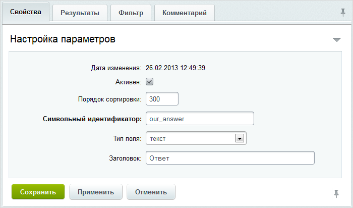
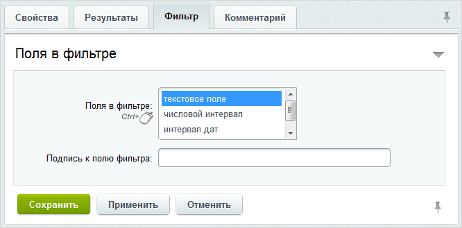

# Создание веб-формы, вопросов и полей

**Навигация**
- [← Оглавление курса](index.md)
- [← Предыдущий: 7467 — Что должно быть в веб-форме](lesson_7467.md)
- [Следующий: 5309 — Настройка статусов →](lesson_5309.md)

Официальная страница урока: https://dev.1c-bitrix.ru/learning/course/index.php?COURSE_ID=48&LESSON_ID=5308

### Создание веб-формы

Для создания формы перейдите в административный раздел на страницу Сервисы &gt; Веб-Формы &gt; Настройка форм и нажмите кнопку **Создать**. На закладке **Свойства** заполните все

			необходимые поля

                    

		. Подпись кнопки, сохраняющей результаты формы, замените на **Отправить** и отметьте опцию **Использовать CAPTCHA**.

На закладке **Доступ** для групп **Все пользователи** и **Модераторы системы "Вопрос-ответ"** укажите право доступа **работа со всеми результатами в соответствии с их статусами**:

Сохраните веб-форму. К настройке [шаблона веб-формы](lesson_5310.md) и [почтового шаблона](lesson_5311.md) вернемся после того, как создадим вопросы, поле и статусы.

### Создание вопросов

Последовательно [создайте все вопросы](lesson_5155.md), указанные в Техзадании:

| \| Символьный идентификатор \| Обязателен \| Текст вопроса \| Ответ, тип поля \| Поля в фильтре \| \| --- \| --- \| --- \| --- \| --- \| \| name \| да \| Фамилия, имя, отчество \| пустое значение (пробел), тип text \| отмечаем **текстовое поле** в поле **для вводимого значения** \| \| text \| да \| Вопрос \| пустое значение (пробел), тип textarea \| отмечаем **текстовое поле** в поле **для вводимого значения** \| \| email \| да \| Адрес электронной почты \| пустое значение (пробел), тип email \| *не указываем* \| \| phone \| нет \| Номер телефона \| пустое значение (пробел), тип text \| *не указываем* \| |
| --- |

Рекомендуется выставить сортировку вопросам, чтобы они отображались в верной последовательности, например, в фильтре. В результате на странице со списком вопросов веб-формы у нас будет представлена следующая таблица:

### Создание полей

Теперь [создайте поле](lesson_5156.md), в котором будет храниться ответ на вопрос.

На закладке **Свойства** задайте параметры:

- символьный идентификатор - `our_answer`;
- типа поля - `текст`;
- заголовок - `Ответ`.

Чтобы создаваемое поле не просто отображалось в фильтре поиска, а обязательно после полей **Фамилия, имя, отчество** и **Вопрос**:

- задайте значение сортировки больше, чем у вопроса **Фамилия, имя, отчество** и больше, чем у вопроса **Вопрос**. Например, равной **300** (см. настройки сортировки вопросов выше).
- на закладке **Фильтр** отметьте **текстовое поле** в поле
  			Поля в фильтре
                      
  		.

Сохраните созданное поле.
