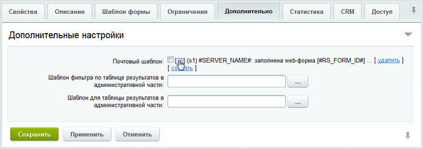
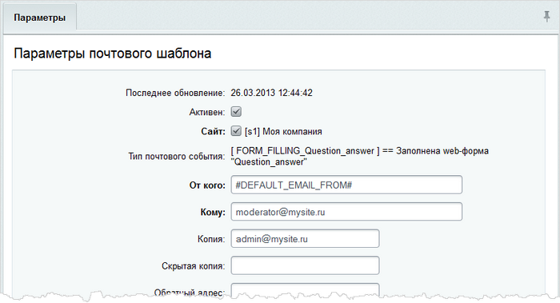
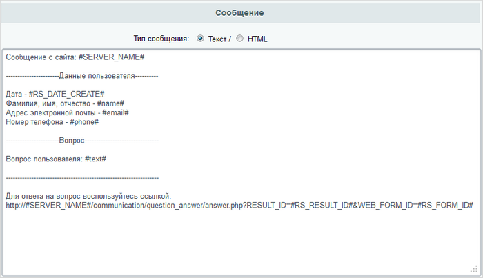

# Почтовый шаблон

**Навигация**
- [← Оглавление курса](index.md)
- [← Предыдущий: 5310 — Создание шаблона формы](lesson_5310.md)
- [Следующий: 6836 — Раздел на сайте для Вопросов и ответов →](lesson_6836.md)

Официальная страница урока: https://dev.1c-bitrix.ru/learning/course/index.php?COURSE_ID=48&LESSON_ID=5311

|  | #### Шаблон для e-mail сообщений |
| --- | --- |

После заполнения веб-формы отправляется письмо с уведомлением  модераторам и администратору сайта.

В форме редактирования веб-формы **Вопрос-ответ** переходим на закладку **Дополнительно** и нажимаем ссылку

			создать

                    

		. В результате сразу создается почтовый шаблон и почтовое событие **Заполнена web-форма "Question_answer"** для нашей веб-формы.

По

			ссылке с идентификатором

                    

		 шаблона переходим к его редактированию:

- В поле **Кому** указываем email модератора.
- В поле **Копия** указываем email администратора сайта, чтобы он мог контролировать работу модератора.
- Отредактируем текст сообщения, оставив только данные о посетителе и сам вопрос, а также добавим ссылку для перехода к форме ответа на вопрос:
  

**Примечание:** все параметры, которые могут быть использованы при создании почтового шаблона, указаны внизу формы под полем **Сообщение**.
