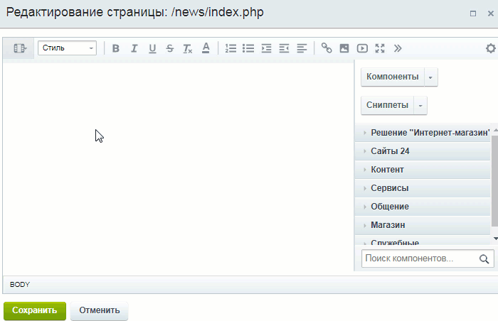
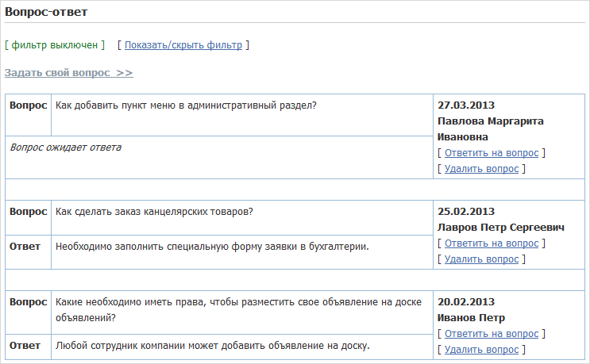

# Список вопросов и ответов

**Навигация**
- [← Оглавление курса](index.md)
- [← Предыдущий: 6836 — Раздел на сайте для Вопросов и ответов](lesson_6836.md)
- [Следующий: 5314 — Добавление вопроса →](lesson_5314.md)

Официальная страница урока: https://dev.1c-bitrix.ru/learning/course/index.php?COURSE_ID=48&LESSON_ID=5313

**Внимание!**

                    Этот урок предполагает наличие у администратора навыков по работе с кодом и минимальных знаний PHP, HTML и CSS. Если у вас возникают трудности по реализации описанного в уроке алгоритма, обратитесь к разработчикам вашего сайта.


Интерфейс главной страницы раздела со списком вопросов создается с помощью компонента **Список результатов**. Но разместить и настроить компонент - мало, вам предстоит ещё настроить вывод данных, то есть изменить шаблон компонента.


### Размещение компонента


Откройте страницу **Вопрос - ответ** на редактирование и в теле страницы

			обычным способом

                    Нужный компонент переносится на страницу в визуальном редакторе.





[Подробнее](/learning/course/index.php?COURSE_ID=34&LESSON_ID=9163#add_component)...

		 разместите компонент

			**Список результатов**

                    Компонент предназначен для вывода списка результатов выбранной веб-формы.


						[Описание компонента «Список результатов» в пользовательской документации.](http://dev.1c-bitrix.ru/user_help/detail.php?ID=63061)

		.


Настройте параметры компонента:


- В поле **ID веб-формы** укажите форму `Вопрос-ответ`.
- Поле **Страница просмотра результата** оставьте пустым, оно использоваться не будет.
- В поле **Страница редактирования результата** введите название страницы составления ответа - `answer.php`.
- В поле **Страница добавления результата** укажите название страницы заполнения формы - `ask_question.php`.
- Опцию **Показать дополнительные поля веб-формы** отметьте, чтобы на странице отображались ответы на вопросы.
- Опцию **Показать текущий статус результата** снимите, т.к. эта информация использоваться не будет.


Результат:


Штатный внешний вид врядли подойдёт под дизайн вашего сайта. Отредактируйте шаблон компонента, чтобы изменить внешний вид выводимой информации.


### Редактирование шаблона компонента


Скопируйте шаблон


Копировать шаблон можно следующими способами:

1) В рамках файловой системы копированием папки `/bitrix/components/bitrix/_нужный_компонент_/templates/` в папку `/local/templates/шаблон_сайта/components/namespace/название_компонента/_название_шаблона`.

2) Средствами интерфейса системы с помощью команды **Копировать шаблон компонента** (при включенном режиме **Правка**).

[Подробнее](https://dev.1c-bitrix.ru/learning/course/index.php?COURSE_ID=43&LESSON_ID=4778)...

		 компонента **Список результатов (bitrix:form.result.list)**. Откроется

			форма копирования

                    

		 шаблона компонента. Укажите название нового шаблона и шаблон сайта, в который копировать шаблон компонента (например, шаблон по умолчанию .default). Отметьте опции **Применить новый шаблон компонента** и **Перейти к редактированию шаблона**, чтобы сразу новый шаблон использовался в компоненте и открылась форма редактирования шаблона.


После сохранения откроется окно для редактирования шаблона компонента. Удобнее редактировать шаблон из административной части. Такие скопированные шаблоны хранятся по пути /bitrix/templates/[название_шаблона_сайта]/components/bitrix. В нашем примере путь до шаблона компонента получится такой: /bitrix/templates/.default/components/bitrix/form.result.list/qa_template, файл **template.php**.


Сначала отредактируем ту часть, которая отвечает за вывод формы фильтра. В фильтре оставим только следующие поля:


- дату создания вопроса (хранится в переменной `FORM_F_DATE_CREATE`);
- вопросы формы **Фамилия, имя, отчество** и **Вопрос**, а также поле **Ответ**, которые хранятся в `arrFORM_FILTER` (для показа в фильтре при создании этих вопросов и поля были выполнены соответствующие настройки на закладке
  			Фильтр
  						[Описание компонента «Создание и редактирование вопроса» в пользовательской документации.](http://dev.1c-bitrix.ru/user_help/detail.php?ID=63050)
  		).


Находим в коде шаблона код таблицы формы фильтра (таблица с классом **form-filter-table data-table**) и заменяем на следующий:


```

<table class="form-filter-table data-table">
	<thead>
		<tr>
			<th colspan="2"> </th>
		</tr>
	</thead>
	<tbody>
		<?
		if (strlen($arResult["str_error"]) > 0)
		{
		?>
		<tr>
			<td class="errortext" colspan="2"><?=$arResult["str_error"]?></td>
		</tr>
		<?
		} // endif (strlen($str_error) > 0)
		?>
		<tr>
			<td><?=GetMessage("FORM_F_DATE_CREATE")." (".CSite::GetDateFormat("SHORT")."):"?></td>
			<td><?=CForm::GetDateFilter("date_create", "form1", "Y", "", "")?></td>
		</tr>

		<?
		if (is_array($arResult["arrFORM_FILTER"]) && count($arResult["arrFORM_FILTER"])>0)
		{
			foreach ($arResult["arrFORM_FILTER"] as $arrFILTER)
			{
				$prev_fname = "";

				foreach ($arrFILTER as $arrF)
				{
					if ($arParams["SHOW_ADDITIONAL"] == "Y" || $arrF["ADDITIONAL"] != "Y")
					{
						$i++;
						if ($arrF["SID"]!=$prev_fname)
						{
							if ($i>1)
							{
							?>
							</td>
							</tr>
							<?
							} //endif($i>1);
							?>
		<tr>
			<td>
				<?=$arrF["FILTER_TITLE"] ? $arrF['FILTER_TITLE'] : $arrF['TITLE']?>
				<?=($arrF["FILTER_TYPE"]=="date" ? " (".CSite::GetDateFormat("SHORT").")" : "")?>
			</td>
			<td>
			<?
						} //endif ($fname!=$prev_fname) ;
						?>
						<?
						switch($arrF["FILTER_TYPE"]){
							case "text":
								echo CForm::GetTextFilter($arrF["FID"]);
								break;
							case "date":
								echo CForm::GetDateFilter($arrF["FID"]);
								break;
							case "integer":
								echo CForm::GetNumberFilter($arrF["FID"]);
								break;
							case "dropdown":
								echo CForm::GetDropDownFilter($arrF["ID"], $arrF["PARAMETER_NAME"], $arrF["FID"]);
								break;
							case "exist":
							?>
								<?=CForm::GetExistFlagFilter($arrF["FID"])?>
								<?=GetMessage("FORM_F_EXISTS")?>
							<?
								break;
						} // endswitch
						?>
						<?
						if ($arrF["PARAMETER_NAME"]=="ANSWER_TEXT")
						{
						?>
				 [<span class='form-anstext'>...</span>]
						<?
						}
						elseif ($arrF["PARAMETER_NAME"]=="ANSWER_VALUE")
						{
						?>
				 (<span class='form-ansvalue'>...</span>)
						<?
						}
						?>
				<br />
						<?
						$prev_fname = $arrF["SID"];
					} //endif (($arrF["ADDITIONAL"]=="Y" && $SHOW_ADDITIONAL=="Y") || $arrF["ADDITIONAL"]!="Y");

				} // endwhile (list($key, $arrF) = each($arrFILTER));

			} // endwhile (list($key, $arrFILTER) = each($arrFORM_FILTER));
		} // endif(is_array($arrFORM_FILTER) && count($arrFORM_FILTER)>0);
		?></td>
		</tr>
	</tbody>
	<tfoot>
		<tr>
			<th colspan="2">
				<input type="submit" name="set_filter" value="<?=GetMessage("FORM_F_SET_FILTER")?>" /><input type="hidden" name="set_filter" value="Y" />  <input type="submit" name="del_filter" value="<?=GetMessage("FORM_F_DEL_FILTER")?>" />
			</th>
		</tr>
	</tfoot>
</table>
```


Теперь отредактируем ссылку **Заполнить форму &gt;&gt;**. Для этого в строке:


```

<p>
<b><a href="<?=$arParams["NEW_URL"]?><?=$arParams["SEF_MODE"] != "Y" ? (strpos($arParams["NEW_URL"], "?") === false ? "?" : "&")."WEB_FORM_ID=".$arParams["WEB_FORM_ID"] : ""?>"><?=GetMessage("FORM_ADD")?>  >></a></b>
</p>
```


находим параметр `FORM_ADD` и заменяем его на `FORM_NEW_QUESTION`. После чего в языковом файле по пути `/bitrix/templates/.default/components/bitrix/form.result.list/qa_template/lang/ru/template.php` добавляем следующее языковое сообщение:


```

$MESS ['FORM_NEW_QUESTION'] = "Задать свой вопрос";
```


Функции **OnSelectAll_** и **OnDelete_** можно удалить из шаблона, поскольку в коде для нашей формы списка вопросов и ответов они использоваться не будут.


Теперь можно приступать к редактированию формы списка вопросов и ответов.


Вернемся к редактированию шаблона компонента и для списка вопросов добавим механизм постраничной навигации, чтобы страница не была очень большой. В связи с этим нам потребуется параметр постраничной навигации, определяющий количество вопросов на одной странице. Помимо этого нам необходимо знать идентификатор статуса **Ответ**. Его можно посмотреть в списке статусов веб-формы (цифра в поле ID). Мы не будем усложнять задачу и зададим эти параметры явно в шаблоне компонента. Просто добавьте строки (важно, чтобы строки были добавлены как PHP код, т.е. в границах знаков **&lt;? ?&gt;**:


```

$status = "4";   // ID статуса Ответ. В нашем примере идентификатор статуса Ответ получился равен 4;
$ques_count = "10";  // параметр постраничной навигации. Укажите любую цифру. В нашем примере это 10;
```


**Примечание:** Более удобный, но сложный вариант - вы можете определить настройку этих параметров через параметры компонента. Аналогично тому, как мы это сделаем для компонента **Редактирование результата** далее в примере (урок [Ответ на вопрос](lesson_5316.md)).


Форма вопросов и ответов будет представлять из себя таблицу, в которой будут отображаться:


- вопрос;
- ответ;
- дата создания вопроса;
- фамилия, имя, отчество пользователя, создавшего вопрос;
- ссылки **Ответить на вопрос** и **Удалить вопрос** с учетом прав доступа пользователей к системе **Вопрос-ответ**.


Находим код формы в шаблоне компонента (начало аналогично коду ниже) и заменяем на следующий код:


```

<form name="rform_<?=$arResult["filter_id"]?>" method="post" action="<?=POST_FORM_ACTION_URI?>#nav_start">
	<input type="hidden" name="WEB_FORM_ID" value="<?=$arParams["WEB_FORM_ID"]?>" />
	<?=bitrix_sessid_post()?>

	<?
	if ($arResult["res_counter"] > 0 && $arParams["SHOW_STATUS"] == "Y" && $arParams["F_RIGHT"] >= 15)
	{
	?>
	<p><input type="submit" name="save" value="<?=GetMessage("FORM_SAVE")?>" /><input type="hidden" name="save" value="Y" /> <input type="reset" value="<?=GetMessage("FORM_RESET")?>" /></p>
	<?
	} //endif(intval($res_counter)>0 && $SHOW_STATUS=="Y" && $F_RIGHT>=15);
	?>
	<p>
	<?=$arResult["pager"]?>
	</p>

<?

if(count($arResult["arrResults"]) > 0)
{
	$arPerm = CFormStatus::GetPermissions($status);
	$rsContent = new CDBResult;
	$rsContent -> InitFromArray($arResult["arrResults"]);
	$rsContent -> NavStart($ques_count);
	$j=0;
	?>
	<table class="data-table form-table">
	<?
	while ($arRes=$rsContent->Fetch())
	{
		$j++;
		$user_date = $arRes["DATE_CREATE"];
		$res_id=$arRes["ID"];
		$arAns = CFormResult::GetDataByID($res_id, array(), $arResult, $arAnswer);
		if ($j>1)
			{
			?>
				<tr><td colspan="3" class="form-results-delimiter"> </td></tr>
			<?
			}
			?>
		<tr>
		<td><b><?=$arAns["text"][0]["TITLE"]?></b></td><td><?=$arAns["text"][0]["USER_TEXT"]?></td>
		<td rowspan="2"><b><?=substr($user_date,0,10)."";?></b><br/><b><?=$arAns["name"][0]["USER_TEXT"]?></b>
			<br/>
			<?
			if ($arRes["STATUS_ID"]!=$status && in_array("MOVE", $arPerm) || $USER->IsAdmin())
				{
				$href = $arParams["SEF_MODE"] == "Y" ? str_replace("#RESULT_ID#", $arRes["ID"], $arParams["EDIT_URL"]) : $arParams["EDIT_URL"].(strpos($arParams["EDIT_URL"], "?") === false ? "?" : "&")."RESULT_ID=".$arRes["ID"]."&WEB_FORM_ID=".$arParams["WEB_FORM_ID"];
				?>
				[ <a title="<?=GetMessage("FORM_EDIT_ALT")?>" href="<?=$href?>"><?=GetMessage("FORM_EDIT")?></a> ]
				<?
				}
				?>
			<br/>
			<?
			if ($USER->IsAdmin())
				{
				$href = $arParams["LIST_URL"].(strpos($arParams["LIST_URL"], "?") === false ? "?" : "&").($arParams["SEF_MODE"] == "Y" ? "" : "WEB_FORM_ID=".$arParams["WEB_FORM_ID"]."&")."del_id=".$arRes["ID"]."&".bitrix_sessid_get()."#nav_start";
				?>[ <a title="<?=GetMessage("FORM_DELETE_ALT")?>" href="javascript:if(confirm('<?=GetMessage("FORM_CONFIRM_DELETE")?>')) window.location='<?=$href?>'"><?=GetMessage("FORM_DELETE")?></a> ]
				<?
				}
				?>
		</td>
		</tr>
		<tr>
			<?
		if ($arRes["STATUS_ID"]!=$status)
			{
			?>
		<td colspan="2"><i><?=GetMessage("FORM_NEW_ANSWER")?></i></td>
		<?
			}
		else
			{
		?>
		<td><b><?=$arAns["our_answer"][0]["TITLE"]?></b></td>
		<td><?=$arAns["our_answer"][0]["USER_TEXT"]?></td>
		<?
			}
		?>
		</tr>
	<?
	}
	?>
	</table>
<br />
	<?
echo $rsContent->NavPrint('Вопросы');
}
?>
</form>
```


**Важно!** Встречающиеся в коде `name`, `text` и `our_answer` - это символьные идентификаторы вопроса **Фамилия, имя, отчество**, вопроса **Вопрос** и поля **Ответ**. Если у Вас заданы другие символьные идентификаторы - замените их на свои.


Для используемого в коде параметра `FORM_NEW_ANSWER` необходимо в языковом файле `/bitrix/templates/.default/components/bitrix/form.result.list/qa_template/lang/ru/template.php` добавить следующее сообщение:


```

$MESS ['FORM_NEW_ANSWER'] = "Вопрос ожидает ответа";
```


А для параметров **FORM_EDIT**, **FORM_EDIT_ALT**, **FORM_DELETE_ALT** и **FORM_DELETE**  отредактировать их языковые сообщения:


```

$MESS ['FORM_EDIT_ALT'] = "Дать ответ на вопрос";
$MESS ['FORM_EDIT'] = "Ответить на вопрос";
$MESS ['FORM_DELETE_ALT'] = "Удалить вопрос";
$MESS ['FORM_DELETE'] = "Удалить вопрос";
```


### Результат в публичном разделе


Сразу посмотрим, как будет выглядеть результат нашей работы над шаблоном и добавления нескольких вопросов. Полный функционал заработает только после выполнения настроек на других страницах (следующие уроки).


Главная страница системы **Вопрос-ответ** будет представлена в следующем виде для обычных пользователей:


Причем для авторизованных создателей вопросов будут отображаться и те вопросы, которые еще ожидают ответа.


Пользователям группы **Модератор системы "Вопрос-ответ"** дополнительно в списке будут отображаться все неотвеченные вопросы со ссылкой **Ответить на вопрос**.


Администратору сайта всегда доступны все вопросы. По ссылке **Ответить на вопрос** он может дать ответ на новый вопрос или изменить уже существующий ответ, а по ссылке **Удалить вопрос** - удалить любой вопрос.



